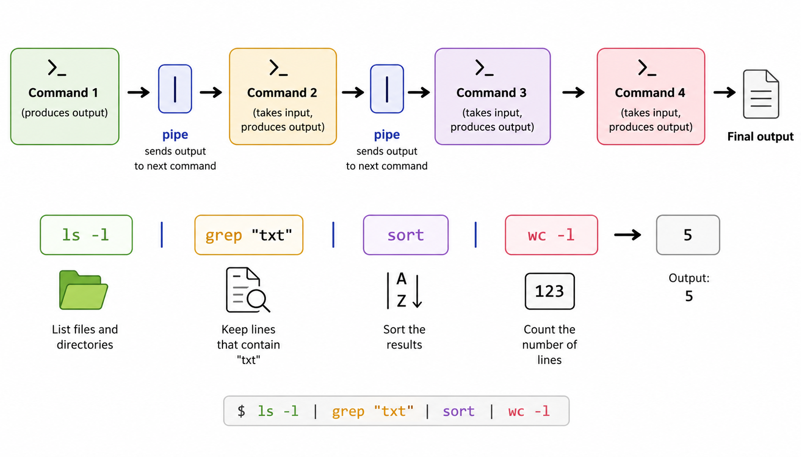

# The Unix Shell

## Why the Command Line?

If you're new to bioinformatics, the command line may seem like an unnecessary detour. But the answer lies in the nature of biological data itself.

Modern sequencing experiments generate gigabytes or terabytes of data. A single RNA-seq run can produce hundreds of millions of reads across dozens of samples. No graphical interface can efficiently handle this scale. The command line, by contrast, is built for exactly this kind of work: it is fast, scriptable, easily automated, and runs the same way on your laptop as on a supercomputing cluster with thousands of cores.

Every major bioinformatics tool (`bwa`, `samtools`, `GATK`, `DESeq2`, `Snakemake`) is designed to run from the command line. Mastering the shell isn't optional—it's your entry ticket to computational biology.

::: {.callout-note}
## The Unix Philosophy

Unix was designed around a simple but powerful idea: build small programs that each do one thing well, and connect them together with *pipes*. A pipeline that downloads a genome, indexes it, aligns reads, and filters variants is built from this philosophy. You will see this pattern throughout the book.
:::

## Learning Goals

By the end of this chapter, you should be able to:

1. Open a terminal on macOS, Linux, or Windows and identify the parts of a Unix shell prompt.
2. Navigate the filesystem fluently with `cd`, `ls`, `pwd`, and tab completion.
3. Inspect file contents with `cat`, `less`, `head`, `tail`, and `wc`.
4. Combine small commands with pipes (`|`) and redirection (`>`, `>>`, `<`, `2>`).
5. Use shell history, command-line editing shortcuts, and globbing patterns to type commands faster.
6. Read a manual page and use `--help` to discover what a tool can do without leaving the terminal.

{fig-align="center" width="80%"}

## Opening a Terminal

Your terminal is the window into the shell. Here is how to open one:

- **macOS**: Go to *Applications → Utilities → Terminal*, or press `Cmd+Space` and type "Terminal". Many bioinformaticians prefer [iTerm2](https://iterm2.com/) for its additional features.
- **Linux**: Press `Ctrl+Alt+T`, or search for "Terminal" in your application launcher.
- **Windows**: Install [WSL2](https://learn.microsoft.com/en-us/windows/wsl/install) (Windows Subsystem for Linux) to get a native Ubuntu environment. Alternatively, use [MobaXterm](https://mobaxterm.mobatek.net/) for connecting to remote servers.

When you open a terminal, you will see a **prompt** that looks something like:

```
user@hostname:~$
```

This tells you your username (`user`), the machine you are on (`hostname`), the directory you are in (`~`, which means your home directory), and that you are a regular user (`$`; a root user sees `#`). Everything you type appears after the `$`.

## Anatomy of a Command

Commands follow a consistent pattern:

```
command [options] [arguments]
```

For example:

```bash
ls -lh /home/user/data
```

Here:
- `ls` is the **command** (list directory contents)
- `-lh` are **options** (long format, human-readable file sizes)
- `/home/user/data` is the **argument** (which directory to list)

Options usually come in two forms:
- Short form: `-l`, `-h`, `-a` (single dash, single letter)
- Long form: `--help`, `--all` (double dash, full word)

Short options can often be combined: `-lh` is the same as `-l -h`.

## Navigating the Filesystem

The Unix filesystem is organized as a tree rooted at `/` (the "root" directory). Everything lives somewhere under `/`: files, programs, devices.

```bash
pwd           # print working directory — where am I?
ls            # list files in current directory
ls -lh        # list with details and human-readable sizes
ls -a         # include hidden files (those starting with .)
ls -lhrt      # sort by time, newest last — very useful!
cd /home/user/data   # change to an absolute path
cd data/raw          # change to a relative path
cd ..                # go up one directory
cd ~                 # go to your home directory
cd -                 # return to the previous directory
```

::: {.callout-tip}
## Pro-Tip: Use `ls -lhrt` Constantly

When you have many files in a directory, `ls -lhrt` lists them sorted by modification time, most recent last. This makes it easy to spot the file you just created or the most recent output of a job.
:::

### Understanding Paths

A **path** is the address of a file or directory in the filesystem. There are two types:

| Type | Description | Example |
|------|-------------|---------|
| Absolute | Always starts from root `/` | `/cluster/tufts/biocontainers/datasets` |
| Relative | Relative to your current location | `../data/genome.fa` |

Special path shortcuts:

| Symbol | Meaning |
|--------|---------|
| `~` | Your home directory (`/cluster/home/username`) |
| `.` | Current directory |
| `..` | Parent directory |
| `-` | Previous directory (used with `cd`) |

For example, if your current directory is `/home/user/projects/rnaseq/`:

```bash
ls ../../data/         # goes up two levels, then into data/
cat ~/notes.txt        # reads notes.txt in your home directory
```

## File Permissions

Unix tracks who can read, write, and execute every file. When you run `ls -l`, you see entries like:

```
-rwxr-xr--  1  user  group  4096  Mar 15 10:22  align.sh
drwxr-xr-x  2  user  group  4096  Mar 15 09:00  results/
```

The first column is the permission string. Read it from left to right:

{fig-align="center" width="80%"}

| Position | Meaning |
|----------|---------|
| 1 | File type: `-` (file), `d` (directory), `l` (symlink) |
| 2–4 | **Owner** permissions: read (`r`), write (`w`), execute (`x`) |
| 5–7 | **Group** permissions |
| 8–10 | **Other** (everyone else) permissions |

Common permission operations:

```bash
chmod +x script.sh        # make executable (for the owner)
chmod 755 script.sh       # rwxr-xr-x — standard for scripts
chmod 644 data.txt        # rw-r--r-- — standard for data files
chmod -R 750 project/     # recursively set permissions on a directory
```

The numeric mode uses octal (base-8): `r=4`, `w=2`, `x=1`. So `7 = 4+2+1 = rwx`, `5 = 4+0+1 = r-x`, `4 = r--`.

::: {.callout-warning}
## A Common Pitfall

Scripts that will not run are often not executable. If you see:

```
bash: ./myscript.sh: Permission denied
```

Run `chmod +x myscript.sh` to fix it.
:::

## Getting Help

You should almost never need to memorize every option for every command. Instead, learn how to look things up quickly:

```bash
man ls             # full manual page (press q to quit, / to search)
ls --help          # shorter built-in help
type ls            # tells you if ls is a built-in, alias, or binary
which samtools     # shows the path to an executable
```

When reading a `man` page, options are described in detail. Use `/` to search for a keyword and `n` to jump to the next match.

::: {.callout-tip}
## Pro-Tip: `tldr` — Practical Command Summaries

The `tldr` tool (install via `brew install tldr` or `npm install -g tldr`) provides short, practical examples for any command. Running `tldr rsync` is often faster than reading the full man page when you just need a quick reminder.
:::

## Environment Variables

The shell maintains a set of **environment variables** that control how programs behave. These are key-value pairs accessible with the `$` prefix:

```bash
echo $HOME       # your home directory
echo $USER       # your username
echo $SHELL      # the shell you are using (e.g. /bin/bash)
echo $PATH       # directories searched for executables
echo $PWD        # current directory (same as pwd)
printenv         # list all environment variables
```

The `$PATH` variable is particularly important. It's a colon-separated list of directories the shell searches when you type a command. If a tool isn't found, it's usually because its directory isn't in your `$PATH`.

```bash
# Add a directory to your PATH for the current session
export PATH="/opt/tools/bin:$PATH"

# To make this permanent, add it to ~/.bashrc or ~/.bash_profile
echo 'export PATH="/opt/tools/bin:$PATH"' >> ~/.bashrc
source ~/.bashrc
```

::: {.callout-warning}
## Never Overwrite $PATH Directly

A common mistake is writing `PATH=something` instead of `PATH=something:$PATH`. The first version **replaces** your entire PATH, making most commands unavailable. If you suddenly see `bash: ls: command not found`, you have broken your PATH. Open a new terminal to get a fresh environment.
:::

## Checking Disk Space and Running Processes

You'll often learn `grep` before asking a more urgent question: "Is the disk about to fill up?" Sequencing data produces huge files, so checking disk space and processes should be second nature.

### Disk Usage

```bash
# free space on the filesystem containing current directory
df -h .
df -h /scratch          # free space on a scratch filesystem
du -sh data/            # total size of a directory
du -sh *                # size of everything in the current directory
du -h --max-depth=1 .   # one-level directory size summary (GNU/Linux)
```

On macOS, `du --max-depth` is not available by default. Use:

```bash
du -hd 1 .
```

::: {.callout-tip}
## Pro-Tip: Check Space Before Running Pipelines

Before launching an alignment, assembly, or nf-core pipeline, run `df -h` and `du -sh`. Many failed analyses are not biological or statistical problems; they are simply full disks.
:::

### Process Checks

```bash
top                   # live process viewer
ps -u $USER           # processes owned by you
ps -ef | grep STAR    # find STAR processes
jobs                  # jobs started from the current shell
fg                    # bring a suspended job to the foreground
bg                    # resume a suspended job in the background
kill <PID>            # terminate a process by process ID
```

Use `Ctrl+Z` to suspend a foreground command, then `fg` to resume it in the foreground or `bg` to resume it in the background. For long-running bioinformatics jobs, prefer `tmux`, `screen`, or the cluster scheduler rather than relying on background jobs alone.

## Standard Streams and Redirection

Every Unix process has three standard communication channels:

{fig-align="center" width="85%"}

| Stream | Number | Default |
|--------|--------|---------|
| **stdin** (standard input) | 0 | Keyboard |
| **stdout** (standard output) | 1 | Terminal screen |
| **stderr** (standard error) | 2 | Terminal screen |

You can **redirect** these streams to files:

```bash
ls > filelist.txt          # redirect stdout to a file (overwrite)
ls >> filelist.txt         # append stdout to a file
grep ">" seqs.fa 2> err.log    # redirect stderr to error log
cat < input.txt            # use a file as stdin
command > out.txt 2>&1     # redirect both stdout and stderr to one file
command > out.txt 2> err.txt   # split stdout and stderr into separate files
```

::: {.callout-tip}
## Pro-Tip: Always Capture Errors

When running long bioinformatics jobs, always redirect stderr to a log file:

```bash
bwa mem genome.fa reads_R1.fq reads_R2.fq > aligned.sam 2> bwa.log
```

Many tools (including `bwa`, `samtools`, `STAR`) write their progress and warnings to stderr while outputting data to stdout. This pattern lets you inspect the log without cluttering your alignment file.
:::

## Pipes: Connecting Commands

The **pipe** (`|`) sends the stdout of one command directly into the stdin of the next without writing intermediate files to disk. This is Unix philosophy in action.

{fig-align="center" width="90%"}

```bash
cat sequences.fa | grep ">"           # list all FASTA headers
grep ">" sequences.fa | wc -l        # count the number of sequences
samtools view aligned.bam | head -5  # preview an alignment file
```

You can chain as many commands as you need:

```bash
cat genes.gff | grep "exon" | cut -f1 | sort | uniq -c | sort -rn
```

This does six things: reads a GFF file, filters for exons, extracts chromosomes, sorts them alphabetically, counts unique ones, and sorts by count in descending order.

::: {.callout-note}
## Pipes vs. Files

Pipes process data as a **stream** — each command starts processing as soon as the previous one starts writing output. This is both faster (no disk I/O) and more memory-efficient than writing intermediate files. For very large genomics datasets, this can be the difference between an analysis that runs in minutes vs. one that fills your disk.
:::

## Tab Completion and History

Two shell features make you much faster:

### Tab Completion

Press `Tab` to auto-complete file paths, command names, and (in some tools) option names:

```
$ ls ~/data/raw/sam<Tab>
$ ls ~/data/raw/sample1_R1.fastq.gz    # completed automatically
```

If multiple completions exist, pressing `Tab` twice shows all options.

### Command History

```bash
history           # show recent commands
history | grep bwa    # search your history for bwa commands
!!                # re-run the last command
!bwa              # re-run the most recent command starting with "bwa"
Ctrl+R            # interactive reverse history search (very useful!)
```

`Ctrl+R` is one of the most useful keyboard shortcuts: start typing any part of a previous command and the shell will find the most recent match. Press `Ctrl+R` again to cycle through older matches.

### Other Useful Keyboard Shortcuts

| Shortcut | Action |
|----------|--------|
| `Ctrl+C` | Kill the running command |
| `Ctrl+Z` | Suspend the running command (resume with `fg`) |
| `Ctrl+L` | Clear the screen |
| `Ctrl+A` | Move cursor to beginning of line |
| `Ctrl+E` | Move cursor to end of line |
| `Ctrl+U` | Delete from cursor to beginning of line |
| `Ctrl+W` | Delete the word before the cursor |

## Terminal Multiplexing with tmux

Bioinformatics jobs often run for hours or days. If your network drops or your laptop closes, a job in a plain terminal dies immediately. **tmux** (terminal multiplexer) changes that: your shell sessions run on a persistent server, so you can detach, close your laptop, reconnect later, and pick up exactly where you left off.

### Installing tmux

```bash
brew install tmux              # macOS
sudo apt-get install tmux      # Linux (Debian/Ubuntu)
conda install -c conda-forge tmux   # Conda environment
```

### The tmux Survival Guide

The workflow is simple: create a named session, run your job, detach, and reattach later.

```bash
tmux new -s rnaseq             # create a session named "rnaseq"
# ... start your long-running job ...
# Press Ctrl-b, then d          → detach (job keeps running!)
tmux ls                        # list all active sessions
tmux attach -t rnaseq          # reattach to the session
```

The key prefix `Ctrl-b` triggers all tmux commands. Here are the ones you will use most:

| Key | Action |
|-----|--------|
| `Ctrl-b d` | Detach from session (leaves it running) |
| `Ctrl-b c` | Create a new window in the session |
| `Ctrl-b n` | Go to the next window |
| `Ctrl-b p` | Go to the previous window |
| `Ctrl-b ,` | Rename current window |
| `Ctrl-b x` | Kill current window/pane |
| `Ctrl-b %` | Split pane vertically (left/right) |
| `Ctrl-b "` | Split pane horizontally (top/bottom) |
| `Ctrl-b [` | Enter scroll/copy mode (use arrows; `q` to exit) |

::: {.callout-tip}
## Pro-Tip: Always Use Named Sessions

Run `tmux new -s analysis_name` rather than just `tmux`. A name like `star_align` or `gatk_call` immediately tells you what is in the session when you later run `tmux ls`. Without names, sessions are numbered 0, 1, 2... and become indistinguishable.
:::

### Enabling Mouse Scrolling

By default, mouse scrolling may not work in tmux. Add this to `~/.tmux.conf`:

```bash
echo "set -g mouse on" >> ~/.tmux.conf
tmux source ~/.tmux.conf       # reload config without restarting
```

### Practical Example: Running a Long Alignment

```bash
# Open a dedicated session for this analysis
tmux new -s genome_align

# Inside tmux — start the alignment
bwa mem -t 16 hg38.fa sample_R1.fq.gz sample_R2.fq.gz \
    | samtools sort -@ 8 -o sample.sorted.bam

# Detach: Ctrl-b, then d
# Close your laptop. Go home. Have dinner.

# Next morning — reconnect:
tmux attach -t genome_align
# ... alignment is still running or already done
```

::: {.callout-note}
## tmux vs. `screen`

`screen` is an older terminal multiplexer with similar functionality. On systems where tmux is not available, `screen` is a good fallback:

```bash
screen -S rnaseq        # create a named session
# Ctrl-a, then d        → detach
screen -r rnaseq        # reattach
screen -ls              # list sessions
```

For new users, tmux is preferred — it has better defaults and more active development.
:::

## Summary

| Concept | Key Commands |
|---------|-------------|
| Navigation | `pwd`, `ls`, `cd` |
| Paths | Absolute (`/...`), relative (`../`), home (`~`) |
| Permissions | `chmod`, `ls -l` |
| Help | `man`, `--help`, `which`, `type` |
| Environment | `$PATH`, `$HOME`, `export`, `printenv` |
| Disk/process checks | `df`, `du`, `top`, `ps`, `jobs`, `fg`, `bg`, `kill` |
| Redirection | `>`, `>>`, `<`, `2>`, `2>&1` |
| Pipes | `\|` |
| Terminal multiplexing | `tmux new -s`, `tmux attach`, `Ctrl-b d` |
| Productivity | `Tab`, `Ctrl+R`, `history` |

## Exercises

1. Open a terminal and run `pwd`. Note the absolute path to your home directory. Navigate to `/tmp` using an absolute path, then return home using `~`.

2. Use `ls -lhrt` to list your home directory. Identify at least one file and one directory. What do the size and date columns tell you?

3. Run `echo $PATH` and count how many directories are in your PATH. Then run `which python3` to see which Python installation is being used.

4. Create a simple command pipeline that counts the number of lines containing the word "error" (case-insensitive) in the file `/var/log/system.log` (macOS) or `/var/log/syslog` (Linux). Hint: use `grep -i` and `wc -l`.

5. Try `Ctrl+R` in your terminal and search for a command you used earlier in this session. Practice using it to recall previous commands efficiently.

6. Create a file called `permissions_test.txt` with `touch`. Check its permissions with `ls -l`. Change them so only you can read and write it (mode `600`). Verify with `ls -l` again.

7. Start a tmux session called `test_session`. Inside it, start a command like `top` or `sleep 300`. Detach with `Ctrl-b d`. Confirm the session is still listed with `tmux ls`. Reattach and kill the session.
