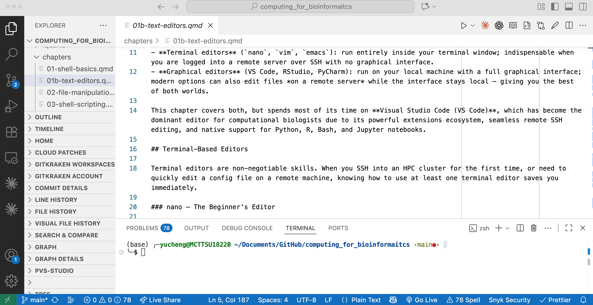

# Text Editors for Bioinformatics

## Why Your Choice of Editor Matters

Every bioinformatician writes text — shell scripts, Python analysis code, R notebooks, YAML configuration files, Markdown reports. The tool you use to write that text shapes how fast you work, how many mistakes you catch before they run, and whether your coding session feels fluid or frustrating.

Unlike in wet-lab work, where instruments are shared and often fixed, your text editor is a deeply personal, infinitely configurable tool. Choosing and mastering one pays dividends for years.

There are two worlds of text editors in bioinformatics:

- **Terminal editors** (`nano`, `vim`, `emacs`): run entirely inside your terminal window; indispensable when you are logged into a remote server over SSH with no graphical interface.
- **Graphical editors** (VS Code, RStudio, PyCharm): run on your local machine with a full graphical interface; modern options can also edit files *on a remote server* while the interface stays local — giving you the best of both worlds.

This chapter covers both, but spends most of its time on **Visual Studio Code (VS Code)**, which has become the dominant editor for computational biologists due to its powerful extensions ecosystem, seamless remote SSH editing, and native support for Python, R, Bash, and Jupyter notebooks.

## Learning Goals

By the end of this chapter, you should be able to:

1. Choose between terminal-based editors (`nano`, `vim`) and graphical editors (VS Code, RStudio) based on the task and the environment.
2. Use `nano` for quick edits and `vim` well enough to make a change on a server you do not control.
3. Configure VS Code with the extensions and settings most useful for bioinformatics work in Python, R, and Quarto.
4. Edit files on a remote HPC node using VS Code's Remote-SSH extension.
5. Recognize when an editor's defaults — encoding, line endings, tab/space conversion — can silently corrupt a bioinformatics file.

## Terminal-Based Editors

Being able to use a terminal editor is a non-negotiable skill. When you SSH into an HPC cluster for the first time, or need to quickly edit a config file on a remote machine, knowing how to use at least one will get you out of trouble immediately.

### nano — The Beginner's Editor

`nano` is installed on nearly every Linux system and has the most forgiving learning curve of any terminal editor. All key bindings are shown at the bottom of the screen.

```bash
nano script.sh          # open or create a file
nano +42 script.sh      # open and jump to line 42
```

Essential `nano` shortcuts (the `^` symbol means `Ctrl`):

| Shortcut | Action |
|----------|--------|
| `Ctrl+O` | Save the file ("Write Out") |
| `Ctrl+X` | Exit (`nano` will ask to save if there are changes) |
| `Ctrl+K` | Cut the current line |
| `Ctrl+U` | Paste the cut line |
| `Ctrl+W` | Search |
| `` Ctrl+\ `` | Search and replace |
| `Ctrl+G` | Open help |
| `Alt+U`  | Undo |

::: {.callout-tip}
## Pro-Tip: Enable Syntax Highlighting in nano

By default `nano` shows plain text. To enable syntax highlighting, add the following to your `~/.nanorc`:

```bash
include "/usr/share/nano/*.nanorc"
```

Or on macOS with Homebrew nano:

```bash
include "/opt/homebrew/share/nano/*.nanorc"
```

Now Python, Bash, and most common file types will render with color.
:::

### vim — The Ubiquitous Power Editor

`vim` (Vi IMproved) comes installed on virtually every Unix system and is the go-to editor for many HPC admins and senior bioinformaticians. Its learning curve is genuinely steep — but worth climbing, because `vim` keybindings also appear in `less`, `man` pages, and many other tools.

The critical concept: `vim` operates in **modes**. When you first open a file, you are in **Normal mode**, where keys are commands — not characters. You must explicitly enter **Insert mode** to type text.

```bash
vim script.sh        # open a file
```

The essential survival guide:

| Keystroke | Mode | Action |
|-----------|------|--------|
| `i` | Normal → Insert | Start typing before the cursor |
| `a` | Normal → Insert | Start typing after the cursor |
| `o` | Normal → Insert | Open a new line below and start typing |
| `Esc` | Insert → Normal | Return to Normal mode |
| `:w` | Normal (command) | Save the file |
| `:q` | Normal (command) | Quit |
| `:wq` | Normal (command) | Save and quit |
| `:q!` | Normal (command) | Quit without saving (force) |
| `/pattern` | Normal | Search for a pattern |
| `n` | Normal | Jump to next search match |
| `dd` | Normal | Delete current line |
| `u` | Normal | Undo |
| `gg` | Normal | Go to the first line |
| `G` | Normal | Go to the last line |
| `:42` | Normal | Go to line 42 |

::: {.callout-warning}
## The Most Common vim Mistake

New users type text in Normal mode and trigger random commands. The file fills with unexpected characters, or worse, gets deleted. If `vim` ever looks wrong, press `Esc` repeatedly until you are certain you are in Normal mode, then type `:q!` to exit without saving and start over.
:::

::: {.callout-note}
## vim vs. neovim

`neovim` (`nvim`) is a modern fork of `vim` with better extensibility, Lua-based configuration, and a growing plugin ecosystem (including LSP support for code completion). If you decide to invest in a terminal editor beyond the basics, `neovim` is the more future-proof choice. Everything in this vim section applies to `neovim` as well.
:::

## Visual Studio Code: The Modern Bioinformatics Editor

Visual Studio Code — usually called **VS Code** — is a free, open-source editor from Microsoft that has become the most popular coding environment across software engineering. For bioinformaticians, it offers three features that make it stand out:

1. **Remote SSH editing**: open and edit files on an HPC cluster from your local VS Code window, as if the files were local.
2. **Polyglot support**: excellent Python, R, Bash, YAML, and Jupyter notebook support through extensions.
3. **Integrated terminal**: run shell commands alongside your code without switching windows.

### Installation

Download VS Code from [code.visualstudio.com](https://code.visualstudio.com). It is available for macOS, Linux, and Windows.

- **macOS**: Download the `.zip`, unzip, and drag `Visual Studio Code.app` to `/Applications`.
- **Linux (Debian/Ubuntu)**: Download the `.deb` package and run `sudo dpkg -i code_*.deb`.
- **Linux (RPM/HPC)**: Download the `.rpm` and run `sudo rpm -i code_*.rpm`, or use the pre-built tarball if you do not have admin rights.

After installation, add the `code` command to your terminal by opening VS Code, pressing `Cmd+Shift+P` (macOS) or `Ctrl+Shift+P` (Linux/Windows), and running **Shell Command: Install 'code' command in PATH**.

```bash
code .                      # open VS Code in the current directory
code ~/projects/rnaseq/     # open a specific project folder
code script.py              # open a single file
```

### The VS Code Interface

When you open a project folder, you will see four main regions:

{fig-align="center" width="90%"}

- **Activity Bar**: the vertical icon strip on the far left. It opens Explorer,
  Search, Source Control, Extensions, and Remote SSH views.
- **Side Panel**: the panel next to the Activity Bar. It shows the file tree, search
  results, Git changes, or extension lists depending on which icon is active.
- **Editor Area**: the main workspace where files open. You can use tabs and split
  panes to view multiple files at once.
- **Status Bar**: the strip at the bottom. It shows useful context such as the current
  Git branch, selected Python/R interpreter, line and column, and file encoding.
- **Integrated Terminal**: a real shell session inside VS Code. Open it with
  `Ctrl+Backtick`.

::: {.callout-tip}
## Pro-Tip: Open a Folder, Not a File

VS Code works best when you open a **folder** (a project directory) rather than an individual file. Opening a folder gives you the file explorer, automatic Git integration, workspace settings, and extension features like workspace-level Python interpreter selection. Develop the habit of `cd` into your project directory and running `code .`.
:::

### Essential Keyboard Shortcuts

Learning a handful of keyboard shortcuts turns VS Code from a fancy notepad into an efficient coding environment.

- **Command Palette**: `Cmd+Shift+P` on macOS or `Ctrl+Shift+P` on Linux/Windows.
  Use this to run any VS Code command by name.
- **Quick file open**: `Cmd+P` or `Ctrl+P`. Fuzzy-search and open any file in the
  project.
- **Integrated terminal**: `Cmd+Backtick` or `Ctrl+Backtick`.
- **Toggle side panel**: `Cmd+B` or `Ctrl+B`.
- **Toggle line comment**: `Cmd+/` or `Ctrl+/`.
- **Select repeated text**: `Cmd+D` or `Ctrl+D` selects the current word; press it
  again to select the next occurrence.
- **Select all occurrences**: `Cmd+Shift+L` or `Ctrl+Shift+L`.
- **Move a line**: `Alt+Up` or `Alt+Down`.
- **Delete the current line**: `Cmd+Shift+K` or `Ctrl+Shift+K`.
- **Undo**: `Cmd+Z` or `Ctrl+Z`.
- **Rename a symbol**: `F2`.
- **Go to definition**: `F12`.
- **Search across the project**: `Cmd+Shift+F` or `Ctrl+Shift+F`.

The **Command Palette** (`Cmd+Shift+P`) is the most important shortcut — if you forget any other shortcut, open the palette and type what you want to do. It finds and runs almost any VS Code feature.

### Connecting to a Remote Server via SSH

This feature alone makes VS Code worth learning. **Remote-SSH** lets you open a folder on your HPC cluster in your local VS Code window. Your code runs on the server; VS Code simply renders the interface locally. You get full file exploration, syntax highlighting, code completion, and an integrated terminal — all pointed at the remote machine.

**Step 1: Install the Remote-SSH extension**

Open the Extensions panel (`Ctrl+Shift+X`), search for **"Remote - SSH"** (publisher: Microsoft), and click Install.

**Step 2: Configure your SSH host**

If you have not already, add your server to `~/.ssh/config` on your local machine:

```sshconfig
Host mycluster
    HostName hpc.university.edu
    User myusername
    IdentityFile ~/.ssh/id_rsa
```

Replace `hpc.university.edu`, `myusername`, and the key path with your actual values. If you have not set up SSH key authentication, do that first — it avoids typing your password on every reconnect:

```bash
# On your local machine — generate a key pair if you don't have one
ssh-keygen -t ed25519 -C "myusername@hpc"

# Copy the public key to the server (enter your password once)
ssh-copy-id myusername@hpc.university.edu
```

**Step 3: Open a remote folder**

Click the green **><** icon in the bottom-left corner of VS Code (the Remote indicator), choose **Connect to Host**, and select `mycluster`. VS Code will SSH into the server, install a small helper there, and reopen the window connected to the remote machine. Then use **File → Open Folder** to open your project directory on the cluster.

::: {.callout-note}
## What Runs Where

When connected via Remote-SSH, **everything runs on the server**: the integrated terminal, Python interpreter, linters, and installed extensions. Your local VS Code is just the interface. This means `python` in the terminal is the server's Python, not yours — which is exactly what you want when running bioinformatics pipelines.
:::

::: {.callout-warning}
## SSH Key Authentication Required

Remote-SSH does not work reliably with password authentication on clusters that require two-factor authentication (e.g., Duo). Set up SSH key authentication and, if your cluster requires it, configure SSH `ControlMaster` to multiplex connections:

```sshconfig
Host mycluster
    HostName hpc.university.edu
    User myusername
    IdentityFile ~/.ssh/id_rsa
    ControlMaster auto
    ControlPath ~/.ssh/cm-%r@%h:%p
    ControlPersist 10m
```

This keeps one connection alive for 10 minutes, so repeated operations (opening files, running extensions) do not each require a new authentication step.
:::

### Essential Extensions for Bioinformatics

VS Code's power comes from its extension ecosystem. Install extensions from the **Extensions panel** (`Ctrl+Shift+X`) or from the command line:

```bash
code --install-extension <extension-id>
```

#### Python Development

- **Python** (`ms-python.python`): IntelliSense, linting, debugging, and environment
  selection.
- **Pylance** (`ms-python.vscode-pylance`): fast type checking and rich autocomplete.
- **Jupyter** (`ms-toolsai.jupyter`): run `.ipynb` notebooks and interactive cells in
  `.py` files.
- **autopep8 / Black** (`ms-python.autopep8`): auto-format Python code on save.

#### R Development

- **R** (`REditorSupport.r`): syntax highlighting, code completion, and R terminal
  integration.
- **R Debugger** (`RDebugger.r-debugger`): step-through debugging for R scripts.

#### Data and File Formats

- **Rainbow CSV** (`mechatroner.rainbow-csv`): colorizes CSV/TSV columns and supports
  SQL-like queries.
- **Excel Viewer** (`GrapeCity.gc-excelviewer`): previews `.csv` and `.tsv` files as
  spreadsheets inside VS Code.
- **YAML** (`redhat.vscode-yaml`): YAML validation and autocomplete, especially useful
  for nf-core and workflow configuration files.
- **Better TOML** (`bungcip.better-toml`): syntax highlighting for TOML config files.

#### Shell and Git

- **ShellCheck** (`timonwong.shellcheck`): static analysis and error checking for Bash
  scripts.
- **GitLens** (`eamodio.gitlens`): inline Git blame, history explorer, and branch
  visualization.

#### Writing and Documentation

- **Quarto** (`quarto.quarto`): preview and render `.qmd` files directly in VS Code.
- **Markdown All in One** (`yzhang.markdown-all-in-one`): Markdown shortcuts, table
  formatting, and preview tools.

::: {.callout-tip}
## Pro-Tip: Install Extensions on the Remote, Not Just Locally

When using Remote-SSH, many extensions need to be installed **on the remote server** to work correctly. In the Extensions panel, look for the **"Install in SSH: mycluster"** button instead of the plain "Install" button. Python, Pylance, Jupyter, ShellCheck, and R should all be installed on the remote.
:::

### Python Workflows in VS Code

#### Selecting the Python Interpreter

VS Code must know which Python environment to use. Click the Python version indicator in the status bar (bottom of the screen) or press `Ctrl+Shift+P` and type **"Python: Select Interpreter"**. Choose your Conda environment or virtual environment.

```bash
# On the server — create a Conda environment for your project
conda create -n rnaseq \
    python=3.11 numpy pandas biopython
conda activate rnaseq

# VS Code will detect and list this environment
```

#### Running Code Interactively

VS Code supports running Python code interactively in two ways:

1. **Jupyter notebooks** (`.ipynb`): Open any notebook and run cells with `Shift+Enter`.
2. **Interactive Python in `.py` files**: Add `# %%` comment markers to any `.py` file to define "cells". Run them with `Shift+Enter` just like a notebook, but your code stays in a plain `.py` file — version-control friendly and pipeline-compatible.

```python
# %% [markdown]
# ## Load and Inspect Data

# %%
import pandas as pd

df = pd.read_csv("counts.tsv", sep="\t", index_col=0)
print(df.shape)
df.head()

# %%
# Normalize
df_norm = df.div(df.sum(axis=0), axis=1) * 1e6
df_norm.to_csv("counts_cpm.tsv", sep="\t")
```

Running this interactively shows the DataFrame output visually in the Interactive Window pane, while the file remains a plain `.py` script that can also be run from the command line with `python script.py`.

::: {.callout-note}
## Notebooks vs. Interactive .py Files

Jupyter notebooks (`.ipynb`) are powerful for exploration but can be messy in Git because they store cell outputs in the file. For a cleaner workflow, write your analysis in a `.py` file using `# %%` cell markers, and only export to `.ipynb` when sharing with collaborators who expect notebook format.
:::

### R Workflows in VS Code

The **R extension** (`REditorSupport.r`) provides syntax highlighting and code completion out of the box. For full interactive use, you need `radian`, a modern R console with multi-line editing and autocomplete:

```bash
# Install radian (a better R console)
pip install radian

# In VS Code settings, point the R extension
# to the radian binary.
```

After setup, open an `.R` file. Send a line to the R terminal with `Ctrl+Enter`, or send a selection with `Ctrl+Enter` as well. The R extension also provides:

- **{httpgd}** integration: R plots render in a VS Code panel instead of a separate window.
- **Code completion** for base R, tidyverse, and Bioconductor functions.
- **R Markdown / Quarto** preview when combined with the Quarto extension.

```bash
# Install httpgd from R for inline plot rendering
install.packages("httpgd")
```

### Git Integration

VS Code has first-class Git support built in (no extension needed). The **Source Control panel** (the branch icon in the Activity Bar, or `Ctrl+Shift+G`) shows:

- Uncommitted changes, staged vs. unstaged
- Diff view: click any changed file to see a side-by-side diff
- Commit box: write a message and commit with `Ctrl+Enter`
- Branch indicator in the status bar: click to create or switch branches

For the full workflow:

```bash
# These operations can all be done in VS Code's GUI,
# but knowing the CLI equivalents helps when debugging.
git status       # Source Control panel shows this visually
git diff         # click a file in Source Control to see the diff
git add .        # "Stage All Changes" in the Source Control panel
git commit -m    # commit message box in the panel
git push         # the "..." menu → Push
```

::: {.callout-tip}
## Pro-Tip: Use GitLens for Blame and History

The **GitLens** extension adds inline Git blame annotations — you can see who last modified each line and when, without leaving the editor. This is invaluable when you return to a script months later and need to understand why a filtering step was written a certain way.
:::

### The Integrated Terminal

Press `Ctrl+Backtick` to open VS Code's integrated terminal. This is a full shell session — not a simulation. You can run `bwa`, `samtools`, Snakemake pipelines, or any other command directly.

Multiple terminals can run simultaneously. Use the `+` button in the terminal panel to open additional sessions, or split the terminal with the split icon to see two sessions side by side.

::: {.callout-tip}
## Pro-Tip: Name Your Terminal Tabs

Right-click a terminal tab and select **Rename** to give it a meaningful name like `snakemake_run` or `interactive_python`. When you have four terminal sessions open, named tabs are much easier to navigate than numbered ones.
:::

### Workspace Settings and `.vscode/`

VS Code stores workspace-level configuration in a `.vscode/` folder at the root of your project. This is useful for sharing consistent settings with collaborators via Git.

#### `.vscode/settings.json`

Project-specific settings:

```json
{
  "python.defaultInterpreterPath": "/opt/conda/envs/rnaseq/bin/python",
  "editor.rulers": [79, 120],
  "editor.formatOnSave": true,
  "files.trimTrailingWhitespace": true,
  "[python]": {
    "editor.defaultFormatter": "ms-python.autopep8"
  },
  "[r]": {
    "editor.formatOnSave": false
  }
}
```

#### `.vscode/extensions.json`

Recommended extensions that VS Code will suggest to collaborators:

```json
{
  "recommendations": [
    "ms-python.python",
    "ms-python.vscode-pylance",
    "ms-toolsai.jupyter",
    "REditorSupport.r",
    "redhat.vscode-yaml",
    "timonwong.shellcheck",
    "mechatroner.rainbow-csv"
  ]
}
```

::: {.callout-note}
## Commit .vscode/extensions.json, Not settings.json

It is good practice to commit `.vscode/extensions.json` — it helps collaborators install the right extensions with one click. Be more cautious with `.vscode/settings.json`, as it may contain local paths (like the Python interpreter path) that differ between machines. Use a `.gitignore` entry or keep only portable settings in the committed version.
:::

### Useful Features for Daily Work

#### Multi-cursor Editing

Hold `Alt` and click in multiple places to place multiple cursors simultaneously. Everything you type is inserted at all cursor positions. This is especially useful for editing multiple lines of a TSV file, renaming multiple variables, or constructing repetitive command arguments.

#### File Search and Replace Across the Project

`Ctrl+Shift+F` opens the project-wide search. Click the arrow next to the search box to expand into "Search and Replace" mode. Use the regex toggle (`.*`) for pattern-based replacement — for example, to rename a variable across all Python scripts in your project.

#### Breadcrumbs

The bar above the editor shows the file path and your current location within the file (class → function → block). Click any segment to jump to that location or see siblings.

#### Outline View

In the Explorer panel, a collapsible "Outline" section shows all functions, classes, and section headings in the current file. For long analysis scripts, this is faster than scrolling.

#### Diff Editor

To compare any two files, open the Command Palette and run **"File: Compare Active File With..."**. VS Code opens a side-by-side diff. This is useful for comparing two versions of a pipeline script or two configuration files.

## Choosing the Right Editor for the Situation

The right editor depends on context, not ideology.

- For a quick edit on a remote server with no graphical interface, use `nano`; use
  `vim` if you are comfortable with it.
- For writing a Bash script directly on a server, use `nano` or `vim` in the terminal.
- For Python analysis on an HPC cluster, use VS Code with Remote-SSH.
- For R analysis and visualization, use VS Code with the R extension or RStudio.
- For Jupyter notebooks, use VS Code with the Jupyter extension or JupyterLab.
- For a large multi-file Python project, use VS Code.
- For a Nextflow or nf-core pipeline, use VS Code with YAML and shell-script support.
- For a quick one-line edit to a config file, use `nano`.

::: {.callout-tip}
## Pro-Tip: Learn Both Worlds

Do not fall into the trap of only knowing graphical editors. HPC clusters often do not allow graphical connections. A bioinformatician who can quickly edit a SLURM script in `vim` or `nano` without panicking is far more self-sufficient than one who needs VS Code for every edit. Invest a few hours in `nano` basics and `vim` survival skills — you will use them for the rest of your career.
:::

## Summary

- `nano` is easy, always available, and best for quick edits on remote machines.
- `vim` is ubiquitous, modal, and keyboard-driven. It is worth learning for remote
  editing and server work.
- VS Code is graphical and extensible, making it the best day-to-day editor for larger
  bioinformatics projects.
- VS Code with Remote-SSH gives you a local interface while your files, terminal, and
  code execution live on the HPC cluster.
- VS Code with the Jupyter extension supports exploratory analysis in `.py` files or
  `.ipynb` notebooks.

## Exercises

1. Open a terminal and create a new file called `hello.sh` using `nano`. Write a two-line Bash script that prints "Hello, bioinformatics!" and the current date using `date`. Save and exit. Make the script executable and run it.

2. Open `hello.sh` again, this time using `vim`. Practice entering Insert mode with `i`, typing a comment line at the top (`# My first script`), returning to Normal mode with `Esc`, and saving with `:wq`.

3. Install VS Code on your local machine. Open your terminal and verify that the `code` command is available by running `code --version`.

4. Configure an SSH host in your `~/.ssh/config` file for a server you have access to (your university HPC, a cloud VM, or a local machine with SSH enabled). Connect to it with VS Code Remote-SSH and open a project folder.

5. Install the Python and ShellCheck extensions in VS Code. Open `hello.sh` from Exercise 1 in VS Code. Does ShellCheck flag any warnings? Create a Python file `count_sequences.py` and type a few lines — observe how IntelliSense offers completions.

6. Open a project folder in VS Code that contains Python scripts. Use `Ctrl+Shift+F` to search for any variable name that appears in multiple files. Practice using multi-cursor editing (`Alt+Click`) to rename it in one file simultaneously across several lines.

7. Explore the VS Code Outline view for a Python script with several functions. Can you navigate to a specific function using the Outline panel rather than scrolling? What is the keyboard shortcut to navigate to a symbol by name?
