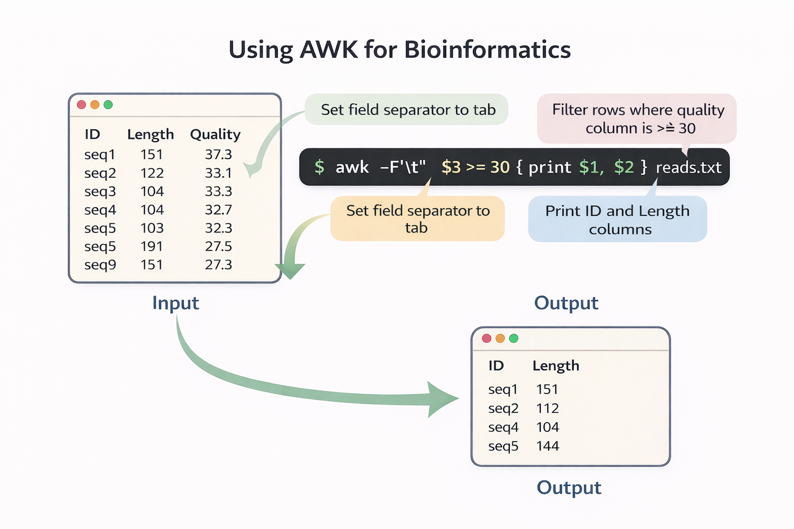
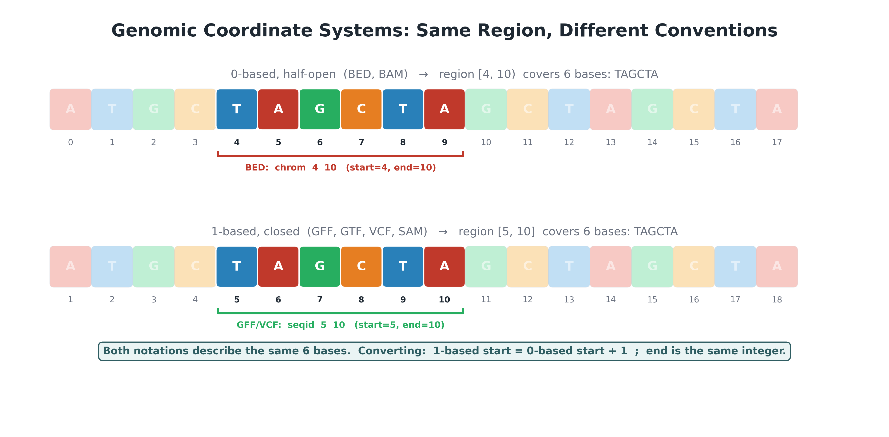

# File Manipulation

## Working with Files Every Day

A bioinformatician's daily work revolves around files: FASTA files of reference genomes, FASTQ files of sequencing reads, BAM files of alignments, VCF files of variants, and countless intermediate outputs. You need to know how to create, organize, view, search, and process these files efficiently from the command line.

This chapter covers the essential Unix file manipulation tools and introduces the biological file formats you will encounter most often.

## Learning Goals

By the end of this chapter, you should be able to:

1. Create, copy, move, and delete files and directories from the command line, including recursive operations.
2. Inspect file metadata (size, permissions, modification time) and change permissions and ownership when needed.
3. View, search, and stream the contents of plain-text and gzipped bioinformatics files without decompressing them to disk.
4. Compress and archive files with `gzip`, `bgzip`, and `tar`, and choose the right format for genomic data.
5. Recognize the most common biological file formats (FASTA, FASTQ, BAM, VCF, BED, GFF) and read them with standard Unix tools.
6. Recognize destructive command-line mistakes (recursive `rm`, accidental overwrite, lost output redirection) that destroy work on shared filesystems, and learn how to avoid them.

## Creating and Organizing Files

### Basic File and Directory Operations

```bash
touch notes.txt              # create an empty file (or update timestamp)
mkdir results                # create a directory
mkdir -p data/raw/fastq      # create nested directories in one command
cp genome.fa genome_backup.fa    # copy a file
cp -r results/ results_backup/   # copy a directory recursively
mv old_name.fa new_name.fa   # rename a file
mv data.txt ~/archive/       # move a file to another location
rm temp.txt                  # delete a file (no Trash — permanent!)
rm -r old_results/           # delete a directory recursively
rmdir empty_dir/             # delete an empty directory
```

::: {.callout-warning}
## `rm` Is Permanent

Unlike clicking "Delete" on a desktop, `rm` does not send files to a Trash folder — they are gone immediately. Use `rm -i` to prompt for confirmation before each deletion, or double-check with `ls` before running `rm -r` on a directory.

For important data, always keep backups. On an HPC cluster, never store data only in `/tmp` or scratch spaces — these are periodically wiped.
:::

### Symbolic Links {#sec-symlinks}

A **symbolic link** (symlink, or soft link) is a pointer to another file or directory. The symlink itself is tiny (just a path), but when you read from it, the system transparently follows the pointer to the actual data.

Symlinks are ubiquitous in bioinformatics because genomic data is large and often shared. A reference genome is 3 GB, a database of known variants might be 50 GB. You do not want ten lab members each keeping their own copy. Instead, one copy lives in a shared location, and everyone creates symlinks to it.

#### Creating Symlinks

```bash
# Syntax: ln -s <target> <link_name>

# Link to a shared reference genome — no 3 GB copy
ln -s /shared/databases/hg38.fa ./ref/genome.fa

# Link to an entire directory
ln -s /shared/databases/gatk_bundle ./ref/gatk

# Link multiple FASTQ files from a shared project
# directory into your working directory
ln -s /project/raw_data/*.fastq.gz ./data/
```

The `-s` flag means "symbolic." Without it, `ln` creates a **hard link** (discussed below). In practice, you will almost always use `ln -s`.

#### Identifying Symlinks

`ls -l` shows symlinks with an arrow (`->`) pointing to their target, and the file type is `l`:

```bash
ls -l ref/
# lrwxrwxrwx 1 user group 28 Apr 12 genome.fa -> /shared/databases/hg38.fa
# lrwxrwxrwx 1 user group 32 Apr 12 gatk -> /shared/databases/gatk_bundle
```

To see where a symlink points programmatically:

```bash
readlink ref/genome.fa
# /shared/databases/hg38.fa

# Follow the chain to the final target (if symlinks point to other symlinks)
readlink -f ref/genome.fa
# /shared/databases/hg38.fa
```

#### Absolute vs. Relative Targets

The target path in a symlink can be absolute or relative:

```bash
# Absolute — works regardless of where the link
# is moved
ln -s /shared/databases/hg38.fa ref/genome.fa

# Relative — interpreted relative to the link's
# location, not your current directory
cd ref/
ln -s ../shared_data/hg38.fa genome.fa
```

::: {.callout-warning}
## Relative Symlinks: The #1 Pitfall

When creating a relative symlink, the target path is relative to **the directory containing the link**, not your current working directory. This is a frequent source of broken links:

```bash
# You are in /home/user/project
# You want ref/genome.fa -> /home/user/shared_data/hg38.fa

# WRONG — this creates a link pointing to ./shared_data/hg38.fa
# inside ref/, which does not exist:
ln -s shared_data/hg38.fa ref/genome.fa

# CORRECT — the target is relative to ref/:
ln -s ../shared_data/hg38.fa ref/genome.fa

# SAFEST — use an absolute path to avoid confusion:
ln -s /home/user/shared_data/hg38.fa ref/genome.fa
```

When in doubt, use absolute paths. They never break when the link is moved within the filesystem.
:::

#### Broken Symlinks

A symlink can become **broken** (dangling) if its target is deleted, moved, or the path was wrong to begin with. Broken links still exist as files but lead nowhere:

```bash
# Create a link, then delete the target
ln -s /tmp/test_file.txt mylink.txt
rm /tmp/test_file.txt

ls -l mylink.txt
# lrwxrwxrwx 1 user group 19 Apr 12 10:45 mylink.txt -> /tmp/test_file.txt
# (the link exists, but the target does not)

cat mylink.txt
# cat: mylink.txt: No such file or directory

# Find all broken symlinks in a directory
find . -xtype l
```

To fix a broken symlink, remove it and recreate it with the correct target:

```bash
rm mylink.txt
ln -s /correct/path/test_file.txt mylink.txt
```

#### Common Bioinformatics Use Cases

| Use Case | Example |
|----------|---------|
| **Shared reference genomes** | `ln -s /shared/ref/hg38.fa ./ref/genome.fa` |
| **Shared annotation databases** | `ln -s /shared/databases/dbsnp ./ref/dbsnp` |
| **Staging data on scratch** | `ln -s /project/raw_data/*.fastq.gz /scratch/$USER/data/` |
| **Organizing multi-run data** | Link FASTQ files from multiple sequencing runs into one analysis directory |
| **Pinning tool versions** | `/usr/local/bin/python3 -> /usr/local/bin/python3.11` |

A practical example — setting up an RNA-seq project without duplicating any data:

```bash
mkdir -p rnaseq_project/{data,ref,results}

# Link shared reference files
ln -s /shared/ref/GRCh38.fa rnaseq_project/ref/genome.fa
ln -s /shared/ref/GRCh38.fa.fai rnaseq_project/ref/genome.fa.fai
ln -s /shared/ref/gencode.v44.annotation.gtf \
    rnaseq_project/ref/annotation.gtf
ln -s /shared/ref/star_index rnaseq_project/ref/star_index

# Link raw data from the sequencing core
ln -s /project/sequencing/run_2024_03/*.fastq.gz rnaseq_project/data/

# Check your setup
ls -lh rnaseq_project/ref/
# total 0   ← no disk space used; all files are symlinks
ls -lh rnaseq_project/data/
# Shows all FASTQ files, but they are links to the originals
```

::: {.callout-tip}
## Pro-Tip: Symlinks and Workflow Managers

Both Snakemake and Nextflow handle symlinks transparently. They follow the link and operate on the underlying file, so you can organize your project with symlinks and run pipelines without any special configuration. Nextflow uses symlinks internally in its `work/` directory to avoid copying large files between tasks.
:::

#### Symbolic Links vs. Hard Links

Unix supports two types of links. You will almost always use symbolic links, but understanding the difference is helpful:

| Feature | Symbolic Link (`ln -s`) | Hard Link (`ln`) |
|---------|------------------------|-------------------|
| What it stores | A path to the target | A direct pointer to the file's data on disk |
| Works across filesystems | Yes | No |
| Works for directories | Yes | No (on most systems) |
| Breaks if target is deleted | Yes (becomes dangling) | No (data persists until all hard links are removed) |
| Easy to identify | Yes (`ls -l` shows `->`) | No (looks like a regular file) |
| When to use | Almost always | Rare; advanced use cases |

```bash
# Hard link (rarely needed in bioinformatics)
ln original.txt hardlink.txt

# Symbolic link (the standard choice)
ln -s original.txt symlink.txt
```

::: {.callout-note}
## When to Use Symlinks

On HPC systems with shared parallel filesystems, copying a 50 GB reference database for every user and every project wastes storage quota and I/O bandwidth. Symlinks cost essentially zero storage and zero copy time. When 20 lab members all point to the same reference genome via symlinks, the cluster stores exactly one copy.
:::

## Viewing File Contents

### Displaying Files

```bash
cat genome.fa                # print the entire file to screen
head -20 reads.fastq         # first 20 lines (default is 10)
tail -20 reads.fastq         # last 20 lines
tail -n +2 file.tsv          # everything from line 2 onward (skip header)
less genome.fa               # page through large files (q to quit)
```

`less` is your best friend for large files. Key navigation shortcuts inside `less`:

| Key | Action |
|-----|--------|
| `Space` / `f` | Page forward |
| `b` | Page backward |
| `g` | Go to beginning |
| `G` | Go to end |
| `/pattern` | Search forward |
| `?pattern` | Search backward |
| `n` / `N` | Next / previous match |
| `q` | Quit |

::: {.callout-tip}
## Pro-Tip: `zless` and `zcat` for Compressed Files

Bioinformatics files are almost always compressed. You do not need to decompress them to inspect their contents:

```bash
zless reads.fastq.gz         # page through a gzipped file
zcat reads.fastq.gz | head   # view first 10 lines
zcat genome.fa.gz | grep ">" # list all sequence headers
```
:::

### Counting Lines, Words, and Characters

```bash
wc -l annotations.gff       # count lines
wc -c genome.fa              # count bytes (rough file size)
wc -w report.txt             # count words
```

`wc -l` is the standard way to count records in bioinformatics. For example:
```bash
grep -c "^>" sequences.fa    # count sequences in a FASTA file
# count reads in a FASTQ file (4 lines/read)
wc -l reads.fastq | awk '{print $1/4}'
```

### Identifying Files and Checking Metadata

File extensions are helpful, but they are not proof. A file named `reads.fastq.gz` might be corrupted, incomplete, or not actually compressed.

```bash
file reads.fastq.gz          # guess file type from contents
file aligned.bam             # identify binary alignment file
stat reads.fastq.gz          # size, timestamps, permissions, inode
ls -lh reads.fastq.gz        # quick human-readable size check
```

`stat` output differs slightly between Linux and macOS, but the idea is the same: inspect the filesystem metadata for a file.

### Checksums: Confirm File Integrity

Sequencing centers and public databases often provide checksum files. A checksum is a fingerprint of a file. If one byte changes, the checksum changes.

```bash
md5sum reads_R1.fastq.gz
sha256sum reference.fa.gz
```

On macOS, the commands may be:

```bash
md5 reads_R1.fastq.gz
shasum -a 256 reference.fa.gz
```

If you receive a file called `MD5SUMS.txt`, verify all files listed inside it:

```bash
md5sum -c MD5SUMS.txt
```

::: {.callout-tip}
## Pro-Tip: Check Raw Data Before Analysis

Run checksum validation before spending days on downstream analysis. A corrupted FASTQ file can produce confusing errors much later in a pipeline.
:::

## Wildcards and Globbing

Shell **wildcards** let you match multiple files by pattern, avoiding the need to type each name:

| Pattern | Matches |
|---------|---------|
| `*` | Zero or more characters |
| `?` | Exactly one character |
| `[abc]` | Any one character from the set |
| `[0-9]` | Any digit |
| `{a,b,c}` | Any of the listed alternatives (brace expansion) |

Examples:
```bash
ls *.fastq.gz                    # all gzipped FASTQ files
ls sample_?_R1.fastq             # sample_1_R1, sample_2_R1, etc.
ls sample_[0-9][0-9]_R1.fastq   # two-digit sample numbers
ls {*.bam,*.sam}                 # all BAM and SAM files
wc -l data/*.gff                 # count lines in all GFF files
```

::: {.callout-warning}
## Wildcard Pitfall: Unpredictable Order

When you use `*.fastq` in a loop or pipeline, the shell expands the pattern in **filesystem order**, which is not guaranteed to be consistent across systems or even runs. This has caused reproducibility errors in published studies. When the order matters (e.g., pairing R1 and R2 files), always build file lists explicitly from known sample names.
:::

## Searching Files with `grep`

`grep` searches for patterns within files. In bioinformatics, it is used constantly:

```bash
grep ">" sequences.fa               # find all FASTA header lines
grep -c ">" multifasta.fa           # count sequences (lines matching >)
grep -v "^#" variants.vcf           # exclude comment lines from VCF
grep -i "gene" annotation.txt       # case-insensitive search
grep -n "chr1" regions.bed          # show line numbers
grep -w "PASS" variants.vcf         # match whole word only
grep -E "^chr[0-9X]" regions.bed    # use extended regex
grep -A 1 ">" seqs.fa               # show header AND the line after it
```

### Regular Expressions

`grep` supports **regular expressions** — pattern-matching syntax more powerful than simple text search:

| Pattern | Matches |
|---------|---------|
| `^` | Start of line |
| `$` | End of line |
| `.` | Any single character |
| `*` | Zero or more of the preceding |
| `+` | One or more (with `-E`) |
| `[ATCG]` | Any nucleotide |
| `\t` | Tab character (with `-P`) |

Examples:
```bash
grep "^>" seqs.fa                   # headers that start the line with >
grep "ATCG$" seqs.fa                # sequences ending in ATCG
grep -P "\t" file.tsv               # lines containing tabs
grep -E "^(chr[0-9]+|chrX|chrY)" regions.bed   # standard chromosomes only
```

::: {.callout-tip}
## Pro-Tip: `grep -c` vs. `grep | wc -l`

Both `grep -c ">" file.fa` and `grep ">" file.fa | wc -l` count matches, but `grep -c` is faster because it does not pass output to a second process. Use `grep -c` when you only need the count.
:::

## Text Processing Tools

### `cut` — Extract Columns

`cut` extracts specific columns from delimited text files. This is ideal for tab-separated formats like BED, GFF, and VCF:

```bash
cut -f1,2,3 regions.bed             # extract columns 1, 2, 3
cut -f1 -d"," data.csv              # first column from a CSV file
cut -f4- annotations.gff            # column 4 to the end
```

### `sort` — Sort Lines

```bash
sort file.txt                        # sort alphabetically
sort -k2,2n regions.bed             # sort numerically by column 2
sort -k1,1 -k2,2n regions.bed      # sort by chr, then by start position
sort -t$'\t' -k5,5rn counts.tsv    # sort by column 5, numeric, descending
sort -u file.txt                    # sort and remove duplicates
```

Sorting genomic coordinates correctly requires `-k1,1` (sort chromosome alphabetically) then `-k2,2n` (sort start position numerically). This is the standard approach for producing sorted BED files.

### `uniq` — Collapse Duplicates

`uniq` collapses adjacent identical lines. It must be used on **sorted** input:

```bash
cut -f1 regions.bed | sort | uniq       # list unique chromosomes
# count occurrences of each chromosome
cut -f1 regions.bed | sort | uniq -c
cut -f1 regions.bed | sort | uniq -d    # show only duplicated lines
```

### `awk` — Column-Aware Processing

`awk` is a mini-programming language for processing columnar text. It processes a file **line by line**: for each line, it evaluates a `CONDITION` and, if true, executes an `ACTION`. Fields are automatically split and accessed as `$1`, `$2`, ..., `$NF` (last field), with `$0` representing the entire line.

{fig-align="center" width="88%"}

#### Always Set the Field Separator

By default, `awk` splits on any whitespace and collapses consecutive spaces — which silently shifts columns in tab-delimited files with empty fields. **Always** specify the delimiter explicitly:

```bash
awk -F '\t' '{ print $3 }' file.tsv    # correct: tab-delimited
awk -F ','  '{ print $2 }' file.csv    # comma-delimited CSV
```

#### Filtering Rows

```bash
# Filter BED file for features on chromosome 1
awk -F '\t' '$1 == "chr1"' regions.bed

# Filter GFF for exons longer than 1000 bp
awk -F '\t' '$3 == "exon" && $5 - $4 > 1000' annotation.gtf

# Keep only PASS variants in a VCF
awk -F '\t' '$7 == "PASS"' variants.vcf

# Pattern matching with ~
awk '$1 ~ /^chr[0-9]+$/' regions.bed    # standard autosomes only
```

#### Computing New Columns

```bash
# Compute gene length from GFF coordinates (col5 - col4)
awk -F '\t' '$3 == "gene" { print $1, $4, $5, $5-$4 }' annotation.gtf

# Normalize read counts (count / total * 1e6 = CPM)
awk -F '\t' 'NR > 1 { print $1, $2 / 1000000 }' counts.tsv

# Add a new column to a BED file (feature length)
awk -F '\t' 'OFS="\t" { print $0, $3-$2 }' regions.bed
```

#### `BEGIN` and `END` Blocks

`BEGIN` runs once before any input is read; `END` runs once after all input is processed. These are used for initialization and summaries:

```bash
# Count total reads and calculate mean length
awk 'NR % 4 == 2 { total += length($0); count++ }
     END { print "Reads:", count, "Mean length:", total/count }' reads.fastq

# Print a header line before output
awk 'BEGIN { print "chr\tstart\tend\tlength" }
     { print $1, $2, $3, $3-$2 }' OFS="\t" regions.bed

# Sum a column with a running total
awk -F '\t' '{ sum += $4 } END { print "Total bases covered:", sum }' \
    regions.bed
```

#### Special Variables

| Variable | Meaning |
|----------|---------|
| `$0` | The entire current line |
| `$1`, `$2`, ... | Fields (columns) |
| `$NF` | The last field |
| `NR` | Current line number (Number of Records) |
| `NF` | Number of fields on the current line |
| `FS` | Input Field Separator (same as `-F`) |
| `OFS` | Output Field Separator (default: space) |
| `ORS` | Output Record Separator (default: newline) |

#### Formatted Output with `printf`

For precise formatting, use `printf` (borrowed from C):

```bash
# Print aligned columns
awk -F '\t' '{ printf "%-20s %8d %8d\n", $1, $4, $5 }' annotation.gtf

# Scientific notation for small p-values
awk '{ printf "%s\t%.2e\n", $1, $5 }' results.tsv

# Fixed decimal places
awk '{ printf "Coverage: %.1f%%\n", $3/$4*100 }' stats.txt
```

#### Practical awk Pipelines

```bash
# Top 10 most-covered chromosomes in a BED file
cut -f1 regions.bed | sort | uniq -c | sort -rn | head -10

# Mean mapping quality from SAM file
samtools view aligned.bam \
    | awk '{ sum += $5; n++ } END { printf "Mean MAPQ: %.1f\n", sum/n }'

# Fraction of reads that are mapped
samtools flagstat aligned.bam \
    | awk '/mapped \(/ {
        split($0,a,"("); split(a[2],b,"%")
        print b[1]+0 "% mapped"
      }'

# Count genes per chromosome from GTF
awk -F '\t' '$3=="gene" { print $1 }' annotation.gtf \
    | sort | uniq -c | sort -rn
```

::: {.callout-tip}
## Pro-Tip: awk vs. Python for One-Liners

Use `awk` when the whole operation fits on one or two lines and involves column selection, filtering, or simple arithmetic. The advantage is that it is immediately readable in a pipeline and runs with zero startup overhead. When you need string parsing, data structures, or external libraries, switch to Python.

A good rule of thumb from *Bioinformatics Data Skills*: if you need to look at more than two `awk` manual pages to write the command, write a Python script instead.
:::

### `bioawk` — awk for Biological Formats

`bioawk` extends standard `awk` with built-in parsers for biological file formats (FASTA, FASTQ, SAM, BED, GFF, VCF). It automatically splits records into named fields:

```bash
# Install
conda install -c bioconda bioawk

# List FASTA headers and sequence lengths
bioawk -c fastx '{ print $name, length($seq) }' genome.fa

# Filter FASTQ reads by minimum length
bioawk -c fastx 'length($seq) >= 50 { print "@"$name"\n"$seq"\n+\n"$qual }' \
    reads.fastq

# Calculate GC content of each sequence
bioawk -c fastx '{
    gc = gsub(/[GCgc]/,"&",$seq)
    print $name, length($seq), gc/length($seq)*100
}' sequences.fa

# Count reads with mean quality >= 20
bioawk -c fastx '{
    q=0; for(i=1;i<=length($qual);i++) q+=ord(substr($qual,i,1))-33
    if(q/length($qual) >= 20) count++
} END { print count, "reads pass Q20" }' reads.fastq
```

Available `-c` modes: `fastx` (FASTA/FASTQ), `sam`, `bed`, `gff`, `vcf`, `hdr` (tab-separated with header).

::: {.callout-tip}
## Pro-Tip: `bioawk -c fastx` Replaces Many grep/awk Chains

Instead of chaining `grep "^>"` and `awk` to process FASTA files, `bioawk -c fastx` handles multi-line FASTA automatically and gives you named fields (`$name`, `$seq`, `$qual`). This avoids the common bug of accidentally reading a sequence that wraps across multiple lines.
:::

### `sed` — Stream Editing

`sed` (stream editor) performs text substitutions and transformations on the fly:

```bash
sed 's/chr/Chr/' regions.bed           # replace first "chr" on each line
sed 's/chr/Chr/g' regions.bed          # replace all occurrences
sed '/^#/d' variants.vcf               # delete comment lines
sed -n '10,20p' large_file.txt         # print only lines 10 to 20
sed 's/\t/,/g' data.tsv > data.csv    # convert TSV to CSV
```

### `tr` — Character Translation

`tr` changes or deletes individual characters. Use it for quick cleanup tasks:

```bash
tr '[:lower:]' '[:upper:]' < seq.txt       # uppercase sequence text
# remove Windows carriage returns
tr -d '\r' < windows_file.txt > unix_file.txt
# convert commas to tabs (simple CSV only)
tr ',' '\t' < data.csv > data.tsv
```

Use `tr` for simple character-level edits. Use `sed`, `awk`, Python, or R for structured formats where quoting and columns matter.

### Comparing Files and Lists

Bioinformatics work often involves checking whether two lists match: sample IDs in a sample sheet vs. FASTQ filenames, genes in one result vs. another, or chromosomes in a BED file vs. a reference.

#### `diff`

`diff` compares two files line by line:

```bash
diff expected_samples.txt observed_samples.txt
diff -u old_config.yaml new_config.yaml   # unified diff, easier to read
```

#### `comm`

`comm` compares two sorted files and reports lines unique to file 1, unique to file 2, and shared by both:

```bash
sort expected_samples.txt > expected.sorted.txt
sort observed_samples.txt > observed.sorted.txt

comm -23 expected.sorted.txt observed.sorted.txt  # expected but missing
comm -13 expected.sorted.txt observed.sorted.txt  # unexpected extras
comm -12 expected.sorted.txt observed.sorted.txt  # shared IDs
```

#### `paste`

`paste` combines files side by side:

```bash
paste sample_ids.txt conditions.txt
paste -d ',' sample_ids.txt conditions.txt > samples.csv
```

#### `join`

`join` merges two sorted tables by a key column:

```bash
sort -k1,1 gene_lengths.tsv > gene_lengths.sorted.tsv
sort -k1,1 de_results.tsv > de_results.sorted.tsv

join -t $'\t' -1 1 -2 1 gene_lengths.sorted.tsv de_results.sorted.tsv
```

For complex joins, use R or Python. For quick checks on sorted, simple tabular files, `join` is handy.

### `tee` — Save and View at the Same Time

`tee` writes output to both the screen and a file:

```bash
samtools flagstat sample.bam | tee results/sample.flagstat.txt
grep -v "^#" variants.vcf | wc -l | tee results/variant_count.txt
```

This is useful when you want a log of an interactive command without hiding the output from your terminal.

### `xargs` — Build Commands from Input

`xargs` turns lines of input into command arguments.

```bash
find data -name "*.fastq.gz" | xargs ls -lh
find results -name "*.tmp" | xargs rm
```

Use `-n` to control how many arguments are passed per command:

```bash
cat samples.txt | xargs -n 1 echo "Processing"
```

For filenames that may contain spaces, use null-separated input:

```bash
find data -name "*.fastq.gz" -print0 | xargs -0 ls -lh
```

::: {.callout-warning}
## Be Careful with `xargs rm`

Always preview before deleting:

```bash
find results -name "*.tmp" -print
find results -name "*.tmp" -print0 | xargs -0 rm
```

For complicated batch work, prefer a loop, GNU Parallel, Snakemake, or Nextflow so the commands are easier to audit.
:::

## Working with Compressed Files

Bioinformatics files are almost universally compressed to save storage space. The most common compression format is `gzip` (`.gz`):

```bash
gzip large_file.fa              # compress (replaces file with file.fa.gz)
gunzip large_file.fa.gz         # decompress
gzip -k large_file.fa           # compress but keep the original
gzip -l reads.fastq.gz          # show compression ratio and sizes
zcat reads.fastq.gz | head      # view without decompressing
zgrep "^>" seqs.fa.gz           # grep a compressed file
```

For genomics tools like `samtools` and `tabix`, **bgzip** (block gzip) is preferred because it allows random access to compressed files:

```bash
bgzip variants.vcf              # compress with block gzip
tabix -p vcf variants.vcf.gz   # create an index for random access
tabix variants.vcf.gz chr1:1000000-2000000  # fetch a specific region
```

### Working with Archives

When you receive a dataset or install software, you often get `.tar.gz` (tarball) files:

```bash
tar -czf archive.tar.gz data/           # create a compressed archive
tar -xzf archive.tar.gz                 # extract
tar -tzf archive.tar.gz                 # list contents without extracting
tar -xzf archive.tar.gz -C /target/dir  # extract to a specific directory
```

## Downloading Data

### `wget` and `curl`

Both `wget` and `curl` download files from the internet. They differ in defaults and philosophy:

```bash
# wget — simple, creates a local file automatically
wget https://ftp.ncbi.nlm.nih.gov/genomes/all/GCF/.../genome.fa.gz

# curl — flexible, prints to stdout by default
curl -O https://ftp.ncbi.nlm.nih.gov/genomes/all/GCF/.../genome.fa.gz
# -O: save to file, -L: follow redirects
curl -OL https://example.com/data.tar.gz
# stream directly into pipeline
curl https://example.com/file.fa.gz | zcat | head
```

::: {.callout-tip}
## Pro-Tip: Download and Inspect Without Storing

For large database files, you can stream through `curl` or `wget` directly into a pipeline without writing the compressed file to disk:

```bash
curl -s https://ftp.ncbi.nlm.nih.gov/genomes/all/GCF/.../genes.gff.gz \
    | zcat | grep "gene" | wc -l
```
:::

### `rsync` — Efficient File Synchronization

`rsync` is the preferred tool for transferring files between servers. Unlike `cp` or `scp`, it only transfers the parts of files that have changed:

```bash
# Basic syntax: rsync [options] source destination
rsync -avz data/ user@server:/home/user/data/      # upload to server
rsync -avz user@server:/results/ ./local_results/  # download from server
# --dry-run: preview without acting
rsync -avzn source/ dest/
# show progress for large files
rsync -avz --progress large_file.bam user@server:
```

The flags `-avz` mean: `-a` archive mode (preserves permissions, timestamps), `-v` verbose, `-z` compress during transfer.

::: {.callout-note}
## Slash or No Slash?

In `rsync`, whether the source has a trailing slash matters:

- `rsync -avz data/ server:/dest/` — copies the **contents** of `data/` into `server:/dest/`
- `rsync -avz data server:/dest/` copies the **directory** `data` into `server:/dest/`, creating `server:/dest/data/`

When in doubt, use `-n` (dry run) first to see what will happen.
:::

## Common Bioinformatics File Formats

You need to know these formats to manipulate them effectively.

### FASTA

Plain text format for sequences. Each record has a header line starting with `>` followed by one or more lines of sequence:

```
>sp|P68871|HBB_HUMAN Hemoglobin subunit beta
MVHLTPEEKSAVTALWGKVNVDEVGGEALGRLLVVYPWTQRFFESFGDLSTPDAVMGNPK
VKAHGKKVLGAFSDGLAHLDNLKGTFATLSELHCDKLHVDPENFRLLGNVLVCVLAHHFG
```

```bash
grep -c "^>" proteins.fa            # count sequences
grep "^>" proteins.fa | head        # list first few headers
awk '/^>/{count++} END{print count}' seqs.fa  # count sequences with awk
```

### FASTQ

Extends FASTA with quality scores. Each read is exactly 4 lines:

{fig-align="center" width="88%"}

```
@SRR519926.1 read1 length=101
ACGTACGTACGTACGTACGTACGTACGT...
+
IIIIIIIIIIIIIIIIIIIIIIIIIII...
```

Line 1: `@` + read name; Line 2: sequence; Line 3: `+` (separator); Line 4: quality scores (ASCII-encoded Phred scores).

```bash
wc -l reads.fastq | awk '{print $1/4}'  # count reads (4 lines per read)
head -8 reads.fastq                      # inspect first 2 reads
grep -c "^@" reads.fastq                 # count reads by counting @ headers
```

::: {.callout-warning}
## FASTQ Quality Encoding

Quality scores are encoded as ASCII characters with an offset. Most modern data (Illumina 1.8+) uses **Phred+33** (ASCII offset 33). Older data used Phred+64. A quality score of 30 means a 1-in-1000 chance of a base-calling error (99.9% accuracy). Tools like `FastQC` will tell you which encoding your data uses.
:::

### VCF (Variant Call Format)

Tab-separated format for genetic variants. Lines starting with `#` are headers:

```
##fileformat=VCFv4.2
#CHROM  POS     ID      REF  ALT  QUAL  FILTER  INFO
chr1    925952  rs2799066  G    A    100   PASS    DP=42;AF=0.5
```

```bash
grep -v "^#" variants.vcf | wc -l          # count variants
grep -v "^#" variants.vcf | awk '$7=="PASS"' | wc -l  # count PASS variants
# variants per chromosome
cut -f1 variants.vcf | grep -v "^#" | sort | uniq -c
```

### BED (Browser Extensible Data)

Zero-based, half-open intervals for genomic coordinates. Minimum 3 columns: chromosome, start, end:

```
chr1    0       1000    region1   100   +
chr1    2000    3500    region2   200   -
```

{fig-align="center" width="88%"}

::: {.callout-note}
## Zero-Based vs. One-Based Coordinates

BED and BAM files use **0-based, half-open** coordinates: `chr1 100 200` represents bases 101–200 (100 bases). GFF, GTF, VCF, and SAM use **1-based, closed** coordinates: `chr1 101 200` represents the same region. This off-by-one difference causes confusion and bugs. Always check which convention a tool uses.
:::

### GFF/GTF (Genome Feature Format)

9-column tab-separated format for genome annotations (genes, transcripts, exons):

```
chr1  Ensembl  gene  11869  14409  .  +  .  gene_id "ENSG00000223972"
```

```bash
grep -w "gene" annotation.gtf | wc -l         # count genes
awk '$3 == "exon"' annotation.gtf | wc -l     # count exons
cut -f1 annotation.gtf | sort | uniq -c       # features per chromosome
```

## Putting It Together: A File Manipulation Workflow

Here is a realistic example: you have received a raw VCF file and want to do some basic quality checks before proceeding:

```bash
# How many total variants?
grep -v "^#" raw.vcf | wc -l

# How many passed quality filters?
grep -v "^#" raw.vcf | awk '$7 == "PASS"' | wc -l

# What chromosomes are represented?
grep -v "^#" raw.vcf | cut -f1 | sort | uniq -c | sort -rn

# What types of variants are there? (look at REF and ALT lengths)
grep -v "^#" raw.vcf | awk 'length($4)==1 && length($5)==1' | wc -l  # SNPs
grep -v "^#" raw.vcf | awk 'length($4)!=length($5)' | wc -l          # indels

# Save PASS variants only to a new file
grep "^#" raw.vcf > filtered.vcf
grep -v "^#" raw.vcf | awk '$7 == "PASS"' >> filtered.vcf
```

## Summary

| Task | Tools |
|------|-------|
| Create/move/delete files | `touch`, `mkdir`, `cp`, `mv`, `rm` |
| View contents | `cat`, `head`, `tail`, `less`, `wc` |
| Inspect files | `file`, `stat`, `du`, `df`, `md5sum`, `sha256sum` |
| Wildcards | `*`, `?`, `[...]`, `{...}` |
| Search | `grep`, `grep -E`, `grep -P` |
| Column processing | `cut`, `sort`, `uniq`, `awk`, `paste`, `join` |
| Compare lists/files | `diff`, `comm` |
| Text editing | `sed`, `tr` |
| Batch command construction | `xargs`, `tee` |
| Compression | `gzip`, `bgzip`, `zcat`, `tar` |
| Download | `wget`, `curl`, `rsync` |

## Exercises

1. Download the human chromosome 22 annotation from Ensembl (GFF3 format). Count the total number of genes, the number of protein-coding genes, and the number of exons. Use only Unix tools (`grep`, `awk`, `cut`, `wc`).

2. From a multi-FASTA file of protein sequences:
   a. Count the total number of sequences
   b. List all unique sequence identifiers (header lines without the `>`)
   c. Find all sequences that contain the motif `GXXXG` (a common transmembrane helix motif)

3. Take a FASTQ file and extract every fourth line (the quality scores). Calculate the average ASCII value of all quality characters using `awk`. What is the average Phred score?

4. You have a BED file with ChIP-seq peaks. Use command-line tools to:
   a. Count peaks on each chromosome
   b. Calculate the total covered base pairs (sum of end - start for all regions)
   c. Find the 10 longest peaks

5. Use `rsync` in dry-run mode (`-n`) to preview what files would be transferred from one directory to another. Then run it without `-n` to actually transfer the files.

6. Compare `grep -c "^>" seqs.fa` and `grep "^>" seqs.fa | wc -l` for a large FASTA file. Do they give the same answer? Which is faster (try with `time`)?

7. Create a project directory with `data/`, `ref/`, and `results/` subdirectories. Use `ln -s` to symlink a reference genome file into `ref/` using an absolute path. Then create a second symlink using a relative path. Verify both with `ls -l`. Delete the original file — what happens to each symlink? Use `find . -xtype l` to identify the broken links.

8. Create two files: `expected_samples.txt` and `observed_samples.txt`. Sort both files and use `comm` to identify samples that are missing from the observed list.

9. Download or copy a small `.fastq.gz` file. Use `file`, `gzip -l`, and `md5sum` or `shasum -a 256` to inspect the file and record its checksum.

10. Use `find` and `xargs` to list all `.qmd` files in this book with human-readable file sizes. Preview the command before using `xargs`.
