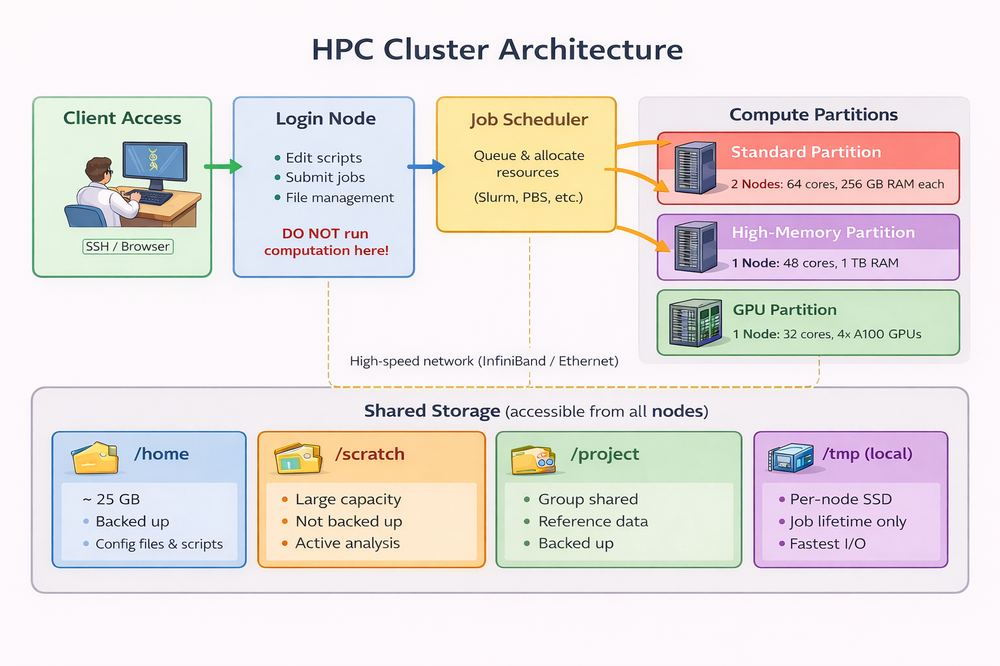
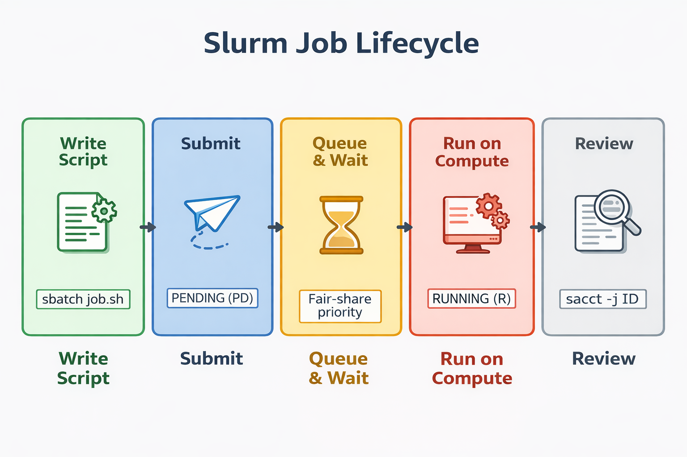

# Tufts HPC, SSH, and File Transfer

## Why Use HPC?

Modern bioinformatics often outgrows a laptop. Whole-genome sequencing datasets run to hundreds of gigabytes. RNA-seq projects contain dozens of FASTQ files. Tools like STAR, genome assemblers, and deep-learning models need more memory, CPU cores, or GPUs than most personal computers have.

The Tufts High-Performance Computing (HPC) cluster is a shared resource for Tufts students, staff, and researchers. It gives you login nodes for access, compute nodes where work actually happens, shared storage, pre-installed software modules, and the Slurm scheduler—so many people can run large jobs simultaneously without fighting over the same machine.

::: {.callout-note}
## The Big Rule

When you first connect to Tufts HPC, you are on a **login node**. Use login nodes for
logging in, editing files, moving data, and submitting jobs. Do not run real computation
there. All analysis jobs should run on **compute nodes** through Slurm.
:::

## Learning Goals

By the end of this chapter, you should be able to:

1. Explain the difference between your laptop, a login node, a compute node, and shared
   cluster storage.
2. Connect to Tufts HPC with `ssh`.
3. Transfer files with `sftp` and `rsync`.
4. Find your home and lab storage directories on Tufts HPC.
5. Submit, monitor, and cancel simple Slurm jobs.
6. Request an interactive compute session for testing commands.
7. Choose reasonable CPU, memory, time, and partition requests for small bioinformatics
   jobs.

## Tufts HPC Access

Before connecting, you need an active Tufts HPC account. If you are off campus, connect
to the Tufts VPN first. Tufts login may also require two-factor authentication.

Tufts provides two ways to access the cluster:

| Method | Best for |
|---|---|
| OnDemand web portal | Browser-based shell, Jupyter, RStudio, file browsing, small uploads/downloads |
| SSH from a terminal | Command-line work, scripts, Slurm jobs, `sftp`, `rsync` |

The current Tufts OnDemand portal is:

```text
https://ondemand-prod.pax.tufts.edu
```

This chapter focuses on the command-line route, since it's what you'll use most for reproducible bioinformatics workflows.

## What Is SSH?

**SSH** stands for Secure Shell. It's the standard way to open a secure terminal on a remote computer. Your keystrokes are encrypted in transit to the server.

For Tufts HPC, the SSH login host is:

```text
login-prod.pax.tufts.edu
```

From your laptop terminal:

```bash
ssh your_utln@login-prod.pax.tufts.edu
```

Replace `your_utln` with your Tufts username.

The first time you connect, SSH will ask whether you trust the host key. After that, you'll be prompted for your password and any 2FA step. A successful login puts you on one of the Tufts HPC login nodes, with a prompt like:

```text
[your_utln@login-prod-01 ~]$
```

The `~` means your home directory. On Tufts HPC, that is:

```text
/cluster/home/your_utln
```

::: {.callout-warning}
## Do Not Compute on Login Nodes

If your prompt contains `login-prod`, you are on a login node. Do not run aligners,
assemblers, large R/Python jobs, or other heavy programs there. Request a compute node
with Slurm first.
:::

## What Is SFTP?

**SFTP** stands for SSH File Transfer Protocol. It's the same secure connection as SSH, but gives you a file-transfer prompt instead of a shell.

Start SFTP from your laptop:

```bash
sftp your_utln@login-prod.pax.tufts.edu
```

Useful SFTP commands:

```bash
# Show where you are on the cluster
pwd

# Show where you are on your laptop
lpwd

# List files on the cluster
ls

# List files on your laptop
lls

# Move around on the cluster
cd /cluster/home/your_utln

# Move around on your laptop
lcd ~/Downloads

# Upload one file to the cluster
put sample_metadata.csv

# Download one file from the cluster
get results/summary.txt

# Leave SFTP
exit
```

SFTP works well for transferring a few files and for exploring what is on the cluster. For project directories or interrupted transfers, use `rsync`.

## Transferring Files With rsync

`rsync` uses SSH too, but it's built for real project work: it copies whole directories, shows progress, and can resume partial transfers. Run it from your laptop, not inside an SSH session.

Upload a local project directory to your Tufts HPC home directory:

```bash
rsync -avzP ~/bio196/rnaseq_demo/ \
  your_utln@login-prod.pax.tufts.edu:/cluster/home/your_utln/rnaseq_demo/
```

Download results back to your laptop:

```bash
rsync -avzP \
  your_utln@login-prod.pax.tufts.edu:/cluster/home/your_utln/rnaseq_demo/results/ \
  ~/bio196/rnaseq_demo/results/
```

Common flags:

| Flag | Meaning |
|---|---|
| `-a` | Archive mode: copy directories recursively and preserve file information |
| `-v` | Verbose: print what is being copied |
| `-z` | Compress during transfer |
| `-P` | Show progress and keep partial files so interrupted transfers can resume |

::: {.callout-important}
## Trailing Slash Matters

This copies the **contents** of `rnaseq_demo`:

```bash
rsync -avzP rnaseq_demo/ remote:rnaseq_demo/
```

This copies the **directory itself**, creating `rnaseq_demo/rnaseq_demo` on the remote
side if the destination already exists:

```bash
rsync -avzP rnaseq_demo remote:rnaseq_demo/
```
:::

## Tufts HPC Storage

Tufts HPC storage is shared across login and compute nodes. Copy a file to cluster storage once, and your job can access it from any node.

| Storage area | Tufts path | Use for |
|---|---|---|
| Home | `/cluster/home/your_utln` | Scripts, small data, notebooks, configuration files |
| Lab project storage | `/cluster/tufts/your_lab_name/your_utln` | Shared lab data, larger project inputs, final outputs |

Tufts home directories are fixed-size, meant for modest storage. If you're working with a lab, use lab project storage for larger datasets. Check usage with:

```bash
df -H /cluster/tufts/your_lab_name
```

Tufts also provides the `hpctools` helper on the cluster for checking storage usage and
quotas.

::: {.callout-warning}
## No Restricted Data

Tufts HPC documentation states that restricted data should not be stored on the HPC
cluster. If your project involves regulated or sensitive data, confirm the approved
storage and compute environment before transferring files.
:::

## Anatomy of Tufts HPC

{fig-align="center" width="95%"}

The pieces you will use most are:

| Component | What it does |
|---|---|
| Login node | Where SSH lands; used for editing, file management, and job submission |
| Compute node | Where analysis jobs actually run |
| Slurm | Scheduler that assigns jobs to compute nodes |
| Partition | A queue/group of compute nodes with similar purpose |
| Shared storage | Filesystems mounted on login and compute nodes |
| Modules | System for loading installed software |

Tufts public partitions currently include:

| Partition | Use |
|---|---|
| `batch` | Default CPU-only jobs |
| `gpu` | Jobs that need GPUs |
| `preempt` | Lower-priority jobs that may be stopped and need resubmission |

Some labs also have lab-specific partitions. You can see partitions available to you with:

```bash
sinfo
```

## Slurm: Running Work on Compute Nodes

On your laptop, a command runs right away. On a shared cluster, you request resources, then Slurm decides when and where your job starts.

{fig-align="center" width="95%"}

The most important Slurm commands are:

| Command | Purpose |
|---|---|
| `sbatch script.sh` | Submit a batch job |
| `squeue -u $USER` | Show your queued/running jobs |
| `scancel JOBID` | Cancel a job |
| `sacct -j JOBID` | Inspect a completed job |
| `srun --pty ... bash` | Start an interactive compute session |
| `sinfo` | Show partitions and node states |

## A First Tufts Slurm Job

Create a file called `hostname_job.sh` on the cluster:

```bash
nano hostname_job.sh
```

Put this in the file:

```bash
#!/bin/bash
#SBATCH --job-name=hostname_test
#SBATCH --partition=batch
#SBATCH --nodes=1
#SBATCH --ntasks=1
#SBATCH --cpus-per-task=1
#SBATCH --mem=2G
#SBATCH --time=00:05:00
#SBATCH --output=hostname_%j.out
#SBATCH --error=hostname_%j.err

echo "This job ran on:"
hostname

echo "Submitted from:"
echo "$SLURM_SUBMIT_DIR"

echo "Job ID:"
echo "$SLURM_JOB_ID"
```

Submit it:

```bash
sbatch hostname_job.sh
```

Check whether it is pending or running:

```bash
squeue -u $USER
```

When it finishes, inspect the output:

```bash
ls hostname_*.out
cat hostname_1234567.out
```

Your job output should show a compute-node hostname, not `login-prod`.

## Requesting an Interactive Session

Interactive sessions let you test commands before committing them to a script. Request one from a login node:

```bash
srun -p batch -t 00:30:00 --ntasks=1 --cpus-per-task=2 --mem=4G --pty bash
```

Once Slurm allocates resources, your prompt changes to a compute node. Now you can test commands safely. When you're done:

```bash
exit
```

The `exit` command releases the compute resources.

::: {.callout-tip}
## Test Interactively, Run Production With sbatch

Use `srun --pty bash` to debug commands. Once the command works, put it into a script and
submit it with `sbatch` so it can keep running even if your SSH connection closes.
:::

## Loading Software With Modules

Tufts HPC uses environment modules for its installed software. The list changes, so check what's available first:

```bash
# Search for available software
module spider fastqc
module avail samtools

# Start clean, then load what you need
module purge
module load samtools

# Check what is loaded
module list

# Check the executable
which samtools
samtools --version
```

For course work, you may also use Conda environments and containers in later chapters.
Modules are still useful because they provide cluster-supported tools and compilers.

## CPUs, Memory, and Time

The scheduler works best when your request matches what your job actually needs.

```bash
#SBATCH --ntasks=1
#SBATCH --cpus-per-task=8
#SBATCH --mem=16G
#SBATCH --time=02:00:00
```

For most bioinformatics programs:

- Use `--ntasks=1`.
- Use `--cpus-per-task` for threaded tools such as `bwa mem -t`, `STAR --runThreadN`,
  `fastqc -t`, or `samtools sort -@`.
- Set `--mem` to the total memory the job needs.
- Set `--time` to the maximum runtime. Jobs are stopped when they exceed this limit.

::: {.callout-important}
## More Resources Can Mean More Waiting

Requesting 64 cores for a tool that uses 1 core does not make it faster. It makes the job
harder to schedule and wastes shared resources. Test small, check actual usage, then scale
up.
:::

## Job Arrays for Many Samples

Job arrays are perfect when you need to run the same command across many samples. Here's how:

Create a file called `samples.txt`:

```text
sample01
sample02
sample03
```

Then create `array_demo.sh`:

```bash
#!/bin/bash
#SBATCH --job-name=array_demo
#SBATCH --partition=batch
#SBATCH --array=1-3
#SBATCH --ntasks=1
#SBATCH --cpus-per-task=1
#SBATCH --mem=1G
#SBATCH --time=00:05:00
#SBATCH --output=array_%A_%a.out

SAMPLE=$(sed -n "${SLURM_ARRAY_TASK_ID}p" samples.txt)

echo "Array job ID: $SLURM_ARRAY_JOB_ID"
echo "Array task ID: $SLURM_ARRAY_TASK_ID"
echo "Sample: $SAMPLE"
hostname
```

Submit it:

```bash
sbatch array_demo.sh
```

This creates one task per sample. In a real RNA-seq workflow, the same idea lets you run
FastQC, trimming, or alignment independently for each sample.

## Checking Completed Jobs

After a job finishes, use Slurm accounting to see what happened:

```bash
sacct -j 1234567 --format=JobID,JobName,Elapsed,MaxRSS,AllocCPUS,State,ExitCode
```

Useful fields:

| Field | Meaning |
|---|---|
| `Elapsed` | How long the job actually ran |
| `MaxRSS` | Peak memory used |
| `AllocCPUS` | CPUs allocated |
| `State` | Completed, failed, cancelled, timeout, etc. |
| `ExitCode` | `0:0` usually means success |

If your cluster has `seff` installed, it gives a compact efficiency report:

```bash
seff 1234567
```

## A Small Bioinformatics Example

Here's a realistic example: running FastQC on paired FASTQ files in a course directory. Adjust the paths for your own setup.

Start with this directory structure:

```bash
mkdir -p /cluster/home/$USER/bio196/rnaseq_demo/{fastq,qc,logs,scripts}
cd /cluster/home/$USER/bio196/rnaseq_demo
```

Upload FASTQ files from your laptop:

```bash
rsync -avzP ~/bio196/rnaseq_demo/fastq/ \
  your_utln@login-prod.pax.tufts.edu:/cluster/home/your_utln/bio196/rnaseq_demo/fastq/
```

On the cluster, create `samples.txt`:

```bash
ls fastq/*_R1.fastq.gz | sed 's|fastq/||; s|_R1.fastq.gz||' > samples.txt
```

Create `scripts/fastqc_array.sh`:

```bash
#!/bin/bash
#SBATCH --job-name=fastqc
#SBATCH --partition=batch
#SBATCH --array=1-4
#SBATCH --ntasks=1
#SBATCH --cpus-per-task=2
#SBATCH --mem=4G
#SBATCH --time=01:00:00
#SBATCH --output=logs/fastqc_%A_%a.out
#SBATCH --error=logs/fastqc_%A_%a.err

SAMPLE=$(sed -n "${SLURM_ARRAY_TASK_ID}p" samples.txt)

module purge
module load fastqc

fastqc -t ${SLURM_CPUS_PER_TASK} \
  "fastq/${SAMPLE}_R1.fastq.gz" \
  "fastq/${SAMPLE}_R2.fastq.gz" \
  -o qc/
```

Submit the job:

```bash
sbatch scripts/fastqc_array.sh
```

After it completes, download the QC reports:

```bash
rsync -avzP \
  your_utln@login-prod.pax.tufts.edu:/cluster/home/your_utln/bio196/rnaseq_demo/qc/ \
  ~/bio196/rnaseq_demo/qc/
```

## Common Mistakes

### Running on the Login Node

If you see `login-prod` in your prompt, stop and move to a compute node. Use `sbatch` for batch jobs or `srun --pty bash` for interactive testing.

### Using the Wrong Path

Always use full Tufts HPC paths in your transfer commands:

```text
/cluster/home/your_utln
/cluster/tufts/your_lab_name/your_utln
```

### Forgetting VPN Off Campus

If SSH or file transfer fails from home or a coffee shop, connect to the Tufts VPN and try
again.

### Requesting Too Much

Large requests wait longer in the queue. Start small, check `sacct` or `seff`, then scale up.

### Trusting `module load tool` Forever

Default module versions can change. For important analyses, record the version shown by
`module list` and the tool's own `--version` output.

## Quick Reference

Connect to Tufts HPC:

```bash
ssh your_utln@login-prod.pax.tufts.edu
```

Start SFTP:

```bash
sftp your_utln@login-prod.pax.tufts.edu
```

Upload a directory with `rsync`:

```bash
rsync -avzP local_dir/ \
  your_utln@login-prod.pax.tufts.edu:/cluster/home/your_utln/remote_dir/
```

Submit and monitor jobs:

```bash
sbatch script.sh
squeue -u $USER
scancel JOBID
sacct -j JOBID --format=JobID,JobName,Elapsed,MaxRSS,State,ExitCode
```

Start an interactive compute session:

```bash
srun -p batch -t 00:30:00 --ntasks=1 --cpus-per-task=2 --mem=4G --pty bash
```

Check Tufts storage:

```bash
pwd
df -H /cluster/tufts/your_lab_name
hpctools
```

## Summary

Tufts HPC work follows a simple pattern:

1. Connect from your laptop with `ssh your_utln@login-prod.pax.tufts.edu`.
2. Put files in `/cluster/home/your_utln` or your lab space under
   `/cluster/tufts/your_lab_name/your_utln`.
3. Transfer small files with `sftp` and project directories with `rsync`.
4. Use the login node only for light work.
5. Run computation on compute nodes through Slurm.
6. Test small, check resource usage, and scale up carefully.

## Exercises

1. Connect to Tufts HPC using `ssh your_utln@login-prod.pax.tufts.edu`. What hostname do
   you land on? Is it a login node or a compute node?

2. Use `pwd` after logging in. Confirm that your home directory is under
   `/cluster/home/your_utln`.

3. From your laptop, create a small text file and upload it with `sftp`. Then download it
   back to a different local folder.

4. Use `rsync -avzP` to upload a small directory to
   `/cluster/home/your_utln/bio196/rsync_test/`. Modify one file locally and run the same
   `rsync` command again. Which files are transferred the second time?

5. Submit the `hostname_job.sh` example. Check the output file and confirm that the job
   ran on a compute node.

6. Start an interactive session with 2 CPUs, 4 GB RAM, and 30 minutes. Run `hostname`,
   then exit to release the resources.

7. Run `sinfo`. Which partitions are visible to your account?

8. Submit the array demo and inspect the output files. Which Slurm variable identified
   the sample for each task?

## Further Reading

- [Tufts RT Guide: Cluster Login](https://rtguides.it.tufts.edu/hpc/access/20-cli.html)
- [Tufts RT Guide: File Transfers](https://rtguides.it.tufts.edu/hpc/access/40-xfer.html)
- [Tufts RT Guide: HPC Storage](https://rtguides.it.tufts.edu/hpc/access/30-storage.html)
- [Tufts RT Guide: Slurm Job Scheduler](https://rtguides.it.tufts.edu/hpc/slurm/index.html)
- [Tufts RT Guide: Partitions and Limits](https://rtguides.it.tufts.edu/hpc/compute/partition.html)
