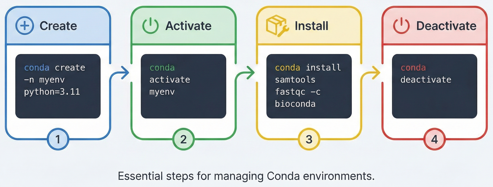
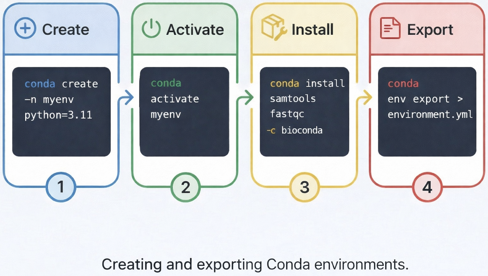

# Managing Software with Conda {#sec-conda}

## The Software Management Problem in Bioinformatics

Software management in bioinformatics is messier than most fields. You build a variant-calling pipeline that works perfectly on your laptop. You move to an HPC cluster and it silently fails—`bcftools` is a different version. Your colleague downloads your RNA-seq pipeline and immediately hits dependency conflicts. Or worse: a tool you installed months ago suddenly breaks because some shared library got upgraded.

This isn't a rare edge case. It happens constantly because bioinformatics tools have deep, tangled dependency trees. Python versions, C libraries, R packages, and compiled binaries all interact in ways that are hard to predict and even harder to fix once they break. The problem has a name: **dependency hell**.

**Conda** solves this by letting you create isolated software environments. Each environment is a self-contained directory with its own Python, its own libraries, its own executables—completely separate from your system Python and from every other environment you've made.

::: {.callout-note}
## Why Not Just Use `pip`?

`pip` installs Python packages only and has no concept of non-Python dependencies (C libraries, compiled binaries, R packages). `conda` handles the entire software stack — Python packages, R packages, C/C++ libraries, and standalone bioinformatics executables — all within a single, unified framework. For bioinformatics, this is essential.
:::

## Choosing the Right Installer

The conda ecosystem has several installers. Which one you pick matters now more than ever, thanks to a licensing change in 2024.

| Installer | Maintained By | License | Recommended? |
|-----------|--------------|---------|-------------|
| **Miniforge** | conda-forge community | BSD (free) | **Yes — default choice** |
| Miniconda | Anaconda, Inc. | Commercial terms (2024) | No (licensing) |
| Anaconda | Anaconda, Inc. | Commercial terms (2024) | No (too large + licensing) |

::: {.callout-warning}
## Anaconda Licensing Change (2024)

In spring 2024, Anaconda, Inc. updated its terms of service. Organizations with more than 200 employees using Miniconda, Anaconda, or the `defaults` channel now require a paid commercial license. For academic and HPC environments, this creates compliance risk.

**Use Miniforge instead.** Miniforge is maintained by the conda-forge community, uses the permissive BSD license, and pre-configures `conda-forge` as the default channel. It is now the community-recommended standard.
:::

### Installing Miniforge

```bash
# Download the installer for Linux (x86_64)
wget https://github.com/conda-forge/miniforge/\
releases/latest/download/Miniforge3-Linux-x86_64.sh

# Run the installer
bash Miniforge3-Linux-x86_64.sh

# Follow the prompts; accept the license,
# choose install path (default: ~/miniforge3).
# When asked "update your shell profile?" → yes

# Restart your shell, or source the initialization script
source ~/.bashrc   # or ~/.zshrc

# Verify
conda --version    # e.g., conda 24.x.x
mamba --version    # e.g., mamba 1.x.x
```

For macOS (Apple Silicon):
```bash
wget https://github.com/conda-forge/miniforge/\
releases/latest/download/Miniforge3-MacOSX-arm64.sh
bash Miniforge3-MacOSX-arm64.sh
```

::: {.callout-tip}
## Pro-Tip: HPC Clusters Without sudo

On shared HPC systems you do not have root access. That is fine — conda installs entirely in your home directory (`~/miniforge3` by default). No `sudo` is ever needed or appropriate. Never run `conda install` with `sudo`.

If disk quota is a concern on your home directory, install to a project directory:
```bash
bash Miniforge3-Linux-x86_64.sh -p /proj/mylab/software/conda
```
:::

## Setting Up Bioconda

Bioconda is a package repository (a "channel" in conda terms) with over 9,000 bioinformatics tools: `samtools`, `bcftools`, `STAR`, `BWA`, `FastQC`, `GATK`, `Trimmomatic`, `snakemake`, and many more. It's the center of the bioinformatics software world in conda.

{fig-align="center" width="88%"}

### Channel Configuration

```bash
# Add channels in this exact order (last added = highest priority)
conda config --add channels bioconda
conda config --add channels conda-forge

# Enforce strict channel priority — critical for reproducibility
conda config --set channel_priority strict

# Verify your configuration
conda config --show channels
# channels:
#   - conda-forge     ← highest priority
#   - bioconda
```

::: {.callout-important}
## The August 2024 `defaults` Removal

The bioconda project removed the `defaults` channel from its recommended configuration in August 2024 due to the Anaconda licensing change. If you previously had `defaults` in your channel list, remove it:

```bash
conda config --remove channels defaults
```

Using `channel_priority strict` combined with only `bioconda` and `conda-forge` ensures all packages come from open-licensed channels.
:::

## Conda Environments

The heart of conda is the **environment**: a self-contained directory with a specific Python version and a specific set of packages. When you activate it, conda rewires your `PATH` to use only that environment's executables.

{fig-align="center" width="92%"}

{fig-align="center" width="92%"}

### Creating Environments

```bash
# Create a named environment with a specific Python version
conda create -n rnaseq python=3.11

# Create with packages pre-installed (faster than installing afterward)
conda create -n rnaseq python=3.11 star=2.7.11 samtools=1.19 -c bioconda

# Create in a specific directory (useful for project-local envs on HPC)
conda create --prefix /proj/mylab/envs/rnaseq python=3.11
```

::: {.callout-tip}
## Pro-Tip: Pin Your Python Version

Always specify the Python version explicitly when creating an environment (`python=3.11`). This makes the environment reproducible and avoids unexpected upgrades when you later install packages.
:::

### Activating and Deactivating

```bash
# Activate by name
conda activate rnaseq

# Your prompt changes to show the active environment:
# (rnaseq) user@host:~$

# Activate by path
conda activate /proj/mylab/envs/rnaseq

# Return to base environment
conda deactivate

# List all environments
conda info --envs
# or
conda env list
# Output:
# base                  *  /home/user/miniforge3
# rnaseq                   /home/user/miniforge3/envs/rnaseq
# variant-call             /home/user/miniforge3/envs/variant-call
```

### Installing Packages

```bash
# Always activate the target environment first
conda activate rnaseq

# Install from bioconda
conda install -c bioconda samtools fastqc trimmomatic

# Install a specific version
conda install -c bioconda "samtools=1.19"

# Install R packages from bioconda/conda-forge
conda install -c conda-forge r-base=4.3
conda install -c bioconda bioconductor-deseq2

# Install Python packages (prefer conda over pip within conda environments)
conda install numpy pandas matplotlib

# If a package is only on PyPI and not in conda channels, pip is acceptable:
pip install some-pypi-only-package
```

::: {.callout-warning}
## Mixing pip and conda

Using `pip` inside a conda environment is generally safe, but do it last — install everything possible via `conda` first, then add pip-only packages. Mixing the two in the wrong order can break the environment's dependency solver. Never use `pip install --user` inside a conda environment.
:::

### Updating and Removing

```bash
# Update a package
conda update samtools

# Update all packages in the active environment
conda update --all

# Remove a package
conda remove fastqc

# Delete an entire environment
conda env remove -n old-env

# Clean cached packages (frees disk space)
conda clean --all
```

## The mamba Solver

Conda's original solver was slow. Resolving environments with dozens of packages could take minutes. **mamba** is a C++ rewrite of that solver that's dramatically faster.

Good news: since conda 23.10 (November 2023), conda uses the `libmamba` solver by default. You don't need to install mamba separately or call it explicitly. For Miniforge, `mamba` is also available as a drop-in replacement if you prefer:

```bash
# These are equivalent in modern conda (libmamba is default):
conda create -n rnaseq python=3.11 star samtools -c bioconda
mamba create  -n rnaseq python=3.11 star samtools -c bioconda

# If you're on an older conda, enable libmamba explicitly:
conda install -n base conda-libmamba-solver
conda config --set solver libmamba
```

For day-to-day use, you can continue using `conda` commands — the speed improvement is automatic. Use `mamba` explicitly if you prefer the faster terminal output feedback.

## Reproducible Environments

Conda's real superpower for science is the ability to **export and recreate environments exactly**. This is how you share your setup with collaborators and publish reproducible work.

{fig-align="center" width="88%"}

### Exporting Environments

There are two export strategies with different trade-offs:

```bash
# Strategy 1: Full export with exact versions and build strings
# Most reproducible, but platform-specific (Linux → Linux)
conda env export > environment.yml

# Strategy 2: Export only explicitly installed packages (recommended)
# Cross-platform compatible; conda resolves
# dependencies fresh on each platform
conda env export --from-history > environment.yml
```

A `--from-history` export looks like this:

```yaml
name: rnaseq
channels:
  - conda-forge
  - bioconda
dependencies:
  - python=3.11
  - star=2.7.11
  - samtools=1.19
  - fastqc=0.12
  - multiqc=1.19
  - bioconductor-deseq2=1.42
```

::: {.callout-tip}
## Pro-Tip: Commit `environment.yml` to Version Control

Store your `environment.yml` alongside your analysis scripts in git. This makes your computational environment as version-controlled and reproducible as your code. Reviewers and collaborators can recreate your exact software stack with a single command.
:::

### Recreating an Environment

```bash
# Create a new environment from the specification file
conda env create -f environment.yml

# Update an existing environment to match the file
conda env update -f environment.yml --prune
```

### conda-lock: Pinned Cross-Platform Reproducibility

For maximum reproducibility, especially on long-running projects or publications, use `conda-lock`. It pins every package, version, and build hash for each platform you target:

```bash
# Install conda-lock
conda install -c conda-forge conda-lock

# Generate lock files for Linux and macOS
conda-lock -f environment.yml -p linux-64 -p osx-arm64

# Creates: conda-lock.yml (multi-platform) or separate lock files
# Install from the lock file
conda-lock install --name rnaseq conda-lock.yml
```

The lock file captures every package with its exact version and cryptographic hash. You'll get identical software even years from now.

## Conda in Shell Scripts

Shell scripts that use `set -euo pipefail` (strict mode, which you should use) will fail when they hit `conda activate`. That's because `conda activate` is a shell function, not a standalone executable—it doesn't exist in non-interactive scripts.

The pattern from bioinformatics practice for using conda in scripts:

```bash
#!/usr/bin/env bash
set -euo pipefail

# Source the conda initialization script to make conda/activate available
# Adjust the path to match your Miniforge installation
CONDA_BASE=$(conda info --base 2>/dev/null || echo "$HOME/miniforge3")
source "${CONDA_BASE}/etc/profile.d/conda.sh"

# Now conda activate works
conda activate rnaseq

# Run your pipeline commands
STAR --runMode alignReads \
     --genomeDir /shared/genome/star_index \
     --readFilesIn "${SAMPLE}_R1.fastq.gz" "${SAMPLE}_R2.fastq.gz" \
     --readFilesCommand zcat \
     --outSAMtype BAM SortedByCoordinate \
     --outFileNamePrefix "results/${SAMPLE}/"

conda deactivate
```

For Slurm job scripts, the same pattern applies:

```bash
#!/usr/bin/env bash
#SBATCH --job-name=align
#SBATCH --cpus-per-task=16
#SBATCH --mem=64G
#SBATCH --time=4:00:00

set -euo pipefail

source ~/miniforge3/etc/profile.d/conda.sh
conda activate rnaseq

SAMPLE=$1
bwa mem -t 16 /shared/genome/hg38.fa \
    "data/${SAMPLE}_R1.fastq.gz" \
    "data/${SAMPLE}_R2.fastq.gz" \
    | samtools sort -@ 8 -o "results/${SAMPLE}.sorted.bam"

conda deactivate
```

## HPC-Specific Best Practices

### Shared Environments for a Lab Group

On HPC clusters, having everyone maintain their own copy of large environments is wasteful. A shared environment in a project directory saves disk space and setup time:

```bash
# An HPC admin or PI creates a shared environment
conda create --prefix /proj/mylab/envs/rnaseq-2024 \
    -c bioconda -c conda-forge \
    python=3.11 star=2.7.11 samtools=1.19 fastqc multiqc

# Lab members activate it directly
conda activate /proj/mylab/envs/rnaseq-2024
```

::: {.callout-tip}
## Pro-Tip: Add Shared Environments to conda's Search Path

Instead of typing the full path every time, add the shared environments directory to your conda path:
```bash
conda config --append envs_dirs /proj/mylab/envs

# Now you can activate by name
conda activate rnaseq-2024
```
:::

### Disk Quota Management

Large conda environments can hit hundreds of gigabytes. On HPC systems with home directory quotas, that's a real problem. Here's how to manage it:

```bash
# Check environment sizes
du -sh ~/miniforge3/envs/*

# Move an environment to a project directory
cp -r ~/miniforge3/envs/rnaseq /proj/mylab/envs/
rm -rf ~/miniforge3/envs/rnaseq

# Register the moved environment
conda config --append envs_dirs /proj/mylab/envs

# Clean package cache (the tarball cache can be large)
conda clean --packages --tarballs

# Check cache size
du -sh ~/miniforge3/pkgs/
```

### Do Not Mix Conda with Environment Modules

HPC clusters use `module load` (Lmod/Environment Modules) for software. Mixing `module load` with `conda activate` causes silent conflicts—both systems fighting over your `PATH`.

Pick one per project:

```bash
# Option A: Pure conda (recommended for Python/R-heavy workflows)
conda activate rnaseq
# All tools come from conda

# Option B: Pure modules (for system-installed tools managed by HPC admins)
module load samtools/1.19
# Do NOT conda activate at the same time

# If you must mix them, activate conda AFTER
# loading modules, and be alert to PATH conflicts
module load cuda/12.1   # GPU libraries from system
conda activate pytorch  # Python packages from conda
```

### Conda and MPI / GPU Software

Don't install MPI (OpenMPI, MPICH) from conda on HPC clusters. Cluster MPI is compiled for your specific interconnect hardware (InfiniBand, OmniPath), and you should use it via modules. GPU drivers work the same way.

```bash
# Wrong: installing conda MPI on an HPC cluster
conda install openmpi   # ← do not do this

# Correct: use system MPI from modules, conda for Python packages only
module load openmpi/4.1
conda activate my-mpi-env   # only Python/R packages here
```

## Quick Reference

### Common Conda Commands

```bash
# Environment management
conda create -n NAME python=3.11          # create environment
conda activate NAME                       # activate
conda deactivate                          # deactivate
conda env list                            # list all environments
conda env remove -n NAME                  # delete environment
conda env export --from-history > e.yml   # export (cross-platform)
conda env create -f e.yml                 # recreate from file

# Package management (always activate first)
conda install PKG                         # install latest
conda install "PKG=1.19"                  # install specific version
conda install -c bioconda PKG             # install from channel
conda update PKG                          # update package
conda remove PKG                          # remove package
conda list                                # list installed packages
conda search PKG                          # search for a package

# Maintenance
conda clean --all                         # clear caches
conda info                                # show configuration
conda config --show channels              # show channel list
```

### Finding Bioinformatics Packages

```bash
# Search on the command line
conda search -c bioconda samtools
conda search -c bioconda "star*"

# Or visit the bioconda package index at:
# https://bioconda.github.io/conda-package_index.html
```

::: {.callout-tip}
## Pro-Tip: Bioconda and the Biocontainers Project

Every bioconda package is automatically built as a **Docker/Singularity container** through the Biocontainers project. If you need to run a tool in a container (e.g., for a Snakemake/Nextflow workflow on HPC), you can pull the container directly:

```bash
# Pull a Singularity container from the biocontainers registry
singularity pull docker://quay.io/biocontainers/samtools:1.19--h50ea8bc_0

# Or reference it in a Snakemake rule:
# container: "docker://quay.io/biocontainers/fastqc:0.12.1--hdfd78af_0"
```

This makes conda and containers complementary, not competing, tools.
:::

## Complete Workflow Example: RNA-seq Setup

The following demonstrates a complete conda-based setup for an RNA-seq project, from environment creation to running the first quality-control step across multiple samples.

```bash
# ── Step 1: Create the project environment ────────────────────────────────
conda create -n rnaseq-project python=3.11 \
    -c bioconda -c conda-forge \
    star=2.7.11 \
    samtools=1.19 \
    fastqc=0.12.1 \
    multiqc=1.19 \
    trimmomatic=0.39 \
    subread=2.0.6 \
    -y   # skip the confirmation prompt

# ── Step 2: Export the environment for reproducibility ────────────────────
conda activate rnaseq-project
conda env export --from-history > environment.yml
git add environment.yml
git commit -m "Add conda environment specification for RNA-seq project"

# ── Step 3: Verify installations ──────────────────────────────────────────
STAR --version            # STAR_2.7.11a
samtools --version        # samtools 1.19
fastqc --version          # FastQC v0.12.1

# ── Step 4: Run QC in parallel using GNU parallel ─────────────────────────
# (conda activate is already done; parallel inherits the environment)
ls data/*.fastq.gz | parallel "fastqc {} -o qc/ -t 2"
multiqc qc/ -o qc/multiqc_report

# ── Step 5: Recreate on another machine ───────────────────────────────────
# (on a collaborator's system)
conda env create -f environment.yml
conda activate rnaseq-project
```

## Summary

Conda solves the dependency nightmare that makes bioinformatics software hard to install reliably and share. Here's what matters:

- **Miniforge**, not Miniconda or Anaconda. The licensing changed in 2024, and Miniforge keeps you safe.
- Configure **bioconda + conda-forge** with `channel_priority strict`. Remove `defaults` if you have it.
- One **named environment per project**. Keeps your dependencies isolated and sane.
- **libmamba** is conda's default solver now (≥23.10). Resolution is fast without extra steps.
- Export with `--from-history` for cross-platform reproducibility. Use **conda-lock** if you need absolute guarantees.
- On HPC: no `sudo`, watch your disk quota, explicitly source `conda.sh` in scripts, and don't mix conda with system MPI or GPU libraries.

## Exercises

1. Install Miniforge on your system. Verify that `conda --version` and `mamba --version` both report correctly.

2. Configure your channels: add `bioconda` and `conda-forge`, set `channel_priority strict`, and remove `defaults` if present. Confirm the setup with `conda config --show channels`.

3. Create an environment named `qc-env` with Python 3.11, `fastqc`, and `multiqc`. Activate it and run `fastqc --version` to verify.

4. Export `qc-env` with `--from-history` to a file named `qc-environment.yml`. Open the file and inspect its contents. What version of Python was recorded?

5. Deactivate `qc-env` and create a second environment, `trim-env`, with `trimmomatic` and `cutadapt`. List all environments with `conda env list`.

6. Write a bash script called `run-qc.sh` that: (a) sources the conda initialization script, (b) activates `qc-env`, (c) runs `fastqc` on a sample FASTQ file of your choice. Test that the script works when called as `bash run-qc.sh` (not in an interactive shell).

7. On an HPC system (or by simulating the constraint): install Miniforge to a directory outside your home folder using the `-p` flag. Configure conda to search that directory for environments.

8. Search for the `bwa` aligner on bioconda using `conda search`. What is the most recent version available? Install it into a new environment named `align-env`.
