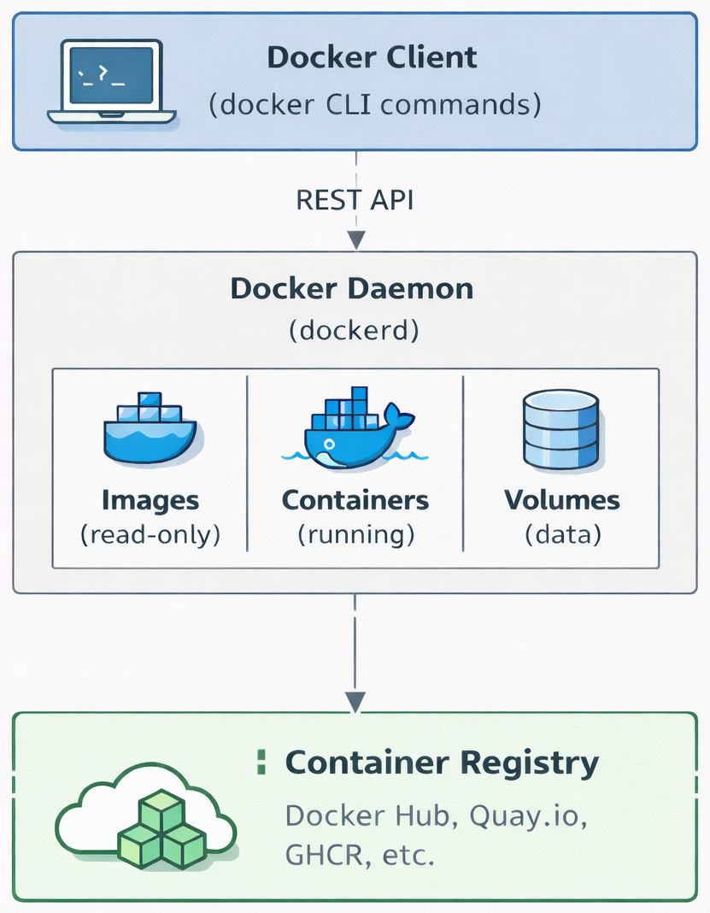

# Docker: Packaging Bioinformatics Software

## The Portability Problem

You have spent weeks tuning an RNA-seq pipeline on your laptop. It calls `STAR` for alignment, `featureCounts` for quantification, and a custom Python script that depends on `pandas 2.1`, `numpy`, and a specific version of `pysam`. Everything works. Then you hand the pipeline to a collaborator, and it immediately breaks — their `pysam` version is too old, their `STAR` was compiled against different libraries, and their system Python is 3.8 instead of 3.11.

Conda (@sec-conda) solves this at the *environment* level by isolating packages and their dependencies. Containers, though, go much further. They package the **entire operating system** — the kernel interface, system libraries, compilers, and user-space tools — into a single portable artifact. A container built on your laptop will behave identically on your collaborator's Mac, on a cloud VM, or on an HPC cluster, because it carries its own world with it.

**Docker** is the most widely used container platform and underpins most bioinformatics container ecosystems. This chapter covers how to use Docker to run, build, and share containerized bioinformatics tools.

::: {.callout-note}
## Containers vs. Virtual Machines

Containers are *not* virtual machines. A virtual machine (VM) runs a complete guest operating system on emulated hardware — it boots its own kernel. A container shares the host's Linux kernel and only isolates the user-space environment (libraries, binaries, files). This makes containers:

- **Lighter**: a container image is typically 50–500 MB vs. several GB for a VM
- **Faster to start**: milliseconds vs. minutes
- **More efficient**: no hardware emulation overhead

The trade-off is that containers provide weaker isolation than VMs. For scientific computing, this is rarely a concern — the goal is portability and reproducibility, not security sandboxing.
:::

## Docker Architecture

Docker has several key components that work together. Knowing how they interact will help you understand what happens when you run commands.

{fig-align="center" width="65%"}

- **Docker Client**: the `docker` command-line tool. It sends instructions to the daemon.
- **Docker Daemon** (`dockerd`): the background service that builds, runs, and manages containers. It requires root privileges, which is why Docker is generally not available on shared HPC clusters (see @sec-singularity-apptainer for the HPC alternative).
- **Images**: read-only templates that define the filesystem and configuration for a container. Built from a `Dockerfile`.
- **Containers**: running instances of images. You can run multiple containers from the same image.
- **Registries**: remote repositories where images are stored and shared (Docker Hub, Quay.io, GitHub Container Registry).

## Installation

### Docker Desktop (macOS / Windows)

Download Docker Desktop from [docker.com](https://www.docker.com/products/docker-desktop/). It bundles the Docker daemon, CLI, and a lightweight Linux VM (since Docker containers require a Linux kernel).

After installation, verify:

```bash
docker --version
# Docker version 27.x.x, build ...

docker run hello-world
# Should print "Hello from Docker!" and confirm the installation works
```

### Linux

On Linux, Docker runs natively. Install via your package manager:

```bash
# Ubuntu / Debian
sudo apt-get update
sudo apt-get install docker-ce docker-ce-cli containerd.io

# Add yourself to the docker group (avoids needing sudo for every command)
sudo usermod -aG docker $USER
# Log out and back in for this to take effect
```

::: {.callout-warning}
## Docker on HPC Clusters

Most HPC clusters **do not allow Docker** because the Docker daemon runs as root — a security risk on shared systems. If you need containers on an HPC cluster, use **Apptainer/Singularity** instead (covered in the next chapter). You can still *build* your images with Docker on your local machine and then convert them for use on HPC.
:::

## Images and Containers

*Images* and *containers* are two different things:

| Concept | Analogy | Characteristics |
|---------|---------|-----------------|
| **Image** | A recipe or blueprint | Read-only, versioned, shareable |
| **Container** | A dish made from the recipe | Writable, temporary, running instance |

You build an image once, then use it to spawn many containers. Each container runs independently, and when it stops or is deleted, any changes inside it are lost. The original image remains unchanged unless you explicitly save data to a volume mounted on your host machine.

### Image Naming Convention

Images are named using a consistent scheme:

```
[registry/]repository:tag
```

Here are some examples:

| Full Name | Registry | Repository | Tag |
|-----------|----------|------------|-----|
| `ubuntu:22.04` | Docker Hub (default) | `ubuntu` | `22.04` |
| `biocontainers/samtools:v1.9-4-deb_cv1` | Docker Hub | `biocontainers/samtools` | `v1.9-4-deb_cv1` |
| `quay.io/biocontainers/fastqc:0.12.1--hdfd78af_0` | Quay.io | `biocontainers/fastqc` | `0.12.1--hdfd78af_0` |

::: {.callout-tip}
## Pro-Tip: Always Pin Your Tags

Never use the `latest` tag in production or in a publication-bound pipeline. `latest` is a moving target — the image it points to today may differ from what it pointed to six months ago. Always specify an explicit version tag to ensure reproducibility:

```bash
# Bad — not reproducible
docker pull biocontainers/samtools:latest

# Good — pinned version
docker pull biocontainers/samtools:v1.9-4-deb_cv1
```
:::

## Essential Docker Commands

### Pulling Images

```bash
# Pull an image from Docker Hub
docker pull biocontainers/samtools:v1.9-4-deb_cv1

# Pull from Quay.io (many BioContainers are hosted here)
docker pull quay.io/biocontainers/fastqc:0.12.1--hdfd78af_0
```

### Running Containers

```bash
# Run a command inside a container and remove it when done
docker run --rm biocontainers/samtools:v1.9-4-deb_cv1 samtools --version

# Start an interactive shell inside a container
docker run --rm -it ubuntu:22.04 /bin/bash
```

Key flags:

| Flag | Purpose |
|------|---------|
| `--rm` | Automatically remove the container when it exits |
| `-it` | Interactive mode with a terminal (for shell access) |
| `-d` | Run in the background (detached mode) |
| `--name mycontainer` | Assign a name for easy reference |

### Mounting Local Data

Containers are isolated from the host filesystem by default. To give a container access to your data, use **bind mounts** with the `-v` flag:

```bash
# Mount the current directory's "data" folder into /data inside the container
docker run --rm \
  -v $(pwd)/data:/data \
  biocontainers/samtools:v1.9-4-deb_cv1 \
  samtools sort /data/input.bam -o /data/sorted.bam
```

The syntax is `-v host_path:container_path`. The container reads and writes to `/data`, but the files actually live in `./data` on your host.

::: {.callout-warning}
## File Permissions

Processes inside a Docker container often run as root by default. Files created inside a bind mount will be owned by root on the host, which can cause permission headaches. Use the `--user` flag to run as your own UID:

```bash
docker run --rm \
  --user $(id -u):$(id -g) \
  -v $(pwd)/data:/data \
  biocontainers/samtools:v1.9-4-deb_cv1 \
  samtools index /data/sorted.bam
```
:::

### Managing Images and Containers

```bash
# List downloaded images
docker images

# Remove an image
docker rmi biocontainers/samtools:v1.9-4-deb_cv1

# List running containers
docker ps

# List all containers (including stopped)
docker ps -a

# Stop a running container
docker stop mycontainer

# Remove a stopped container
docker rm mycontainer

# Clean up unused images, containers, and build cache
docker system prune
```

## Writing a Dockerfile {#sec-dockerfile}

A `Dockerfile` is a plain-text recipe that defines how to build a Docker image. Each instruction creates a **layer** — a cached, read-only snapshot of the filesystem. Docker reuses unchanged layers on subsequent builds, making rebuilds fast.

### Basic Structure

```dockerfile
# Base image — start from an existing image
FROM ubuntu:22.04

# Metadata
LABEL maintainer="your.email@example.com"
LABEL description="Variant calling tools for WGS analysis"

# Install system dependencies
RUN apt-get update && apt-get install -y --no-install-recommends \
    wget \
    build-essential \
    zlib1g-dev \
    libbz2-dev \
    liblzma-dev \
    libcurl4-openssl-dev \
    && rm -rf /var/lib/apt/lists/*

# Install samtools from source
RUN wget https://github.com/samtools/samtools/releases/\
download/1.20/samtools-1.20.tar.bz2 \
    && tar xjf samtools-1.20.tar.bz2 \
    && cd samtools-1.20 \
    && make \
    && make install \
    && cd .. \
    && rm -rf samtools-1.20 samtools-1.20.tar.bz2

# Set the working directory
WORKDIR /workspace

# Default command when the container starts
CMD ["/bin/bash"]
```

### Key Dockerfile Instructions

| Instruction | Purpose | Example |
|-------------|---------|---------|
| `FROM` | Set the base image | `FROM ubuntu:22.04` |
| `RUN` | Execute a command during build | `RUN apt-get install -y samtools` |
| `COPY` | Copy files from host into the image | `COPY scripts/ /opt/scripts/` |
| `ENV` | Set an environment variable | `ENV PATH="/opt/tools:$PATH"` |
| `WORKDIR` | Set the working directory | `WORKDIR /workspace` |
| `CMD` | Default command when container starts | `CMD ["/bin/bash"]` |
| `ENTRYPOINT` | Fixed executable (arguments appended) | `ENTRYPOINT ["samtools"]` |
| `LABEL` | Add metadata | `LABEL version="1.0"` |
| `EXPOSE` | Document a network port | `EXPOSE 8888` |

### ENTRYPOINT vs. CMD

Both of these instructions affect what happens when a container starts, but they work differently:

- **CMD** provides a default command that users can override completely.
- **ENTRYPOINT** sets a fixed executable, and user arguments are *appended* to it.

```dockerfile
# CMD approach — user can override everything
CMD ["samtools", "sort"]
# docker run myimage                    → runs "samtools sort"
# docker run myimage samtools index
#   → runs "samtools index" (CMD replaced)

# ENTRYPOINT approach — tool is fixed, user provides arguments
ENTRYPOINT ["samtools"]
CMD ["--help"]
# docker run myimage                    → runs "samtools --help"
# docker run myimage sort input.bam     → runs "samtools sort input.bam"
```

For bioinformatics tool containers, `ENTRYPOINT` is often the better choice — it makes the container behave like the tool itself.

### Building and Tagging

```bash
# Build from the Dockerfile in the current directory
docker build -t my-variant-tools:v1.0 .

# Tag with a registry prefix for pushing
docker tag my-variant-tools:v1.0 username/my-variant-tools:v1.0
```

The `-t` flag assigns a name and tag. The `.` tells Docker to use the current directory as the build context (where it looks for the `Dockerfile` and any files referenced by `COPY`).

### Using Conda in a Dockerfile

In bioinformatics, many of the tools you want are already packaged in Bioconda. Starting from a Conda base image is usually the quickest way to build a working container:

```dockerfile
FROM condaforge/miniforge3:latest

LABEL maintainer="your.email@example.com"
LABEL description="RNA-seq quantification pipeline"

# Create a conda environment with pinned versions
RUN mamba create -n rnaseq -y \
    -c bioconda -c conda-forge \
    star=2.7.11b \
    subread=2.0.6 \
    samtools=1.20 \
    multiqc=1.22 \
    && mamba clean -a -y

# Activate the environment by default
ENV PATH="/opt/conda/envs/rnaseq/bin:$PATH"

WORKDIR /workspace
CMD ["/bin/bash"]
```

::: {.callout-tip}
## Pro-Tip: Use `mamba` Over `conda` in Dockerfiles

`mamba` is a drop-in replacement for `conda` that resolves dependencies much faster. The `condaforge/miniforge3` base image includes `mamba` by default. Use it in your `RUN` commands to speed up builds significantly.
:::

## Multi-Stage Builds {#sec-multistage}

Many bioinformatics tools need compilers, development headers, and build tools during compilation, but you don't need any of that after the binary is built. A **multi-stage build** lets you compile in one stage and then copy only the final binary into a clean, smaller stage for production:

```dockerfile
# Stage 1: Build
FROM ubuntu:22.04 AS builder

RUN apt-get update && apt-get install -y \
    build-essential wget zlib1g-dev \
    libbz2-dev liblzma-dev libcurl4-openssl-dev

RUN wget https://github.com/samtools/samtools/releases/\
download/1.20/samtools-1.20.tar.bz2 \
    && tar xjf samtools-1.20.tar.bz2 \
    && cd samtools-1.20 \
    && ./configure --prefix=/opt/samtools \
    && make \
    && make install

# Stage 2: Runtime (much smaller)
FROM ubuntu:22.04

RUN apt-get update && apt-get install -y --no-install-recommends \
    libcurl4 zlib1g libbz2-1.0 liblzma5 \
    && rm -rf /var/lib/apt/lists/*

# Copy only the compiled binary from the builder stage
COPY --from=builder /opt/samtools /opt/samtools
ENV PATH="/opt/samtools/bin:$PATH"

WORKDIR /workspace
CMD ["/bin/bash"]
```

The final image contains only the runtime libraries and compiled binary — no compiler, no source code, no build dependencies. This can reduce image size from gigabytes to hundreds of megabytes.

## Dockerfile Best Practices

Follow these practices to build smaller, faster, more reproducible images:

1. **Combine `RUN` commands with `&&`.** Each `RUN` instruction creates a layer in your image. If you combine related commands into a single `RUN`, you'll have fewer layers and smaller images. This matters especially when you install packages and then clean up caches in the same step.

    ```dockerfile
    # Good — single layer, cache cleaned
    RUN apt-get update && apt-get install -y --no-install-recommends \
        samtools bcftools \
        && rm -rf /var/lib/apt/lists/*

    # Bad — cleanup happens in a separate layer, so the cache still exists in a previous layer
    RUN apt-get update && apt-get install -y samtools bcftools
    RUN rm -rf /var/lib/apt/lists/*
    ```

2. **Order instructions from stable to volatile.** Docker caches layers from top to bottom. Put your stable layers first — like OS package installation — and save your frequently changing layers for last, such as your scripts. That way, rebuilds can reuse the cached base without recomputing everything from scratch.

3. **Use `--no-install-recommends`** with `apt-get` to skip optional packages and keep the image lean.

4. **Pin all versions.** Always specify exact versions for base images, packages, and tools. If you don't, unversioned installs will silently change as new releases come out, breaking your reproducibility.

5. **Don't store data in images.** Mount your data at runtime with `-v`. Images should contain only software and configurations, not your research data.

6. **Use `.dockerignore`** to exclude large or sensitive files from the build context:

    ```
    # .dockerignore
    *.bam
    *.fastq.gz
    .git/
    data/
    results/
    ```

## BioContainers: Pre-Built Bioinformatics Images {#sec-biocontainers}

[BioContainers](https://biocontainers.pro/) is a community project that provides pre-built container images for thousands of bioinformatics tools. Whenever a new package is added to [Bioconda](https://bioconda.github.io/), it's automatically packaged into both a Docker image and a Singularity image and made available.

### Finding Images

BioContainers images are hosted on two main registries. Most live on **Quay.io**, following the pattern `quay.io/biocontainers/<tool>:<tag>` — for example, `quay.io/biocontainers/samtools:1.20--h50ea8bc_1`. Older images are also available on **Docker Hub** under `biocontainers/<tool>:<tag>`, such as `biocontainers/samtools:v1.9-4-deb_cv1`.

You can browse available images at [biocontainers.pro](https://biocontainers.pro/) or search from the command line:

```bash
# Search Docker Hub
docker search biocontainers/samtools
```

### Using BioContainers

```bash
# Pull and run FastQC
docker run --rm \
  -v $(pwd):/data \
  quay.io/biocontainers/fastqc:0.12.1--hdfd78af_0 \
  fastqc /data/sample.fastq.gz -o /data/qc_results/

# Pull and run MultiQC
docker run --rm \
  -v $(pwd):/data \
  quay.io/biocontainers/multiqc:1.22--pyhdfd78af_0 \
  multiqc /data/qc_results/ -o /data/multiqc_report/
```

::: {.callout-tip}
## Pro-Tip: Multi-Package Containers

BioContainers also offers **mulled** containers that bundle multiple tools into one image. These are useful when a pipeline step needs two tools that are not available together. Search for them on [Quay.io](https://quay.io/organization/biocontainers) with the `mulled-v2-` prefix.
:::

## Docker Compose: Multi-Container Applications

Some bioinformatics workflows need multiple services at once: a Galaxy server and its database, or a Jupyter notebook connected to a BLAST server. **Docker Compose** lets you define all of these services in a single YAML file and run them together.

```yaml
# docker-compose.yml
services:
  jupyter:
    image: jupyter/datascience-notebook:latest
    ports:
      - "8888:8888"
    volumes:
      - ./notebooks:/home/jovyan/work
      - ./data:/home/jovyan/data

  blast:
    image: ncbi/blast:latest
    volumes:
      - ./blast_db:/blast/blastdb
      - ./data:/data
```

```bash
# Start all services
docker compose up -d

# Check running services
docker compose ps

# Stop all services
docker compose down
```

This is particularly useful if you want a reproducible analysis environment that pairs a notebook interface with databases or other services.

## Sharing Images via Registries

### Pushing to Docker Hub

```bash
# Log in to Docker Hub
docker login

# Tag your image with your Docker Hub username
docker tag my-variant-tools:v1.0 yourusername/my-variant-tools:v1.0

# Push
docker push yourusername/my-variant-tools:v1.0
```

### Saving and Loading Images Offline

If you don't have internet access or registry access (common on HPC clusters), you can save images as tar files and move them around:

```bash
# Save an image to a tar file
docker save -o samtools.tar biocontainers/samtools:v1.9-4-deb_cv1

# Load an image from a tar file (on another machine)
docker load -i samtools.tar
```

This workflow is useful as a bridge to HPC: build and test on your laptop, save the image as a tar archive, transfer it to the cluster, and convert it to Singularity/Apptainer format.

## Using Docker Containers in Workflow Managers

Both Snakemake and Nextflow support Docker natively, so you can run each pipeline step in its own container with minimal extra configuration.

### Snakemake

```python
# Enable container usage in the Snakefile
containerized: "docker://username/my-pipeline:v1.0"

rule fastqc:
    input:
        "data/{sample}.fastq.gz"
    output:
        "qc/{sample}_fastqc.html"
    container:
        "docker://quay.io/biocontainers/fastqc:0.12.1--hdfd78af_0"
    shell:
        "fastqc {input} -o qc/"

rule align:
    input:
        reads="data/{sample}.fastq.gz",
        index="ref/genome.idx"
    output:
        "aligned/{sample}.bam"
    container:
        "docker://quay.io/biocontainers/star:2.7.11b--h43eeafb_0"
    shell:
        "STAR --readFilesIn {input.reads} --genomeDir ref/ "
        "--outSAMtype BAM SortedByCoordinate "
        "--outFileNamePrefix aligned/{wildcards.sample}_"
```

Run with the `--sdm` (software-deployment-method) flag introduced in Snakemake 8.
For Docker on a workstation, use `apptainer` as the runtime — Snakemake's
container support delegates to Apptainer/Singularity, which can pull and execute
Docker images natively:

```bash
# Snakemake 8+ (current): use --sdm
snakemake --cores 8 --sdm apptainer

# Snakemake 7 (legacy): equivalent flag was --use-singularity
# snakemake --cores 8 --use-singularity
```

### Nextflow

```groovy
process FASTQC {
    container 'quay.io/biocontainers/fastqc:0.12.1--hdfd78af_0'

    input:
    path reads

    output:
    path "*_fastqc.{html,zip}"

    script:
    """
    fastqc $reads
    """
}
```

Enable Docker in `nextflow.config`:

```groovy
docker {
    enabled = true
    runOptions = '-u $(id -u):$(id -g)'
}
```

## Exercises

1. **Run a BioContainers tool.** Pull the `quay.io/biocontainers/fastqc:0.12.1--hdfd78af_0` image. Mount a directory containing FASTQ files and run FastQC. Inspect the output HTML report.

2. **Write a Dockerfile.** Create a Dockerfile that starts from `condaforge/miniforge3`, installs `samtools`, `bcftools`, and `bedtools` via `mamba`, and sets `/workspace` as the working directory. Build it and test that all three tools are available.

3. **Multi-stage build.** Modify your Dockerfile from exercise 2 to use a multi-stage build: install tools in a `builder` stage, then copy only the conda environment into a clean `miniforge3` runtime stage. Compare the image sizes.

4. **ENTRYPOINT pattern.** Write a Dockerfile that uses `ENTRYPOINT` to make the container behave like the `samtools` command. Running `docker run myimage view input.bam` should execute `samtools view input.bam`.

5. **Docker Compose.** Write a `docker-compose.yml` that starts a Jupyter notebook server with access to a shared data directory. Connect to it in your browser and verify you can read files from the mounted directory.

6. **Reproducibility challenge.** A collaborator sends you a Dockerfile that starts with `FROM ubuntu:latest` and installs tools with `apt-get install -y samtools`. Identify at least three reproducibility problems and rewrite the Dockerfile to fix them.

## Summary

| Concept | Key Takeaway |
|---------|-------------|
| Images vs. containers | Images are read-only blueprints; containers are running instances |
| `docker run --rm -v` | The most common pattern: run a command, mount data, clean up |
| Dockerfile | A recipe for building images, one instruction per layer |
| Multi-stage builds | Compile in one stage, run in another — smaller, cleaner images |
| BioContainers | Thousands of pre-built bioinformatics images, ready to use |
| Version pinning | Always pin base images and tool versions for reproducibility |
| HPC limitation | Docker requires root — use Apptainer/Singularity on clusters |
