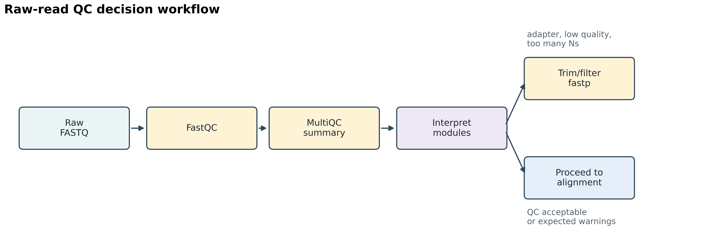
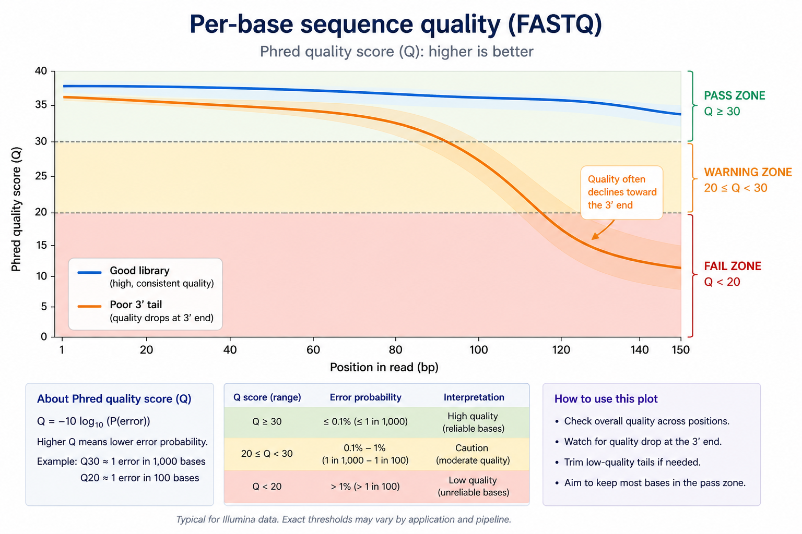
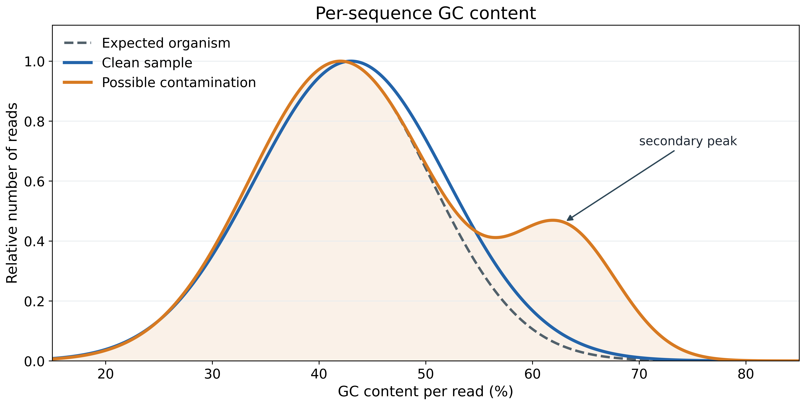
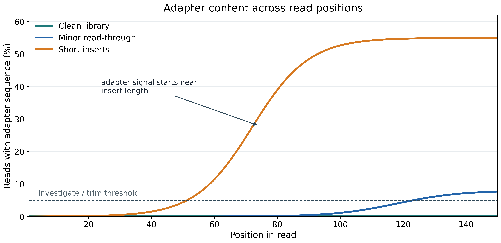
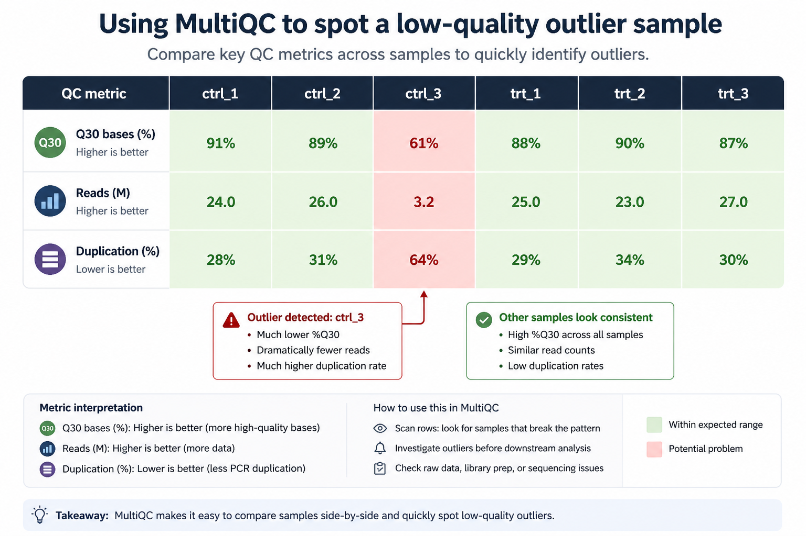

# Quality Control with FastQC

Before any bioinformatics analysis begins in earnest, there is one step that should be non-negotiable: look at your data. Sequencing instruments are not infallible, library preparations go wrong in systematic ways, and samples degrade. Running a read-quality assessment tool takes minutes and can save days of analysis on data that was never going to produce reliable results.

The principle is simple: **garbage in, garbage out**. If your raw sequencing data has problems — adapter contamination, low-quality bases, reads from the wrong organism — every downstream result is compromised. The worst part is that these problems often propagate silently. Your pipeline will still produce output files. You will still get variant calls, expression counts, or an assembly. They will just be wrong.

**FastQC** is the standard tool for this first look. It takes a FASTQ file and produces a report of roughly a dozen quality metrics, each visualized as a pass/warn/fail indicator alongside a diagnostic plot. FastQC was written by Simon Andrews at the Babraham Institute and has been the field's default QC tool since ~2010. Knowing how to read its output fluently is one of the most immediately practical skills a bioinformatician can have.

This chapter focuses primarily on Illumina short-read data, which is where FastQC is most widely used and where its module thresholds are calibrated. Long-read platforms (Oxford Nanopore and PacBio HiFi) have different quality characteristics and use dedicated QC tools; they are briefly addressed at the end of the chapter.

## Learning Goals

By the end of this chapter, you should be able to:

1. Explain why quality control matters at every stage of a genomics workflow, not only on raw reads.
2. Run FastQC on a FASTQ file and navigate its HTML report.
3. Interpret each FastQC module — what it measures, what a passing result looks like, and what common failure patterns indicate.
4. Distinguish FastQC warnings that require corrective action from those that are expected artifacts of a specific assay type.
5. Aggregate QC reports across many samples using MultiQC, and identify outlier samples from a combined summary.
6. Trim and filter reads with `fastp`, and tune its parameters for different analysis types.
7. Decide, based on QC results, whether a library is suitable for downstream analysis or requires trimming or re-sequencing.
8. Describe the key quality differences between Illumina, Nanopore, and PacBio HiFi data, and name the appropriate QC tools for each.

## Why QC Matters at Every Stage

QC is not a one-time checkbox at the beginning of your workflow. You should check quality at every major stage:

- **Raw reads**: Are the sequences high quality? Is there adapter contamination?
- **After trimming**: Did trimming improve quality without losing too much data?
- **After alignment**: What fraction of reads mapped? Are there too many duplicates?
- **After variant calling**: Are the variant statistics consistent with expectations?
- **After assembly**: Is the assembly complete? Are conserved genes present?

The cost of skipping QC is real — wasted compute hours processing bad data, false positive results that do not replicate, and in the worst case, incorrect scientific conclusions. The good news is that QC is fast. Fifteen minutes of checking quality can save weeks of troubleshooting.

{#fig-ngs-qc-workflow fig-align="center" width="92%"}

## FASTQ Files: A Brief Recap

FastQC operates on FASTQ files — the standard text format for sequencing reads. Each read is represented as exactly four lines:

```
@SEQ_ID:instrument:run:flowcell:lane:tile:x:y read:filter:control:index
ACGGCTATGCAATGCGATCGATCGATCGATCGATCGATCG
+
IIIIIIIIIIIIIIIIIIIIIIIIIIIIIIHHHH@@@===
```

Line 1 is the read header. Line 2 is the nucleotide sequence. Line 3 is a `+` separator. Line 4 encodes a **Phred quality score** for every base as an ASCII character. The score $Q$ relates to the base-calling error probability $P$ by:

$$Q = -10 \times \log_{10}(P_{\text{error}})$$

In the modern Phred+33 encoding used by all current Illumina software, subtract 33 from the ASCII value of each character to get the numeric score. A `?` (ASCII 63) encodes Q30 — a 1-in-1,000 chance of error. An `I` encodes Q40. An `!` encodes Q0 (no confidence at all).

| Phred Score | Error Probability | Accuracy |
|---|---|---|
| Q10 | 1 in 10 | 90% |
| Q20 | 1 in 100 | 99% |
| Q30 | 1 in 1,000 | 99.9% |
| Q40 | 1 in 10,000 | 99.99% |

Modern Illumina sequencers typically produce data with Q30 or higher for most bases. Q20 is generally considered the minimum acceptable quality for most applications.

The **Q30 fraction** — the percentage of all bases in a run that score ≥ Q30 — is the headline summary of Illumina run quality. Sequencing core facilities typically report it as a single number before handing data to researchers. Above 80% Q30 is the conventional threshold for a passing run.

## Running FastQC

FastQC can be installed via conda and takes either a single file or a list of files. It produces one `.html` report and one `.zip` archive per input file.

```bash
# Install via conda (once)
conda install -c bioconda fastqc

# Run on a single file
fastqc sample_R1.fastq.gz

# Run on paired-end files
fastqc sample_R1.fastq.gz sample_R2.fastq.gz

# Specify an output directory (recommended)
fastqc -o qc_reports/ sample_R1.fastq.gz sample_R2.fastq.gz

# Use multiple threads to parallelize across files
fastqc -t 4 -o qc_reports/ *.fastq.gz
```

FastQC reads a random subset of reads (by default 200,000) to generate its statistics — enough to characterize quality patterns without requiring the tool to process an entire 50 Gb file. The HTML report opens in any browser.

::: {.callout-note}
## Compressed Files Are Fine

FastQC handles gzipped `.fastq.gz` files natively. You do not need to decompress your files before running FastQC. Since modern FASTQ files are almost always gzip-compressed, this is the typical use case.
:::

## The FastQC Report: Module by Module

The HTML report is organized into modules, each with a pass (✓), warning (⚠), or fail (✗) flag. These flags are calibrated for a standard whole-genome sequencing library; some modules will warn or fail for specific assay types even when the data is perfectly normal.

::: {.callout-warning}
## Flags Are a Starting Point, Not a Verdict

FastQC's pass/warn/fail thresholds are calibrated for **whole-genome shotgun (WGS)** data. If you are working with RNA-seq, amplicon, bisulfite, ATAC-seq, or other specialized data types, expect false warnings on several modules. You must interpret the flags in context — a failing module for RNA-seq is often completely expected. The table in @sec-interpretation-guide maps modules to assay types.
:::

### Per-Base Sequence Quality

This is the most important module. It plots the distribution of Phred quality scores across all read positions — position 1 at the left through the end of the read on the right. For each position, the plot shows a box-and-whisker diagram: the yellow box spans the 25th–75th percentile, the whiskers span the 10th–90th percentile, and the central red line is the median. A healthy plot shows scores staying in the green zone (Q28+) across the entire read, with only a gradual dip at the 3' end.

**What a passing result looks like:** Quality is high across most of the read — median above Q30 for the majority of positions — with a gradual decline toward the 3' end.

{#fig-ngs-qc-per-base-quality fig-align="center" width="90%"}

**Common failure patterns:**

- *Progressive 3' quality drop:* Universal in Illumina data to some degree. After ~100–130 bp, Phred scores often drop into the yellow (Q20–Q28) or red (< Q20) zone. This happens because **phasing errors** accumulate over cycles: clusters gradually lose sync as some molecules lag or lead by one base, degrading the signal. A warning on this module for the last 10–20 bases of a 150 bp read is normal and often acceptable; a sharp drop starting before position 80 suggests the run had problems.

- *Low quality across the entire read:* If quality is uniformly poor from the start, the sequencing run itself failed — likely a flow cell loading problem, a degraded library, or a chemistry error. This data typically should not be used.

- *Position 1–2 low quality:* Sometimes the very first bases show lower quality due to sequencing primer stabilization, and is not usually a concern in practice.

::: {.callout-tip}
## R2 Is Always Worse Than R1

In paired-end sequencing, R2 is expected to have slightly lower quality than R1 throughout, because R2 reads the strand synthesized in the second sequencing step, which accumulates more phasing noise. R2 with moderately lower Q scores is normal. A sharp collapse or mid-read dip in R2 that does not appear in R1 points to a run problem rather than a library issue.
:::

### Per-Tile Sequence Quality

This module is specific to Illumina platforms. The flow cell is divided into tiles — small rectangular imaging regions — and this plot shows whether some tiles have systematically lower quality than others.

**What a passing result looks like:** A uniform blue heatmap across all tiles.

**A warning or failure** shows tiles in red or orange, indicating specific regions of the flow cell underperformed. Common causes include air bubbles, physical defects on the flow cell surface, or debris in the lane that blocked imaging for those tiles during certain cycles. A few bad tiles do not doom an entire run, but a large pattern of tile failure (stripes, regions) indicates a problematic run.

### Per-Sequence Quality Scores

This module plots the distribution of **mean Phred score per read** across all reads in the file.

**What a passing result looks like:** A sharp, prominent peak at high quality — typically around Q35–Q38 for good Illumina data. Almost all reads cluster at high mean quality.

**Warning patterns:** A broad distribution or a secondary peak at low quality (Q10–Q20) indicates a population of low-quality reads. If the low-quality peak is dominant, the run likely had global quality problems.

### Per-Base Sequence Content

This module plots the fraction of A, T, G, and C at each position across all reads. In a fully random library, all four bases should be present at approximately 25% each at every position.

**What a passing result looks like:** Four roughly parallel lines running at ~25% each across the full read length.

**Expected failures for specific assay types:**

- *RNA-seq:* The first ~10–13 bases often show severe non-uniform base composition. This is a known artifact of **random hexamer priming** during reverse transcription — hexamers don't prime randomly, so the first bases are enriched for certain nucleotides. FastQC will fail this module for almost all RNA-seq datasets. **This is expected and does not indicate a problem.**

- *Amplicon sequencing (16S, targeted panels):* All reads start from the same primer sequences, so the first N bases will show 0% for some nucleotides. FastQC fails this module; it is not a problem.

- *ATAC-seq and ChIP-seq:* These assays enrich specific sequences, leading to non-uniform base composition. Also expected.

For WGS or WES, a non-random pattern outside the first few bases that cannot be explained by the assay type warrants investigation — it may indicate adapter contamination or primer carryover.

### Per-Sequence GC Content

This module plots the distribution of GC content per read and overlays it on the theoretical distribution expected for the organism.

**What a passing result looks like:** A single, smooth, roughly bell-shaped peak that aligns well with the theoretical distribution.

**Common failure patterns:**

- *Shifted peak:* The distribution peaks to the left or right of the theoretical center — GC content differs from expectation. This can indicate contamination from another organism, PCR bias, or a batch effect.

- *Bimodal distribution:* A second peak or heavy asymmetry often indicates **contamination** from a second organism, or adapter dimers (short artifactual molecules with atypical GC). For RNA-seq, mild deviations from a bell curve are normal because expressed transcripts are not GC-neutral; a clearly bimodal curve, however, suggests cross-species contamination.

- *Sharp spike:* A very narrow spike rather than a smooth bell suggests that a single highly abundant sequence (a specific rRNA, a viral sequence, a vector) dominates the library.

{#fig-ngs-qc-gc-content fig-align="center" width="88%"}

### Per-Base N Content

This module plots the fraction of `N` calls at each read position.

**What a passing result looks like:** Zero N content across the entire read, or at most a tiny fraction at the very end.

**Failure:** Substantial N enrichment at specific positions or across the whole read indicates that the base caller was unable to discriminate signals. A spike of Ns at a particular position can point to a tile defect or a chemistry bubble affecting that cycle.

### Sequence Length Distribution

This module histograms the distribution of read lengths.

**What a passing result looks like:** A single sharp peak at the expected read length (e.g., exactly 150 bp for a 2×150 bp run). After quality trimming, reads will have variable lengths and FastQC will warn on a trimmed file — this is **expected**.

### Sequence Duplication Levels

This module estimates the proportion of reads that appear more than once, using the first 50 bp of each read as a key across a sample of 200,000 reads.

**What a passing result looks like:** Most reads are unique, with only a small fraction appearing at higher duplication levels.

**Common failure patterns and their causes:**

- *High duplication in RNA-seq:* Expected. Highly expressed genes generate enormous numbers of nearly identical reads. RNA-seq duplication rates of 20–60% are normal for poly-A selected libraries. FastQC fails this module for most RNA-seq datasets. Do **not** deduplicate RNA-seq reads based on position alone.

- *High duplication in WGS:* Problematic. Duplication rates above 15–30% suggest either very low library complexity (too little input DNA, over-amplified) or a PCR cycling problem. High duplication inflates apparent coverage and needs to be addressed computationally.

- *A specific short sequence at extreme frequency:* Usually adapter dimers — two adapters ligated without an insert, producing millions of identical reads.

::: {.callout-warning}
## FastQC Duplication Estimates Are Approximate

FastQC estimates duplication from a sample of reads and uses only the first 50 bp for comparison. True PCR duplicate rates (measured by position after alignment) can differ substantially. Use post-alignment tools like `Picard MarkDuplicates` or `samtools markdup` for an accurate duplicate count; use FastQC duplication as a quick screen, not a definitive measurement.
:::

### Overrepresented Sequences

This module lists any single sequence that makes up more than 0.1% of all reads. FastQC checks flagged sequences against a database of known contaminants.

**What a passing result looks like:** No overrepresented sequences, or a blank table.

**Common entries and their interpretation:**

| Identified Sequence | Interpretation |
|---|---|
| Illumina TruSeq adapter | Adapter contamination — inserts shorter than read length. Trim before alignment. |
| No hit (unknown) | Could be highly expressed gene, rRNA, viral sequence, or PCR artifact. BLAST the sequence. |
| Poly-A or poly-T | RNA degradation or poly-A tail carry-through in RNA-seq library. |
| PhiX 174 | Deliberate Illumina spike-in (expected); or demultiplexing failure if in large amounts. |

::: {.callout-tip}
## BLASTing Unknown Sequences

If an overrepresented sequence has no hit in FastQC's database, copy it and search against NCBI nucleotide with `blastn`. This quickly identifies whether the contaminant is a common laboratory organism (*E. coli*, PhiX, mycoplasma, human) or something more specific to the experiment.
:::

### Adapter Content

This module plots the cumulative fraction of reads containing each known Illumina adapter sequence, by read position.

**What a passing result looks like:** Flat lines at ~0% across all read positions.

**What a failure means:** Rising adapter content after some position indicates that library inserts are shorter than the read length. When a read "runs off" the end of a short insert, it reads into the adapter on the opposite side — called **adapter read-through**. This must be trimmed before alignment.

The position where the adapter line begins to rise tells you the approximate insert size. If adapter content starts climbing at position 60 in a 150 bp run, inserts average around 60 bp — common in small RNA-seq, ATAC-seq, and degraded samples.

{#fig-ngs-qc-adapter-content fig-align="center" width="90%"}

## A Practical Interpretation Guide {#sec-interpretation-guide}

FastQC pass/warn/fail flags are not verdicts — they are starting points for interpretation. The table below summarizes which modules to worry about and which are expected artifacts depending on assay type.

| FastQC Module | WGS | RNA-seq | ChIP-seq / ATAC-seq | Common False Flags |
|---|---|---|---|---|
| Per-Base Sequence Quality | ⚠ matters | ⚠ matters | ⚠ matters | Slight 3' dip is normal for all |
| Per-Tile Sequence Quality | ⚠ matters | ⚠ matters | ⚠ matters | Rare; investigate if severe |
| Per-Sequence Quality Scores | ⚠ matters | ⚠ matters | ⚠ matters | Bimodal = problem; single peak = fine |
| Per-Base Sequence Content | ⚠ matters | ✓ expected fail | ✓ expected fail | First 10–15 bases wobble due to hexamer priming — **normal** |
| Per-Sequence GC Content | ⚠ matters | ⚠ matters | ✓ some bias expected | RNA-seq mild deviations are normal |
| Per-Base N Content | ⚠ matters | ⚠ matters | ⚠ matters | High N → run likely failed |
| Sequence Duplication | ⚠ matters | ✓ expected fail | ✓ expected fail | **RNA-seq**: high duplication is normal |
| Overrepresented Sequences | ⚠ matters | ⚠ matters | ⚠ matters | **RNA-seq**: abundant transcripts trigger this |
| Adapter Content | ⚠ trim | ⚠ trim | ⚠ trim | Always trim before alignment |
| Sequence Length Distribution | Fine | Fine | Fine | After trimming, variable length is expected |

## Aggregating Reports with MultiQC

When an experiment involves tens or hundreds of samples, opening individual HTML files is not practical. **MultiQC** aggregates FastQC reports — and the outputs of many other bioinformatics tools — into a single interactive summary HTML.

```bash
# Install via conda
conda install -c bioconda multiqc

# Run in the directory containing FastQC output folders
multiqc qc_reports/ -o multiqc_output/

# Combine FastQC and a trimmer's output together
multiqc qc_reports/ fastp_reports/ -o multiqc_combined/
```

MultiQC produces a single `multiqc_report.html` with a **General Statistics** table showing per-sample summary numbers (total reads, Q30 fraction, duplication rate, GC%), per-module heatmaps and line plots comparing all samples simultaneously, and color-coded pass/warn/fail status across every module and every sample.

The power of MultiQC is in **spotting outliers**. When all samples are plotted together, a single problem sample becomes immediately visible — five samples may cluster with good quality while one drops early in the per-base quality plot. That is your problem sample.

{#fig-ngs-qc-multiqc-outlier fig-align="center" width="88%"}

::: {.callout-tip}
## Identify Outlier Samples Before Downstream Analysis

Outlier samples in a MultiQC report — a sample with half the expected reads, a dramatically different GC profile, or an unusual duplication rate — will distort differential expression analysis, PCA plots, and variant calling. Identify and investigate outliers at the QC stage, before investing compute time in alignment and quantification.
:::

## fastp: Trimming and Filtering

Once you have identified quality issues — adapter contamination, low-quality 3' tails, reads that are too short — the next step is to clean the data. **`fastp`** is the current standard for this task. It is an all-in-one tool that handles quality filtering, adapter trimming, and read preprocessing in a single pass, produces its own HTML report, and handles paired-end data correctly.

### What Are Adapters?

**Adapters** are short synthetic DNA sequences added during library preparation. They allow DNA fragments to attach to the sequencer's flow cell. Adapters are not part of your organism's genome. If a DNA fragment is shorter than the read length, the sequencer reads past the insert and into the adapter on the other side — these adapter sequences must be removed before alignment.

### Running fastp

```bash
# Install via conda
conda install -c bioconda fastp

# Paired-end trimming with sensible defaults
mkdir -p trimmed fastp_reports
fastp \
    -i sample_R1.fastq.gz \
    -I sample_R2.fastq.gz \
    -o trimmed/sample_R1.trimmed.fq.gz \
    -O trimmed/sample_R2.trimmed.fq.gz \
    --qualified_quality_phred 20 \
    --length_required 50 \
    --detect_adapter_for_pe \
    --thread 4 \
    --html fastp_reports/sample.html \
    --json fastp_reports/sample.json
```

The HTML report shows before/after quality profiles, how many reads were removed and why (low quality, too short, too many Ns, adapter contamination), and which adapter sequences were detected.

### fastp Parameter Reference

| Parameter | Default | Description | When to Change |
|---|---|---|---|
| `--qualified_quality_phred` | 15 | Bases below this quality are "unqualified" | Use **20** for standard analysis; **30** for variant calling |
| `--unqualified_percent_limit` | 40 | Drop read if this % of bases are unqualified | Lower for stricter filtering |
| `--length_required` | 15 | Discard reads shorter than this after trimming | Use **50** for most Illumina data |
| `--detect_adapter_for_pe` | off | Auto-detect adapters via paired-end overlap | **Always enable** for paired-end data |
| `--adapter_sequence` | auto | Specify adapter sequence manually | Only if auto-detection fails |
| `--cut_front` | off | Sliding window trimming from 5' end | Enable for data with 5' quality issues |
| `--cut_tail` | off | Sliding window trimming from 3' end | Enable for data with 3' quality drop-off |
| `--cut_window_size` | 4 | Window size for sliding window trimming | Larger window = more aggressive trimming |
| `--cut_mean_quality` | 20 | Quality threshold for sliding window | Match to `--qualified_quality_phred` |
| `--trim_poly_g` | auto | Trim poly-G tails | Important for **NovaSeq/NextSeq** (two-color chemistry artifact) |
| `--correction` | off | Overlap-based error correction for PE reads | Enable for variant calling workflows |
| `--thread` | 1 | Number of processing threads | Use **4** for good performance |

::: {.callout-note}
## When NOT to Trim Aggressively

Modern aligners like BWA-MEM2 and STAR can "soft-clip" low-quality bases at read ends, meaning the aligner handles them without you having to trim them first. Over-trimming loses data and can introduce length biases. For most RNA-seq and WGS workflows, light trimming with fastp defaults is sufficient — trim adapters (always), apply moderate quality filtering (Q20), and let the aligner handle the rest. Reserve aggressive trimming for data with severe quality problems.
:::

### Before/After Comparison

After trimming, run FastQC again on the trimmed reads and use MultiQC to compare raw vs. trimmed results side by side.

```bash
# FastQC on trimmed reads
mkdir -p fastqc_trimmed
fastqc -t 4 -o fastqc_trimmed/ trimmed/*.trimmed.fq.gz

# Combined MultiQC report (raw FastQC + trimmed FastQC + fastp reports)
mkdir -p multiqc_combined
multiqc fastqc_raw/ fastqc_trimmed/ fastp_reports/ -o multiqc_combined/
```

Check that: (1) adapter content is gone in the trimmed reads, (2) per-base quality at the 3' end has improved, and (3) read counts are reasonable — some reads will be lost during filtering, but if more than 15% were discarded, that warrants investigation.

## Is My Data Good Enough?

There is no single universal threshold. What "good enough" means depends on your downstream analysis, your organism, and your experimental design. The following table gives practical benchmarks as a starting point.

| Metric | Good | Acceptable | Investigate |
|---|---|---|---|
| % bases Q30+ (after trim) | > 90% | 80–90% | < 80% |
| % adapter content (after trim) | < 1% | 1–5% | > 5% |
| % reads retained after trimming | > 95% | 85–95% | < 85% |
| Duplication rate (WGS) | < 15% | 15–30% | > 30% |
| GC content distribution | Unimodal, matches organism | Slight shoulder | Bimodal |

## QC Decision Guide

Use this table to decide what action to take based on what you see in FastQC or MultiQC.

| Scenario | Action |
|---|---|
| Adapter content > 5% | Trim with fastp (`--detect_adapter_for_pe`). Re-run FastQC to confirm removal. |
| Mean quality < Q25 across the run | Apply quality filtering with fastp. If quality is still poor after trimming, consider re-sequencing. |
| Quality drops sharply at the 3' end | Normal for Illumina. Light trimming with fastp is sufficient. |
| GC content is bimodal | Investigate contamination. BLAST overrepresented sequences. Consider a decontamination tool (e.g., Kraken2). |
| High duplication in WGS | Low library complexity — may need re-sequencing with more input DNA. Mark duplicates with Picard. |
| High duplication in RNA-seq | **Normal** — highly expressed genes produce many identical reads. Not a QC failure; do not position-deduplicate. |
| Overrepresented adapter sequences | Trim with fastp. Confirm removal with FastQC. |
| Overrepresented biological sequences | BLAST the sequence. May be rRNA contamination in RNA-seq; consider rRNA depletion. |
| Per-base sequence content wobbles at 5' end | **Normal** — random hexamer priming bias. No action needed. |
| Very low read count for one sample | Check library prep and sequencing depth. May need re-sequencing or exclusion from analysis if depth is insufficient. |
| One sample is a clear outlier in MultiQC | Investigate before including in analysis. Look at all modules for that sample together. |

## A Complete QC Workflow

Putting the tools together, a standard Illumina QC workflow before alignment looks like this:

```bash
# 1. Initial QC on raw reads
mkdir -p fastqc_raw
fastqc -t 8 -o fastqc_raw/ raw_data/*.fastq.gz

# 2. Aggregate reports
multiqc fastqc_raw/ -o fastqc_raw/multiqc/

# 3. Trim adapters and filter (if adapter content or quality issues detected)
mkdir -p trimmed fastp_reports
for sample in sample1 sample2 sample3; do
    fastp \
        -i raw_data/${sample}_R1.fastq.gz \
        -I raw_data/${sample}_R2.fastq.gz \
        -o trimmed/${sample}_R1.trimmed.fq.gz \
        -O trimmed/${sample}_R2.trimmed.fq.gz \
        --qualified_quality_phred 20 \
        --length_required 50 \
        --detect_adapter_for_pe \
        --thread 4 \
        --html fastp_reports/${sample}.html \
        --json fastp_reports/${sample}.json
done

# 4. Post-trim QC and combined report
mkdir -p fastqc_trimmed
fastqc -t 8 -o fastqc_trimmed/ trimmed/*.fq.gz
multiqc fastqc_raw/ fastqc_trimmed/ fastp_reports/ -o multiqc_combined/

# 5. Proceed to alignment only if QC is satisfactory
```

## QC Beyond Raw Reads

Quality control does not end after adapter trimming. Each stage of your analysis has its own QC metrics that should be checked before trusting downstream results.

### Alignment QC

After aligning reads to a reference genome (with BWA-MEM2, STAR, HISAT2, etc.), check alignment statistics with `samtools`.

```bash
# Basic alignment stats: mapped reads, duplicates, properly paired
samtools flagstat sample.bam

# Comprehensive statistics including insert size and error rates
samtools stats sample.bam > sample.stats.txt
```

**Key metrics to evaluate:**

| Metric | Expected Value | What It Means |
|---|---|---|
| Mapping rate (WGS) | > 90% | Low rate → wrong reference, contamination, or severe quality problem |
| Mapping rate (RNA-seq) | > 70% | Lower than WGS due to intron-spanning reads and transcriptome complexity |
| Properly paired reads | > 90% | High discordant pairs → library prep problem or data corruption |
| Duplicate rate (WGS) | < 30% | Higher rates → low input material or over-amplification |
| Insert size distribution | Matches library prep target (e.g., 300–500 bp) | Bimodal distribution = mixed library; very short = degraded sample |

MultiQC can aggregate `samtools flagstat` and `samtools stats` output alongside FastQC results, giving a single report that spans raw reads through alignment.

::: {.callout-warning}
## Poor Raw QC Cascades Through Your Entire Pipeline

What happens when you skip raw read QC? A sample with 68% Q30 bases and 25% adapter content, after trimming, loses ~28% of its reads. After alignment, only 75% of reads map (vs. 97% for clean samples), and the duplicate rate climbs to 29%. Poor data quality compounds at every step. Catching it early is far cheaper than diagnosing it at the end.
:::

### Variant Calling QC

After calling variants with GATK, DeepVariant, or similar tools, check these statistics:

| Metric | Expected Value (Human WGS) | What a Bad Value Suggests |
|---|---|---|
| Ti/Tv ratio | 2.0–2.1 (WGS), 2.8–3.0 (exome) | Lower than expected → excess false positive SNP calls |
| Het/Hom ratio | 1.5–2.0 | Very high → contamination; very low → inbreeding or sample swap |
| Total SNP count | ~3–4 million per human genome | Far more → false positives; far fewer → low coverage or wrong sample |

### RNA-seq Specific QC

After alignment with STAR or HISAT2, additional QC checks are important for RNA-seq:

- **Read distribution**: What fraction of reads maps to exons vs. introns vs. intergenic regions? mRNA-seq should be predominantly exonic (>60–70%).
- **Gene body coverage**: Plot signal from the 5' to 3' end of genes. A strong 3' bias indicates RNA degradation; a strong 5' bias suggests incomplete reverse transcription.
- **Tools**: RSeQC (`read_distribution.py`, `geneBody_coverage.py`), Qualimap, or Picard `CollectRnaSeqMetrics`.

### Assembly QC

For genome assembly projects, two tools provide complementary assessments:

- **QUAST**: Reports basic assembly statistics — N50, total assembled length, number of contigs, and comparisons to a reference if available.
- **BUSCO**: Checks for expected single-copy orthologs from a lineage-specific gene database. A high BUSCO completeness score (>90%) indicates the assembly captured most expected genes.

## Quality Control for Long-Read Platforms

FastQC was designed for Illumina short reads. Its modules assume reads of uniform length, similar per-base quality encoding, and cluster-based sequencing artifacts. Neither Oxford Nanopore nor PacBio HiFi data fits these assumptions.

**Oxford Nanopore (ONT):** Reads are variable-length (typically 1–50+ kb), per-base quality scores tend to be lower than Illumina (Q20 for R10.4.1 simplex, ~Q30 for duplex), and the relevant QC metrics are different: N50 read length, total yield in gigabases, pore occupancy over time, and fraction of reads passing the quality filter set during base calling. The primary QC tool is **NanoPlot** or the summary report from MinKNOW/Dorado. `seqkit stats -N 50` provides a fast command-line summary of read length statistics.

**PacBio HiFi:** HiFi reads are generated by circular consensus sequencing (CCS), which applies quality filtering during read generation. The CCS tool reports the number of passes per molecule and the fraction of reads meeting the Q20 accuracy threshold. Quality summaries are generated using `seqkit stats` or tools in the PacBio SMRTlink suite. Key metrics are mean read length (targeting 15–25 kb), mean CCS accuracy (≥Q30 for HiFi), and the number of CCS reads per SMRT cell.

```bash
# Works for both ONT and HiFi FASTQ files
seqkit stats -a -N 50 sample.fastq.gz
# Reports: num_seqs, sum_len, min_len, avg_len, max_len, N50, Q20%, Q30%, GC%
```

## Summary

| Concept | Key Points |
|---|---|
| QC at every stage | Raw reads → trimmed reads → alignment → variant calling → assembly; each has its own metrics |
| Q30 fraction | Headline Illumina quality metric; >80% Q30 is the standard passing threshold |
| Per-Base Sequence Quality | Most important FastQC module; watch for early 3' quality drops or uniform low quality |
| Per-Base Sequence Content | Expected to fail for RNA-seq (hexamer bias), amplicon, ATAC-seq — not a problem |
| Sequence Duplication | Expected to fail for RNA-seq; high duplication in WGS indicates low library complexity |
| Adapter Content | Rising adapter signal → insert shorter than read length → trim before alignment |
| Overrepresented Sequences | Adapter dimers or biological contaminants; BLAST unknowns |
| MultiQC | Aggregates FastQC (and other tool) reports; essential for multi-sample experiments; best for spotting outliers |
| fastp | All-in-one trimmer; always use `--detect_adapter_for_pe` for paired-end data; produces its own HTML report |
| "Good enough" thresholds | >80% Q30, <5% adapter after trim, >85% reads retained, <30% duplication (WGS) |
| QC Decision Guide | Match the scenario to action: trim, filter, investigate contamination, or re-sequence |
| Alignment QC | Mapping rate (>90% WGS), duplicate rate, insert size, properly paired reads |
| ONT QC | Use NanoPlot or seqkit; key metrics are N50, total yield, pore activity |
| PacBio HiFi QC | CCS reports passes and accuracy; use seqkit or SMRTlink for summary stats |

## Exercises

1. Open a FastQC report (download a small dataset from NCBI SRA: `fastq-dump --split-files SRR2121685`, then run `fastqc`). List the modules that pass, warn, and fail. For each failing module, write one sentence explaining what the failure indicates and whether corrective action is needed.

2. A FastQC report for an RNA-seq sample shows: (a) Per-Base Sequence Content fails for positions 1–13, (b) Sequence Duplication Levels fails with 45% duplication, (c) Adapter Content is clean. Which of these failures require corrective action before alignment? Justify your answer for each.

3. You run FastQC on a WGS sample and the Per-Sequence GC Content module shows a sharp secondary peak at ~60% GC, while the main peak is at ~42% (the expected human value). Describe two possible explanations for the secondary peak and one way to investigate each.

4. Write a bash script that: (a) runs FastQC on all `.fastq.gz` files in a `raw/` directory using 4 threads, sending output to `fastqc_raw/`; (b) runs fastp on all paired-end samples (named `{sample}_R1.fastq.gz` and `{sample}_R2.fastq.gz`) with Q20 quality filtering, minimum length 50, and adapter auto-detection; (c) runs a combined MultiQC report on all FastQC and fastp outputs.

5. A collaborator hands you a dataset with 8 samples. After running MultiQC, you notice that `ctrl_3` has 3 million reads while all other samples have ~25 million reads, and its Q30 fraction is 60% while others are all above 85%. What do you tell your collaborator, and what options do you consider before deciding whether to include this sample?

6. You receive 150 bp paired-end reads from an ATAC-seq experiment. FastQC shows that Adapter Content begins rising steeply at position 40 in both R1 and R2. What does this tell you about the insert size distribution of the ATAC-seq library, and what trimming action should you take?

7. After aligning your RNA-seq reads to the human genome, `samtools flagstat` reports a 55% mapping rate. Your FastQC reports before alignment looked fine — Q30 fraction was 88% and adapter content was clean. List three possible biological or technical explanations for the low mapping rate, and describe one command or tool you would use to investigate each.

8. Compare the key quality metrics you would examine for an Illumina RNA-seq sample vs. an Oxford Nanopore whole-genome sequencing sample. List two metrics that are specific to each platform and explain why they are relevant to that platform's sequencing chemistry.
