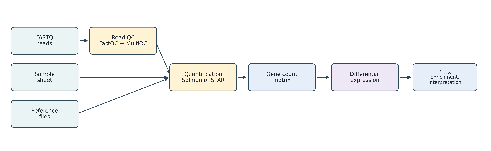
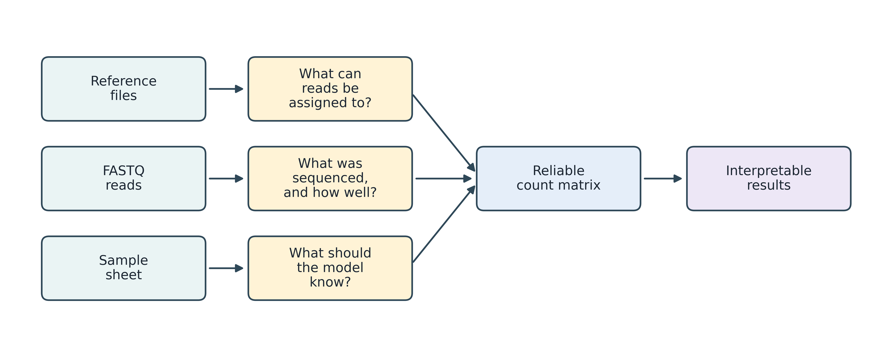
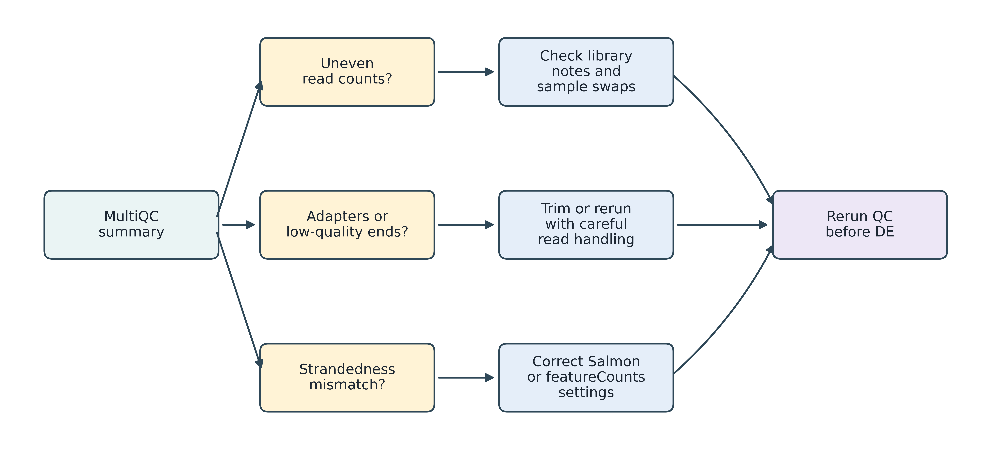
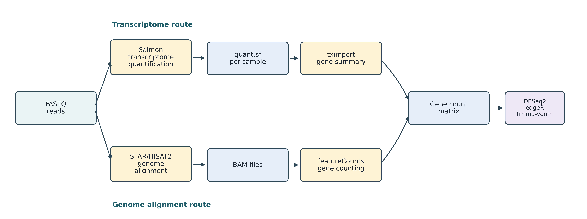
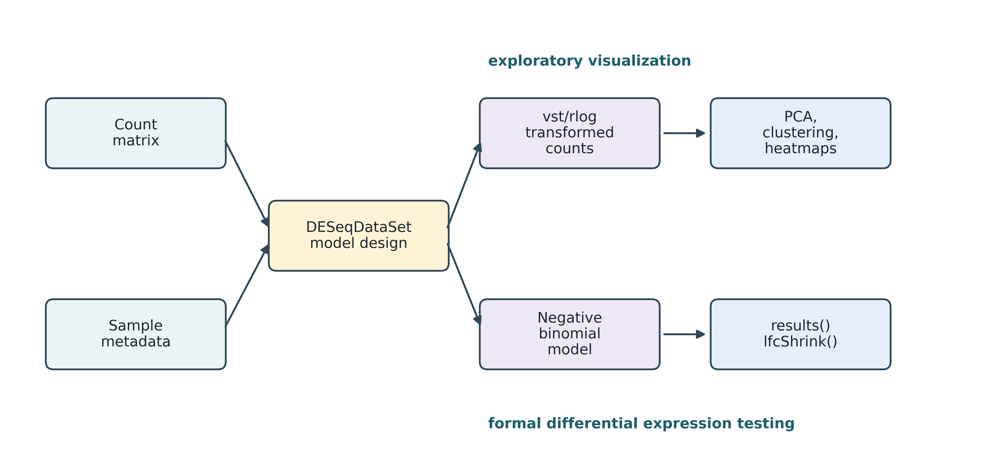
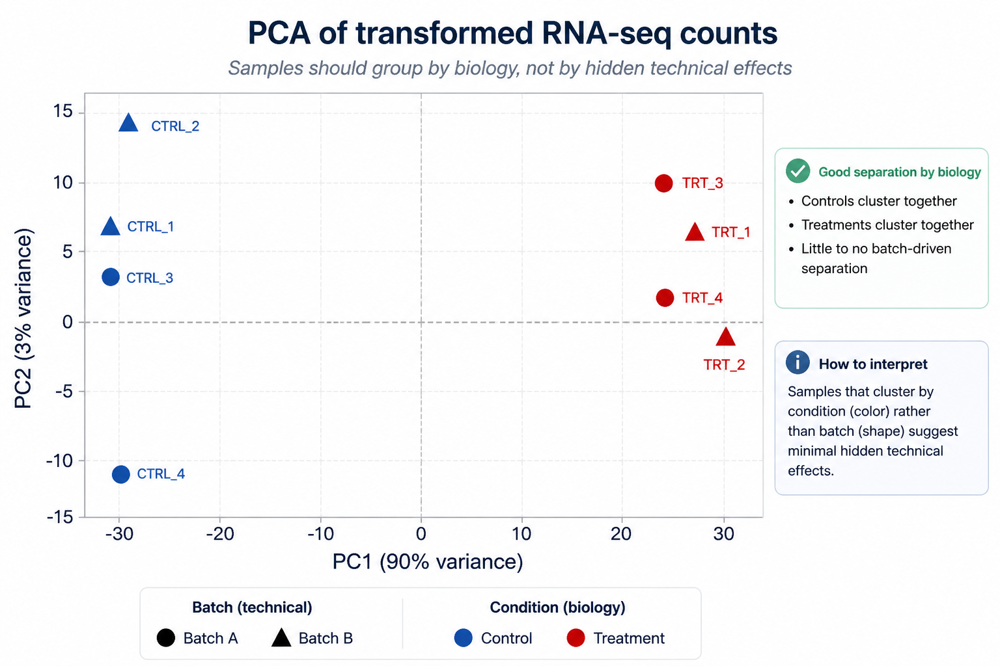
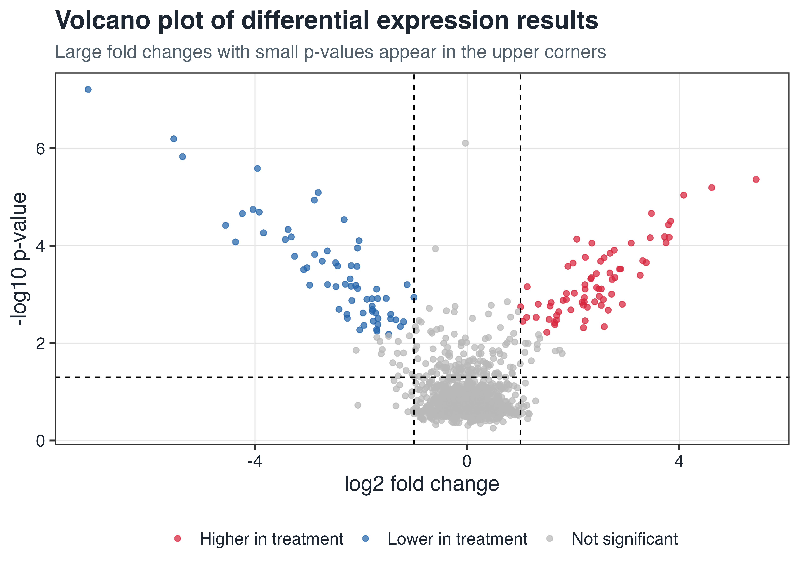

# RNA-seq Analysis

## Learning Goals

By the end of this chapter, you should be able to:

1. Explain the difference between alignment-based and transcriptome-based RNA-seq quantification.
2. Organize a bulk RNA-seq project so that it can be rerun and audited.
3. Inspect FASTQ files, reference files, annotations, and sample metadata before running statistical tests.
4. Produce a gene-level count matrix from either BAM files or Salmon transcript quantifications.
5. Run a basic differential expression analysis with DESeq2 and interpret the most important output columns.
6. Create quality-control plots, heatmaps, volcano plots, and a small enrichment analysis.

This chapter focuses on bulk RNA-seq. Single-cell RNA-seq, spatial transcriptomics, long-read isoform sequencing, and differential transcript usage use related ideas, but their statistical models and quality-control questions are different enough to deserve separate workflows.

## The Big Picture

RNA-seq breaks RNA into fragments, sequences them, and you get raw reads. Your job is to turn those reads into a table: rows = genes or transcripts, columns = samples, values = expression counts.

Real RNA-seq analyses have two parts:

1. **Quantification**: reads become counts.
2. **Statistics**: counts become biology.

Two main paths to quantification:

| Strategy | Main idea | Typical tools | Best for |
|---|---|---|---|
| Genome alignment | Align reads to the genome, then count overlaps with annotated genes or exons. | STAR, HISAT2, featureCounts, HTSeq | Inspectable alignments, novel junction checks, organisms with good genome annotations |
| Transcriptome quantification | Assign reads directly to known transcripts and estimate transcript abundance. | Salmon, kallisto, tximport | Fast routine quantification, transcript-aware gene summaries |

Both work. Alignment gives you BAM files to eyeball in IGV when something smells wrong. Salmon and kallisto are fast and handle isoforms natively, but they depend hard on your reference being right.

### Choosing an Aligner

Different aligners for different jobs. For RNA-seq, the deal-breaker is **splice awareness** — reads jump exon junctions. You need an aligner that splits reads across introns.

| Aligner | Splice-Aware? | Best For | Memory | Speed |
|---------|:------------:|----------|--------|-------|
| **STAR** | Yes | RNA-seq (gold standard) | High (~30 GB for human) | Very fast |
| **HISAT2** | Yes | RNA-seq (memory-efficient) | Low (~8 GB for human) | Fast |
| **Bowtie2** | No | DNA-seq, ChIP-seq, miRNA, metagenomics | Low | Fast |
| **BWA MEM** | No | DNA-seq, WGS, WES | Moderate | Fast |

::: {.callout-warning}
## Do Not Use Bowtie2 for Standard RNA-Seq

Bowtie2 is a general-purpose short-read aligner — it does **not** handle spliced alignments. If you align RNA-seq reads with Bowtie2 against a genome, reads that span exon-exon junctions will either fail to map or map incorrectly. Use STAR or HISAT2 instead.

Bowtie2 *is* appropriate for aligning RNA-seq reads against a **transcriptome** (pre-spliced transcript sequences), or for non-spliced applications like ChIP-seq, ATAC-seq, and whole-genome sequencing.
:::

**STAR vs. HISAT2:**

- **STAR**: Most popular. Finds splice junctions well, detects fusions, counts during alignment. Needs ~30 GB RAM for human. Standard in nf-core pipelines.
- **HISAT2**: Memory-efficient — ~8 GB for human. Good on laptops and big genomes. A bit faster sometimes, maybe slightly less sensitive on rare junctions.

{#fig-rnaseq-pipeline-overview fig-align="center" width="95%"}

::: {.callout-tip}
## Practical Recommendation

For a teaching project, run both at least once. Use Salmon for the fast routine analysis, but learn to inspect alignments with STAR or HISAT2 so you can diagnose failed libraries, wrong strandedness, annotation mismatches, contamination, and surprising genes.
:::

## Project Layout

Don't run RNA-seq in your home directory. Use a real project structure:

```bash
rnaseq-project/
|-- data/
|   |-- raw_fastq/
|   `-- samples.csv
|-- refs/
|   |-- genome.fa
|   |-- genes.gtf
|   `-- transcripts.fa
|-- results/
|   |-- fastqc/
|   |-- multiqc/
|   |-- salmon/
|   |-- star/
|   |-- counts/
|   `-- deseq2/
|-- scripts/
`-- envs/
```

Keep raw data locked down. Version your scripts. Put everything new in `results/`, not cluttered in `data/`.

A minimal paired-end sample sheet might look like this:

```csv
sample,condition,batch,strandedness,fastq_1,fastq_2
ctrl_1,control,A,reverse,fastq/ctrl_1_R1.fastq.gz,fastq/ctrl_1_R2.fastq.gz
ctrl_2,control,B,reverse,fastq/ctrl_2_R1.fastq.gz,fastq/ctrl_2_R2.fastq.gz
trt_1,treatment,A,reverse,fastq/trt_1_R1.fastq.gz,fastq/trt_1_R2.fastq.gz
trt_2,treatment,B,reverse,fastq/trt_2_R1.fastq.gz,fastq/trt_2_R2.fastq.gz
```

Sample names must match your count matrix later. `condition` is the biological variable. `batch` is a known technical grouping (use in the design if needed). `strandedness` is one of `unstranded`, `forward`, `reverse`, or `auto` for nf-core pipelines.

Same sample run across multiple lanes? Multiple rows, same name. Those are technical replicates, not biological ones — pipelines concatenate them anyway.

::: {.callout-warning}
## Metadata Is Part of the Data

If you do not know which FASTQ belongs to which biological replicate, condition, batch, strandedness, and library type, you do not yet have an analyzable RNA-seq project. Guessing metadata is how tidy-looking results become biologically meaningless.
:::

## Software Environment

Use one Conda or Mamba environment for the command-line tools. Install R packages separately through Bioconductor.

```bash
mamba create -n rnaseq \
  -c conda-forge -c bioconda \
  fastqc multiqc fastp seqkit \
  salmon kallisto star hisat2 bowtie2 samtools subread \
  bedtools ucsc-bedgraphtobigwig

conda activate rnaseq
```

In R:

```r
if (!require("BiocManager", quietly = TRUE)) {
  install.packages("BiocManager")
}

BiocManager::install(c(
  "DESeq2",
  "edgeR",
  "tximport",
  "rtracklayer",
  "apeglm",
  "pheatmap",
  "EnhancedVolcano",
  "clusterProfiler",
  "org.Hs.eg.db",
  "AnnotationDbi"
))

install.packages(c("tidyverse", "readr", "ggplot2"))
```

For real projects, save the environment:

```bash
conda env export --from-history > envs/rnaseq.yml
```

## Three Files, Three Questions

RNA-seq goes wrong when you mix up the reference, reads, and metadata. Each has its own question:

{#fig-rnaseq-three-inputs fig-align="center" width="85%"}

## Understand the Reference

Before you look at any reads, check the reference. RNA-seq is a matching game. Wrong chromosome names, mismatched gene IDs, version skew — any of that breaks everything downstream silently.

Common reference files:

| File | Format | Used by |
|---|---|---|
| Genome sequence | FASTA | STAR, HISAT2, IGV |
| Gene annotation | GTF or GFF3 | featureCounts, tximport gene mapping, IGV |
| Transcriptome sequence | FASTA | Salmon, kallisto |

Useful checks:

```bash
seqkit stats refs/genome.fa refs/transcripts.fa
head refs/genes.gtf
cut -f1 refs/genes.gtf | grep -v '^#' | sort | uniq | head
grep '^>' refs/genome.fa | head
```

The sequence names in the GTF/GFF must match the genome FASTA. For example, `chr1` in the annotation and `1` in the genome are not the same name to most tools.

For a GTF file, check which attributes are available:

```bash
grep -v '^#' refs/genes.gtf | head -1
```

You'll need `gene_id`, usually `gene_name`, sometimes `transcript_id`. If the GTF is only CDS, it's incomplete for gene-level work.

## Understand the Reads

First step: file names, read counts, basic FASTQ structure:

```bash
ls -lh data/raw_fastq/
seqkit stats data/raw_fastq/*.fastq.gz
zcat data/raw_fastq/ctrl_1_R1.fastq.gz | head
```

Then run FastQC and MultiQC:

```bash
mkdir -p results/fastqc results/multiqc

fastqc \
  --threads 8 \
  --outdir results/fastqc \
  data/raw_fastq/*.fastq.gz

multiqc \
  --outdir results/multiqc \
  results/fastqc
```

In the MultiQC report, look for:

| QC signal | What it may indicate |
|---|---|
| Very different read counts | Failed library, uneven sequencing, wrong files |
| Adapter content | Need trimming or careful aligner handling |
| Low per-base quality near read ends | Trimming may improve mapping |
| Unusual GC distribution | Contamination, rRNA, biased library |
| Overrepresented sequences | Adapters, primers, rRNA, highly abundant transcripts |

{#fig-rnaseq-qc-decision-tree fig-align="center" width="85%"}

Trimming isn't required unless adapters are bad. If they are, use `fastp` or Trim Galore. Here's `fastp`:

```bash
mkdir -p results/trimmed

fastp \
  --thread 8 \
  --in1 data/raw_fastq/ctrl_1_R1.fastq.gz \
  --in2 data/raw_fastq/ctrl_1_R2.fastq.gz \
  --out1 results/trimmed/ctrl_1_R1.fastq.gz \
  --out2 results/trimmed/ctrl_1_R2.fastq.gz \
  --html results/trimmed/ctrl_1.fastp.html \
  --json results/trimmed/ctrl_1.fastp.json
```

## Route A: Transcriptome Quantification with Salmon

Salmon estimates isoform abundance from reads [@patro2017salmon]. Fast. Works for learning and real projects both.

Build an index:

```bash
mkdir -p refs/salmon_index

salmon index \
  -t refs/transcripts.fa \
  -i refs/salmon_index \
  -k 31
```

For a production analysis, build a decoy-aware Salmon index rather than indexing only transcript sequences. Salmon's documentation recommends selective alignment with a decoy-aware transcriptome to reduce spurious assignment of reads that arise from unannotated genomic loci similar to annotated transcripts.

Quantify one paired-end sample:

```bash
mkdir -p results/salmon

salmon quant \
  -i refs/salmon_index \
  -l A \
  --validateMappings \
  -1 data/raw_fastq/ctrl_1_R1.fastq.gz \
  -2 data/raw_fastq/ctrl_1_R2.fastq.gz \
  -p 8 \
  -o results/salmon/ctrl_1
```

The main output is:

```bash
head results/salmon/ctrl_1/quant.sf
```

Important columns in `quant.sf`:

| Column | Meaning |
|---|---|
| `Name` | Transcript ID |
| `Length` | Transcript length |
| `EffectiveLength` | Length adjusted for fragment sampling |
| `TPM` | Transcripts per million |
| `NumReads` | Estimated number of reads assigned to the transcript |

For DESeq2, don't use TPM straight up. Use `tximport` to handle isoforms and roll up to genes [@soneson2015tximport].

Create a transcript-to-gene table from a GTF file in R:

```r
library(rtracklayer)
library(dplyr)
library(readr)

gtf <- import("refs/genes.gtf")

tx2gene <- as.data.frame(gtf) |>
  filter(type == "transcript") |>
  select(transcript_id, gene_id) |>
  distinct() |>
  filter(!is.na(transcript_id), !is.na(gene_id))

write_csv(tx2gene, "refs/tx2gene.csv")
```

Then import Salmon quantifications:

```r
library(tximport)
library(readr)

samples <- read_csv("data/samples.csv")
tx2gene <- read_csv("refs/tx2gene.csv")

files <- file.path("results/salmon", samples$sample, "quant.sf")
names(files) <- samples$sample

txi <- tximport(
  files,
  type = "salmon",
  tx2gene = tx2gene
)
```

The `txi` object has abundance, counts, and lengths. Best: pass the whole object to `DESeqDataSetFromTximport()` for proper offsets. Acceptable: import with `countsFromAbundance = "lengthScaledTPM"` and use `txi$counts` as a matrix. Don't hand raw summed counts to DESeq2 without offsets.

::: {.callout-note}
## Counts, TPM, and Normalized Counts

Raw counts are for statistical testing. TPM is for comparing relative abundance within or across samples after length correction. DESeq2 normalized counts are for QC plots and interpretation. Avoid mixing these roles.
:::

### Transcriptome Quantification with kallisto

**kallisto** is an alternative using k-mer matching instead of full alignment [@bray2016near]. Faster than Salmon. Outputs feed `tximport` the same way.

#### Build a kallisto Index

```bash
kallisto index \
  -i refs/kallisto_index \
  refs/transcripts.fa
```

#### Quantify One Sample

```bash
mkdir -p results/kallisto/ctrl_1

kallisto quant \
  -i refs/kallisto_index \
  -o results/kallisto/ctrl_1 \
  -t 8 \
  -b 100 \
  data/raw_fastq/ctrl_1_R1.fastq.gz \
  data/raw_fastq/ctrl_1_R2.fastq.gz
```

Key flags:

| Flag | Purpose |
|------|---------|
| `-t 8` | Use 8 threads |
| `-b 100` | Run 100 bootstrap samples (for uncertainty estimation; used by sleuth) |
| `--rf-stranded` | For reverse-stranded libraries |
| `--fr-stranded` | For forward-stranded libraries |

The main output file is `abundance.tsv`:

```bash
head results/kallisto/ctrl_1/abundance.tsv
# target_id     length  eff_length  est_counts  tpm
# ENST00000456328  1657    1468.43     52.000     3.21
```

#### Import kallisto Results with tximport

```r
library(tximport)

files <- file.path("results/kallisto", samples$sample, "abundance.h5")
names(files) <- samples$sample

txi_kallisto <- tximport(
  files,
  type = "kallisto",
  tx2gene = tx2gene
)
```

The `txi_kallisto` object feeds into `DESeqDataSetFromTximport()` identically to the Salmon output.

### Salmon vs. kallisto: When to Use Which

| Feature | Salmon | kallisto |
|---------|--------|---------|
| Algorithm | Quasi-mapping + EM | K-mer hashing + EM |
| Bias correction | GC, position, fragment length | None |
| Decoy-aware | Yes | No |
| Speed | Very fast | Slightly faster |
| Downstream | tximport → DESeq2/edgeR | tximport → DESeq2/edgeR; sleuth |
| Bootstrap | Yes | Yes |

**Salmon** for production — better at extreme GC and bias correction. **kallisto** for quick exploration and sleuth. Both fine for most data.

::: {.callout-tip}
Both tools work well. Salmon's bias models help extreme cases.
:::

## Route B: Genome Alignment and Feature Counting

Alignment takes longer, but you get BAM files to inspect. Use splice-aware aligners. STAR is standard [@dobin2013star]; HISAT2 saves RAM [@kim2019hisat2].

{#fig-rnaseq-quantification-routes fig-align="center" width="95%"}

### Build a STAR Index

```bash
mkdir -p refs/star_index

STAR \
  --runThreadN 8 \
  --runMode genomeGenerate \
  --genomeDir refs/star_index \
  --genomeFastaFiles refs/genome.fa \
  --sjdbGTFfile refs/genes.gtf \
  --sjdbOverhang 99
```

Set `--sjdbOverhang` to read length minus 1. For 100 bp reads, use `99`.

### Align One Sample

```bash
mkdir -p results/star/ctrl_1

STAR \
  --runThreadN 8 \
  --genomeDir refs/star_index \
  --readFilesIn fastq/ctrl_1_R1.fastq.gz \
    fastq/ctrl_1_R2.fastq.gz \
  --readFilesCommand zcat \
  --outSAMtype BAM SortedByCoordinate \
  --outFileNamePrefix results/star/ctrl_1/

samtools index results/star/ctrl_1/Aligned.sortedByCoord.out.bam
```

### Align with HISAT2

HISAT2 is a memory-efficient alternative to STAR. Its index is much smaller (~8 GB vs. ~30 GB for human), making it practical on laptops and memory-constrained HPC nodes.

#### Build a HISAT2 Index

```bash
mkdir -p refs/hisat2_index

hisat2-build \
  -p 8 \
  refs/genome.fa \
  refs/hisat2_index/genome
```

You can extract splice sites and exons from the GTF to boost junction finding:

```bash
# Extract splice sites and exons from GTF
hisat2_extract_splice_sites.py refs/genes.gtf \
  > refs/hisat2_index/splice_sites.txt
hisat2_extract_exons.py refs/genes.gtf > refs/hisat2_index/exons.txt

# Build index with known splice sites
hisat2-build \
  -p 8 \
  --ss refs/hisat2_index/splice_sites.txt \
  --exon refs/hisat2_index/exons.txt \
  refs/genome.fa \
  refs/hisat2_index/genome
```

#### Align One Sample with HISAT2

```bash
mkdir -p results/hisat2

hisat2 \
  -p 8 \
  --dta \
  -x refs/hisat2_index/genome \
  -1 data/raw_fastq/ctrl_1_R1.fastq.gz \
  -2 data/raw_fastq/ctrl_1_R2.fastq.gz \
  2> results/hisat2/ctrl_1.hisat2.log \
  | samtools sort -@ 4 -o results/hisat2/ctrl_1.bam

samtools index results/hisat2/ctrl_1.bam
```

Key flags:

| Flag | Purpose |
|------|---------|
| `--dta` | Downstream transcriptome assembly mode — better for StringTie and counters |
| `-p 8` | 8 threads |
| `--rna-strandness RF` | Reverse-stranded (dUTP). `FR` for forward, omit for unstranded. |

Check the alignment summary in the log file:

```bash
cat results/hisat2/ctrl_1.hisat2.log
# 25000000 reads; of these:
#   25000000 (100.00%) were paired; of these:
#     1250000 (5.00%) aligned concordantly 0 times
#     22000000 (88.00%) aligned concordantly exactly 1 time
#     1750000 (7.00%) aligned concordantly >1 times
# 95.00% overall alignment rate
```

The BAM output from HISAT2 can be used with featureCounts exactly the same way as STAR output — the downstream counting step is identical.

::: {.callout-tip}
## Pro-Tip: STAR vs. HISAT2 on HPC

If your cluster nodes have 64+ GB RAM, use STAR — it is faster and detects more splice junctions. If you are working on a laptop, a small VM, or an organism with a very large genome (e.g., wheat at ~16 GB), HISAT2's smaller memory footprint is a significant advantage.
:::

Open a few BAM files in IGV with the genome and annotation. Ask:

1. Do reads pile up over exons rather than intergenic regions?
2. Are splice junctions plausible?
3. Are reads on the expected strand?
4. Are a few genes consuming most reads?
5. Do replicate tracks look roughly similar?

### Count Reads with featureCounts

Part of Subread, fast gene counter [@liao2014featurecounts].

```bash
mkdir -p results/counts

featureCounts \
  -T 8 \
  -p \
  --countReadPairs \
  -s 0 \
  -t exon \
  -g gene_id \
  -a refs/genes.gtf \
  -o results/counts/gene_counts.txt \
  results/star/ctrl_1/Aligned.sortedByCoord.out.bam \
  results/star/ctrl_2/Aligned.sortedByCoord.out.bam \
  results/star/trt_1/Aligned.sortedByCoord.out.bam \
  results/star/trt_2/Aligned.sortedByCoord.out.bam
```

Key options:

| Option | Meaning |
|---|---|
| `-p` | Input is paired-end |
| `--countReadPairs` | Count fragments/read pairs rather than individual read alignments |
| `-s 0` | Unstranded counting |
| `-s 1` | Stranded counting |
| `-s 2` | Reverse-stranded counting |
| `-t exon` | Count reads overlapping exon records |
| `-g gene_id` | Group exons by gene ID |

Strandedness is critical. Wrong strand = lost signal or discarded data.

Convert featureCounts output into a simple matrix:

```r
library(readr)
library(dplyr)

fc <- read_tsv(
  "results/counts/gene_counts.txt",
  comment = "#"
)

counts <- fc |>
  select(Geneid, ends_with(".bam"))

sample_names <- c("ctrl_1", "ctrl_2", "trt_1", "trt_2")
names(counts) <- c("gene_id", sample_names)

write_csv(counts, "results/counts/counts_matrix.csv")
```

## Differential Expression with DESeq2

DESeq2 fits negative binomial distributions, estimates size factors and dispersion, reports log2 fold changes and adjusted p-values [@love2014deseq2].

Start from either:

1. `txi` from Salmon plus tximport, or
2. a gene-level count matrix from featureCounts.

### DESeq2 from a Count Matrix

```r
library(DESeq2)
library(readr)
library(dplyr)

counts_tbl <- read_csv("results/counts/counts_matrix.csv")
samples <- read_csv("data/samples.csv")

counts <- counts_tbl |>
  tibble::column_to_rownames("gene_id") |>
  as.matrix()

samples <- samples |>
  filter(sample %in% colnames(counts)) |>
  mutate(
    condition = relevel(factor(condition), ref = "control"),
    batch = factor(batch)
  ) |>
  tibble::column_to_rownames("sample")

counts <- counts[, rownames(samples)]

dds <- DESeqDataSetFromMatrix(
  countData = round(counts),
  colData = samples,
  design = ~ batch + condition
)

keep <- rowSums(counts(dds) >= 10) >= 2
dds <- dds[keep, ]

dds <- DESeq(dds)

res <- results(
  dds,
  contrast = c("condition", "treatment", "control"),
  alpha = 0.05
)

resultsNames(dds)

res_shrunk <- lfcShrink(
  dds,
  coef = "condition_treatment_vs_control",
  type = "apeglm"
)

res_tbl <- as.data.frame(res_shrunk) |>
  tibble::rownames_to_column("gene_id") |>
  arrange(padj)

write_csv(res_tbl, "results/deseq2/treatment_vs_control.csv")
summary(res)
```

Formula `~ batch + condition` means: account for batch, then test condition. Don't include batch if it's perfectly confounded with condition. All controls in batch A, all treatments in batch B? The model can't tell them apart.

### DESeq2 from Salmon and tximport

```r
library(DESeq2)

samples <- samples |>
  mutate(
    condition = relevel(factor(condition), ref = "control"),
    batch = factor(batch)
  ) |>
  tibble::column_to_rownames("sample")

dds <- DESeqDataSetFromTximport(
  txi,
  colData = samples,
  design = ~ batch + condition
)

keep <- rowSums(counts(dds) >= 10) >= 2
dds <- dds[keep, ]
dds <- DESeq(dds)
```

::: {.callout-note}
## Check `resultsNames(dds)`

The coefficient name in `lfcShrink()` must match your model. Run `resultsNames(dds)` after `DESeq(dds)` and use the coefficient corresponding to the comparison you want.
:::

## Interpreting DESeq2 Output

Key columns:

| Column | Meaning |
|---|---|
| `baseMean` | Average normalized expression |
| `log2FoldChange` | Estimated effect size |
| `lfcSE` | Standard error |
| `stat` | Wald test statistic |
| `pvalue` | Raw p-value |
| `padj` | Adjusted p-value |

Positive `log2FoldChange` = higher in treatment. Negative = lower.

People use `padj < 0.05` and `abs(log2FoldChange) > 1`, but these aren't magic cutoffs. A gene with `padj = 0.049` is not fundamentally different from one at `padj = 0.051`. Look at effect size, expression level, replicates, and biology.

{#fig-rnaseq-deseq2-flow fig-align="center" width="90%"}

## Alternative: Differential Expression with edgeR {#sec-edger}

**edgeR** is another Bioconductor tool for differential expression. Also negative binomial, different dispersion and testing approach.

### When to Use edgeR vs. DESeq2

| Feature | DESeq2 | edgeR |
|---------|--------|-------|
| Statistical model | Negative binomial, Wald test | Negative binomial, quasi-likelihood (QL) F-test |
| Dispersion estimation | Shrinkage estimator | Empirical Bayes, tagwise dispersion |
| Fold change shrinkage | Built-in (`lfcShrink`) | Not built-in (use `glmTreat` for threshold testing) |
| Normalization | Median-of-ratios | TMM (Trimmed Mean of M-values) |
| Conservative/liberal | Slightly more conservative | Slightly more liberal (QL F-test improves this) |
| Best for | General use, beginners, small samples | Complex designs, large datasets, experienced users |
| Strengths | Excellent defaults, simple interface | Flexible GLM framework, TREAT method |

In practice they agree on most genes. Borderline genes might differ. For important findings, run both and check agreement.

### edgeR Workflow

```r
library(edgeR)
library(readr)

# ── 1. Load count matrix and metadata ──────
counts_tbl <- read_csv("results/counts/counts_matrix.csv")
samples <- read_csv("data/samples.csv")

counts_mat <- counts_tbl |>
  tibble::column_to_rownames("gene_id") |>
  as.matrix()

samples <- samples |>
  mutate(
    condition = factor(condition, levels = c("control", "treatment")),
    batch = factor(batch)
  )

# ── 2. Create DGEList object ──────────────────────────────────────────────
dge <- DGEList(counts = counts_mat, group = samples$condition)

# ── 3. Filter low-count genes ─────────────────────────────────────────────
keep <- filterByExpr(dge, group = samples$condition)
dge <- dge[keep, , keep.lib.sizes = FALSE]
cat("Kept", sum(keep), "of", length(keep), "genes\n")

# ── 4. Normalize (TMM) ────────────────────────────────────────────────────
dge <- calcNormFactors(dge, method = "TMM")

# ── 5. Design matrix ──────────────────────────────────────────────────────
design <- model.matrix(~ batch + condition, data = samples)

# ── 6. Estimate dispersion ────────────────────────────────────────────────
dge <- estimateDisp(dge, design, robust = TRUE)

# ── 7. Fit the quasi-likelihood model ─────────
fit <- glmQLFit(dge, design, robust = TRUE)

# ── 8. Test for differential expression ───────
qlf <- glmQLFTest(fit, coef = "conditiontreatment")

# ── 9. Extract results ────────────────────────────────────────────────────
res_edger <- topTags(qlf, n = Inf) |>
  as.data.frame() |>
  tibble::rownames_to_column("gene_id") |>
  dplyr::arrange(FDR)

# Summary
summary(decideTests(qlf, p.value = 0.05, lfc = 1))
```

### Understanding edgeR Output

| Column | Meaning |
|--------|---------|
| `logFC` | Log2 fold change (treatment vs. control) |
| `logCPM` | Average log2 counts per million |
| `F` | Quasi-likelihood F-statistic |
| `PValue` | Unadjusted p-value |
| `FDR` | False discovery rate (BH-adjusted p-value) |

### edgeR from Salmon/kallisto via tximport

edgeR can also start from transcript-level estimates:

```r
library(tximport)
library(edgeR)

# Import with tximport (same txi object as before)
txi <- tximport(files, type = "salmon", tx2gene = tx2gene,
                countsFromAbundance = "no")

# Create DGEList with offset from tximport
cts <- txi$counts
normMat <- txi$length
normMat <- normMat / exp(rowMeans(log(normMat)))
o <- log(calcNormFactors(cts / normMat)) + log(colSums(cts / normMat))

dge <- DGEList(counts = cts)
dge$offset <- t(t(log(normMat)) + o)

# Continue with design, dispersion, fit, test as above
```

### Comparing DESeq2 and edgeR Results

A useful sanity check is to compare the two methods:

```r
# Merge results by gene_id
comparison <- dplyr::inner_join(
  res_tbl |> dplyr::select(gene_id,
    deseq2_lfc = log2FoldChange, deseq2_padj = padj),
  res_edger |> dplyr::select(gene_id, edger_lfc = logFC, edger_fdr = FDR),
  by = "gene_id"
)

# Fold changes should be highly correlated
cor(comparison$deseq2_lfc, comparison$edger_lfc, use = "complete.obs")
# Typically > 0.95

# How many genes agree on significance?
both_sig <- sum(
  comparison$deseq2_padj < 0.05 &
    comparison$edger_fdr < 0.05, na.rm = TRUE)
deseq2_only <- sum(
  comparison$deseq2_padj < 0.05 &
    comparison$edger_fdr >= 0.05, na.rm = TRUE)
edger_only <- sum(
  comparison$deseq2_padj >= 0.05 &
    comparison$edger_fdr < 0.05, na.rm = TRUE)

cat("Both:", both_sig, "\n")
cat("DESeq2 only:", deseq2_only, "\n")
cat("edgeR only:", edger_only, "\n")
```

Pick one as primary, report it in methods. Mention the other as a sanity check. Don't cherry-pick genes from the one with better p-values — that's p-hacking.

**DESeq2** for beginners — solid defaults and good docs. **edgeR** for complex designs — more flexible GLM framework.

::: {.callout-tip}
One tool wins. Both are defensible.
:::

## Quality Control in R

### Library Size

Plot total reads per sample. Makes outliers obvious.

### PCA

Use variance-stabilized counts for visualization. Never use them for testing — DESeq2 tests raw counts.

```r
vsd <- vst(dds, blind = FALSE)

plotPCA(vsd, intgroup = c("condition", "batch"))
```

{#fig-rnaseq-ggplot-pca fig-align="center" width="90%"}

If batch separates samples more than condition, you have a problem. Don't hide it.

### Sample Distance Heatmap

Plot sample-to-sample distances. Replicates should cluster. One sample isolated? Check its FastQC, mapping, assigns, metadata, lab notes.

## Visualization of Differential Expression

### MA Plot

Shows fold change vs. expression level. Low-count genes have noisier estimates. Shrinkage keeps them from dominating.

### Volcano Plot

Fold change vs. p-value. Genes in top corners have big effects and strong signal. Remember to use adjusted p-values.

{#fig-rnaseq-ggplot-volcano fig-align="center" width="90%"}

### Heatmap of Top Genes

Plot top genes in a heatmap. Check if reported genes behave consistently in replicates. It's a diagnostic, not proof.

## Gene Annotation

Map gene IDs to symbols and Entrez IDs to make results readable. Always confirm ID types — Ensembl, Entrez, and symbols are not the same.

## Functional Enrichment

Once you have a gene list, enrichment analysis asks if biological functions are over-represented. It's downstream interpretation, not a replacement for looking at actual expression.

Use the right background universe — genes that could have been detected, not every gene in the genome.

## Common Failure Modes

| Symptom | Possible cause | First checks |
|---|---|---|
| Low mapping rate | Wrong organism, contamination, poor quality, adapters | FastQC, Kraken/FastQ Screen, reference version |
| Low assigned reads | Wrong annotation, wrong strandedness, intronic reads | featureCounts summary, GTF chromosome names |
| PCA separates by batch | Library prep or sequencing batch effect | Metadata, design formula, sample processing records |
| One replicate is an outlier | Sample swap, failed library, contamination | MultiQC, mapping logs, sample distance heatmap |
| Many mitochondrial/rRNA reads | RNA degradation or incomplete depletion | QC reports, biotype summaries |
| No significant genes | Low power, weak effect, high variance, wrong contrast | Replicate count, dispersion plot, contrast direction |
| Thousands of genes significant | Strong biology, confounding, normalization problem | MA plot, composition bias, sample metadata |

## Reporting Checklist

Include in every RNA-seq report:

1. Biological question and contrast.
2. Sample metadata (IDs, conditions, batches, replicates).
3. Reference version.
4. Tool versions.
5. QC summary — read counts, mapping, assigns, outliers.
6. Statistical design formula.
7. Low-count filtering rule.
8. DE threshold (padj and fold-change cutoff).
9. All the plots — PCA, distance, MA, volcano, heatmap.
10. Results table — gene ID, symbol, baseMean, log2 fold change, p-value, padj.

## Workflow Managers

The commands here are explicit so you see each step. For real projects, use a workflow manager. Later chapters cover Nextflow and `nf-core/rnaseq`, which bundles QC, trimming, alignment/pseudoalignment, counting, and reports.

`nf-core/rnaseq` expects: `sample`, `fastq_1`, `fastq_2`, `strandedness`. Can infer strandedness with `auto`, but check the MultiQC report anyway.

The pipeline flow:

```text
FASTQ + sample sheet + reference
  -> QC report
  -> alignments or transcript quantifications
  -> gene count matrix
  -> exploratory plots
  -> differential expression results
  -> biology
```

## Exercises

1. Download a small public bulk RNA-seq dataset from SRA or recount3. Create a sample sheet with at least `sample` and `condition` columns.
2. Run FastQC and MultiQC on the FASTQ files. Write a short paragraph describing the read length, read count differences, adapter content, and any quality concerns.
3. Quantify the reads with Salmon and import the results into R with `tximport`. Then repeat with kallisto. Compare the estimated counts for the top 20 most expressed genes — how similar are they?
4. Run DESeq2 with an appropriate design formula. Report the number of genes with `padj < 0.05`.
5. Run the same analysis with edgeR. Compare the number of significant genes, the fold change correlation, and the overlap of the top 100 genes between the two methods.
6. Make a PCA plot, sample distance heatmap, MA plot, volcano plot, and top-gene heatmap.
7. Align the same data with both STAR and HISAT2. Compare alignment rates, junction detection, and memory usage. Count reads with featureCounts from both alignments and compare gene counts.
8. Perform GO enrichment on upregulated genes and downregulated genes separately. Explain why the background gene universe matters.
9. Inspect one highly significant gene in IGV using the STAR or HISAT2 BAM file. Does the read coverage support the statistical result?

## Further Reading

Biostar Handbook's *RNA-Seq by Example* teaches the confidence-building checks. Ming Tang's RNA-seq notes are practical on design, QC, batch effects, Salmon/kallisto, enrichment. Both are solid companions beyond this chapter.

For current tool behavior, consult the official vignettes and documentation for [DESeq2](https://www.bioconductor.org/packages/release/bioc/vignettes/DESeq2/inst/doc/DESeq2.html), [edgeR](https://bioconductor.org/packages/release/bioc/vignettes/edgeR/inst/doc/edgeRUsersGuide.pdf), [tximport](https://bioconductor.org/packages/release/bioc/vignettes/tximport/inst/doc/tximport.html), [Salmon](https://salmon.readthedocs.io/en/latest/salmon.html), [kallisto](https://pachterlab.github.io/kallisto/manual), [STAR](https://github.com/alexdobin/STAR/blob/master/doc/STARmanual.pdf), [HISAT2](http://daehwankimlab.github.io/hisat2/manual/), [featureCounts](https://subread.sourceforge.net/featureCounts.html), [MultiQC](https://seqera.io/multiqc/), and [nf-core/rnaseq](https://nf-co.re/rnaseq/).
