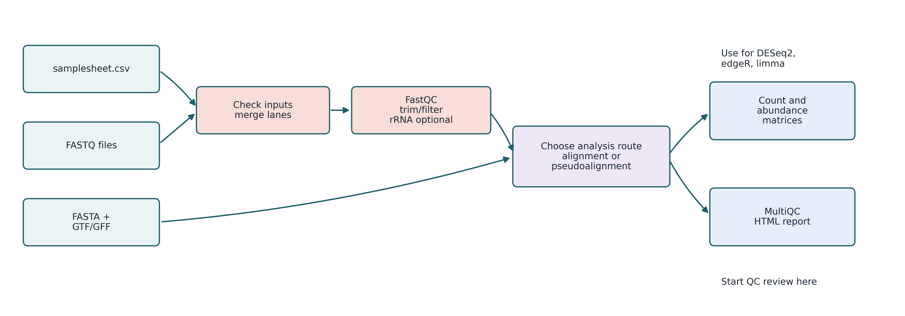
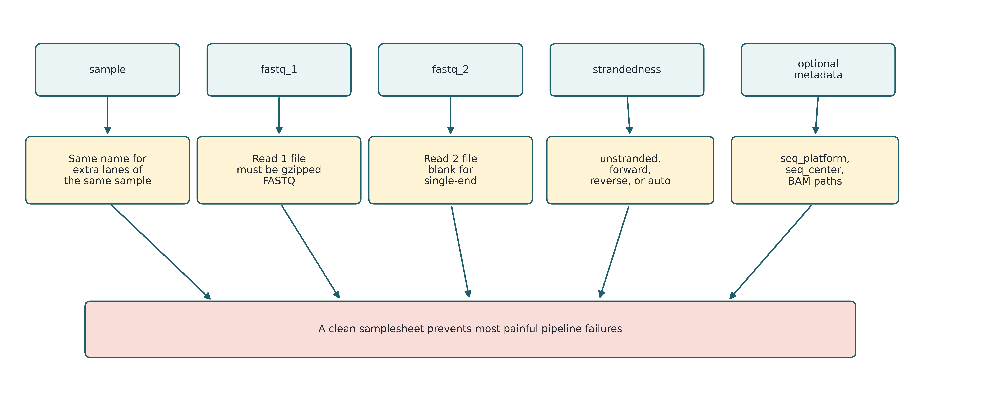
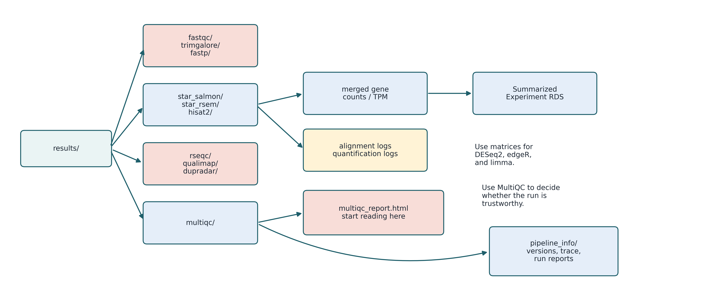

# nf-core/rnaseq: A Worked Example

## Why This Chapter?

The previous chapter introduced nf-core. Now we'll work through one pipeline end to end. We're not redoing the RNA-seq biology from earlier chapters. Instead, we're showing how all those workflow concepts — Nextflow processes, profiles, samplesheets, `-resume`, containers, parameter files — actually come together when you run a real pipeline.

We're using `nf-core/rnaseq` version `3.24.0` because it's the most widely used pipeline and covers everything you'll encounter: a CSV samplesheet, a container profile, a reference genome, many optional parameters, and a MultiQC report at the end. Once you can run this, the same pattern works for `sarek`, `ampliseq`, `chipseq`, `atacseq`, `taxprofiler`, and `scrnaseq`.

::: {.callout-note}
## The Main Idea

Running a community pipeline is a four-step skill: **(1)** prepare a correct samplesheet, **(2)** pick a container profile your system supports, **(3)** launch with a pinned version and a parameter file, and **(4)** read the MultiQC report and `pipeline_info/` to confirm the run worked. The biology comes after.
:::

## Learning Goals

By the end of this chapter you should be able to:

1. Explain what a community pipeline like `nf-core/rnaseq` packages together and what it does *not* do for you.
2. Write a valid samplesheet CSV and describe what the required columns mean.
3. Choose a container profile (`docker`, `apptainer`, `singularity`) appropriate for your environment.
4. Launch the test profile, then a real run, with a pinned version (`-r`) and a parameter file (`-params-file`).
5. Use `-resume` to continue an interrupted run without re-doing completed work.
6. Locate and interpret the workflow artifacts: `multiqc_report.html`, `software_versions.yml`, and `execution_report.html`.
7. Apply a short checklist to decide whether a run succeeded.

## What `nf-core/rnaseq` Packages

The pipeline checks inputs, runs FASTQ-level QC, optionally trims and screens for contaminants, aligns or pseudoaligns reads, builds count matrices, runs post-alignment QC, and rolls everything into one MultiQC report.

{#fig-nfcore-rnaseq-overview fig-align="center" width="95%"}

From a workflow-management perspective, what matters is the *shape* of the pipeline, not the biology of each step:

- It validates inputs before doing real work.
- Every tool runs inside a pinned container, so versions are reproducible.
- Every step writes structured outputs into named subdirectories.
- A single MultiQC report collects QC across tools.
- A `pipeline_info/` directory records exactly how the run was performed.

The pipeline handles the computation, but it won't tell you if your experimental design is sound or if a surprising result is real. For the RNA-seq biology — library prep, alignment versus pseudoalignment, normalization, differential expression — go back to the earlier RNA-seq chapter.

## Prerequisites

You need four things in place before launching:

| Need | Notes |
|---|---|
| Nextflow (Java 17+) | `conda install -c bioconda nextflow`, or follow @sec-nextflow. |
| A container engine | Docker on a laptop; Apptainer or Singularity on most HPC clusters. |
| A reference genome | Either a named iGenomes entry (`--genome GRCh38`) or your own FASTA + GTF. |
| FASTQ files and a samplesheet | One row per library; multiple rows per sample if multi-lane. |

::: {.callout-warning}
## Do Not Run Without a Container Profile

It is technically possible to run `nf-core/rnaseq` against tools on your `PATH`. Don't. You lose the version control that makes the run reproducible, and the official documentation explicitly warns against it. Pick `docker`, `apptainer`, `singularity`, or your institutional profile.
:::

## The Samplesheet

The samplesheet is the only input file you must write by hand. For `nf-core/rnaseq` 3.24.0 the required columns are:

```csv
sample,fastq_1,fastq_2,strandedness
CONTROL_REP1,/data/raw/CTRL1_R1.fastq.gz,/data/raw/CTRL1_R2.fastq.gz,auto
CONTROL_REP2,/data/raw/CTRL2_R1.fastq.gz,/data/raw/CTRL2_R2.fastq.gz,auto
TREATED_REP1,/data/raw/TREAT1_R1.fastq.gz,/data/raw/TREAT1_R2.fastq.gz,auto
TREATED_REP2,/data/raw/TREAT2_R1.fastq.gz,/data/raw/TREAT2_R2.fastq.gz,auto
```

{#fig-nfcore-rnaseq-samplesheet fig-align="center" width="90%"}

| Column | Meaning |
|---|---|
| `sample` | A clear sample name. Letters, numbers, underscores. Use biologically meaningful names like `CONTROL_REP1`, not `s1`. |
| `fastq_1` | Read 1 FASTQ file, gzipped. Full path on shared systems. |
| `fastq_2` | Read 2 FASTQ file. Leave empty for single-end data. |
| `strandedness` | One of `unstranded`, `forward`, `reverse`, or `auto`. Use `auto` if unsure. |

A few rules carry over to almost every nf-core pipeline:

- **Sample names matter.** Multiple rows with the same `sample` value are merged as technical replicates (for example, the same library across sequencing lanes). Different biological replicates need different names.
- **Use full paths** on shared clusters — the working directory of a Slurm job is rarely where you launched from.
- **Validate before launching.** Open the CSV, check every path exists, and confirm the strandedness values are spelled exactly as the pipeline expects.

## Always Test First

Every nf-core pipeline ships with a small test dataset. Run the test profile to answer a single question: can your environment actually run this pipeline?

```bash
nextflow run nf-core/rnaseq \
    -r 3.24.0 \
    -profile test,docker \
    --outdir results_test
```

Replace `docker` with `apptainer` or `singularity` on an HPC cluster. If the test fails, fix the environment — Java, container engine, network access, scratch space — before pointing the pipeline at real data. A failure during the test is cheap; a failure two days into a real run is not.

::: {.callout-tip}
## Pin the Pipeline Version

Always include `-r 3.24.0` (or whichever release you intend). Without `-r`, a later run may silently pick up a newer release with different defaults, output names, or required columns. The version is the most important reproducibility lever you control.
:::

## The Standard Run Pattern

Once the test passes, a real run follows exactly the pattern from @sec-nfcore:

```bash
nextflow run nf-core/rnaseq \
    -r 3.24.0 \
    -profile apptainer \
    -params-file params.yml \
    -resume
```

The single-dash flags are Nextflow's; the double-dash parameters belong to the pipeline. The handful you will use most often:

| Flag | Belongs to | Purpose |
|---|---|---|
| `-r` | Nextflow | Pin pipeline release. |
| `-profile` | Nextflow | Container engine and/or institutional config. |
| `-params-file` | Nextflow | YAML/JSON file of pipeline parameters. |
| `-resume` | Nextflow | Reuse cached tasks from a previous run. |
| `--input` | Pipeline | Path to the samplesheet CSV. |
| `--outdir` | Pipeline | Where final results go. |
| `--genome` / `--fasta` + `--gtf` | Pipeline | Reference: a named iGenomes entry, or your own files. |

A minimal `params.yml` for a custom genome:

```yaml
input:   "samplesheet.csv"
outdir:  "results_rnaseq"
fasta:   "refs/genome.fa"
gtf:     "refs/genes.gtf"
aligner: "star_salmon"
trimmer: "fastp"
save_reference: true
```

Parameter files beat long command lines because they're easy to share, easy to version control, and they become your methods section — the exact record of what you ran.

## Container Profile Choice

`-profile` selects how each process gets its software. The same pipeline runs unchanged on three engines; you pick the one your system supports:

| Profile | Where it fits |
|---|---|
| `docker` | Personal laptops and workstations with root or Docker Desktop. |
| `apptainer` | Most modern HPC clusters. Successor to Singularity. |
| `singularity` | Older HPC clusters still on Singularity. |
| `<institution>` (e.g. `tufts`, `crick`) | Sites with a curated nf-core config that sets the executor, queue, and cache. Use this if it exists. |

On HPC, set a shared container cache once so images are downloaded only once for the whole lab:

```bash
export NXF_APPTAINER_CACHEDIR=/project/mylab/apptainer_cache
export NXF_SINGULARITY_CACHEDIR=/project/mylab/singularity_cache
```

Profiles can be combined. `-profile test,apptainer` runs the small test dataset using Apptainer; `-profile apptainer,slurm` runs your real data through Apptainer on a Slurm cluster.

## A Complete End-to-End Example

Here is a real run for a four-sample human bulk RNA-seq experiment on an HPC cluster with Apptainer.

**Step 1.** Write `samplesheet.csv` (see above).

**Step 2.** Write `params.yml`:

```yaml
input:   "samplesheet.csv"
outdir:  "results_rnaseq"
genome:  "GRCh38"
aligner: "star_salmon"
trimmer: "fastp"
save_reference: true
```

**Step 3.** Confirm the test run still passes on this cluster:

```bash
nextflow run nf-core/rnaseq \
    -r 3.24.0 \
    -profile test,apptainer \
    --outdir results_test
```

**Step 4.** Launch the real run:

```bash
nextflow run nf-core/rnaseq \
    -r 3.24.0 \
    -profile apptainer \
    -params-file params.yml
```

**Step 5.** If the run is interrupted — a node failure, a wall-clock limit, a transient network issue — restart with `-resume`:

```bash
nextflow run nf-core/rnaseq \
    -r 3.24.0 \
    -profile apptainer \
    -params-file params.yml \
    -resume
```

`-resume` is the feature that distinguishes a workflow manager from a shell script. As long as inputs and parameters are unchanged, every task that already finished is reused from Nextflow's cache; only the failed task and what depends on it are re-run.

::: {.callout-warning}
## Resume Is Picky

Caching is keyed on the exact inputs, script, container, and parameters. Editing the samplesheet, switching profiles, or moving the `work/` directory will all invalidate the cache. If `-resume` re-runs more than expected, those changes are the first place to investigate.
:::

## The Pipeline Has Many Tunables

`nf-core/rnaseq` exposes well over a hundred parameters covering trimming, UMI handling, contaminant screening, aligner choice, quantifier choice, duplication analysis, complexity estimation, coverage tracks, and more. Two pieces of advice:

1. **Start with the defaults.** They are sensible, well-tested by the community, and produce a complete report.
2. **Read the official parameter docs** for your release before changing anything: <https://nf-co.re/rnaseq/3.24.0/parameters>. The parameter page is searchable, grouped by topic, and is the authoritative source.

When you do change parameters, put them in your `params.yml` — never bury them in a one-off command line. Future-you needs to know what was actually run.

## Reading the Outputs

The `results_rnaseq/` folder will have many subdirectories. You won't need all of them. Three artifacts matter most from a workflow perspective:

{#fig-nfcore-rnaseq-outputs fig-align="center" width="95%"}

| Artifact | Why it matters |
|---|---|
| `multiqc/multiqc_report.html` | The single HTML page that summarizes QC across every sample and every tool. Open this first. |
| `pipeline_info/software_versions.yml` | The exact version of every tool the pipeline ran. Paste straight into a methods section. |
| `pipeline_info/execution_report.html` | Per-task wall time, CPU, memory, and exit status. Use this when tuning resources or diagnosing failures. |
| `pipeline_info/execution_timeline.html` | Visual timeline of when each task ran — useful for spotting bottlenecks. |
| `pipeline_info/execution_trace.txt` | Machine-readable trace of every task; good for scripting or auditing. |

The other directories — `fastqc/`, `fastp/`, `star_salmon/`, `salmon/`, `multiqc/multiqc_data/`, and so on — fall into a small number of categories:

| Category | Where to look | What's there |
|---|---|---|
| Raw and trimmed read QC | `fastqc/`, `fastp/` or `trimgalore/` | Per-sample HTML reports, also rolled up into MultiQC. |
| Alignment outputs | `<aligner>/` (e.g. `star_salmon/`) | BAM, BAI, log files, optional bigWig coverage tracks. |
| Quantification matrices | `<aligner>/` and/or `salmon/` | Gene- and transcript-level counts, TPM, and a `SummarizedExperiment` RDS for R users. |
| Post-alignment QC | `rseqc/`, `qualimap/`, `dupradar/`, `preseq/` | Strandedness, gene-body coverage, duplication patterns, library complexity. |
| Pipeline metadata | `pipeline_info/` | Software versions, execution reports, run trace. |

The biological interpretation of those matrices — picking counts vs. TPM, choosing a differential expression model, drawing PCA — is covered in the RNA-seq chapter earlier in this course reader.

## A Short Checklist: Did the Run Work?

Use this checklist before sharing results. It applies to any nf-core pipeline, not just RNA-seq:

1. Did the pipeline exit cleanly? Check the Nextflow stdout for `Pipeline completed successfully`.
2. Are all expected samples present in the MultiQC general statistics table?
3. Is `pipeline_info/software_versions.yml` populated?
4. Does `execution_report.html` show every task in a `COMPLETED` state, with no excessive retries?
5. Does the MultiQC report flag any samples in red? If so, investigate before deleting `work/`.
6. Are the final result tables (count matrices, BAMs, or whatever your downstream analysis needs) actually present and non-empty?

If all six pass, you have a clean, reproducible run that someone else can take from here.

## Common Problems and Fixes

| Problem | Likely cause | Fix |
|---|---|---|
| `Sample sheet validation failed` | Missing required column or invalid `strandedness` value | Re-check the four required columns and allowed values. |
| Pipeline cannot find FASTQ files | Relative paths in the samplesheet | Use full absolute paths. |
| STAR fails with exit code 137 | Out of memory | Raise `--max_memory`, request a larger node, or add a `withName: STAR_ALIGN` resource override in a custom config. |
| `-resume` re-runs everything | Inputs, parameters, or `work/` directory changed since the last run | Restore `work/`; keep parameters identical when resuming. |
| Strandedness mismatch warning in MultiQC | Samplesheet value disagrees with what the pipeline inferred | Confirm the library kit, fix the samplesheet, re-run. |
| Containers fail to pull on HPC | Cluster nodes have no internet access | Pre-pull on a login node, or use `nf-core pipelines download` to stage everything offline. |

## Summary

Running `nf-core/rnaseq` follows the standard nf-core pattern. Pin the version. Write your samplesheet. Pick a container profile. Put your parameters in a YAML file. Test first, then run with `-resume` at the ready. The MultiQC report and `pipeline_info/` directory are what you keep — they show what ran, which tool versions were used, which samples were processed, and how each task performed.

These skills transfer directly to every other nf-core pipeline. Once you can run `rnaseq`, you can run `sarek`, `chipseq`, `atacseq`, `ampliseq`, `taxprofiler`, or `scrnaseq` with only tiny changes to the samplesheet and parameter file.

For the RNA-seq biology — what those count matrices mean, how strandedness affects quantification, how to model differential expression — go back to the earlier RNA-seq chapter.

## Exercises

1. Write a `samplesheet.csv` for two control and two treatment paired-end samples. Use absolute paths and `auto` strandedness.
2. Run the test profile (`-profile test,docker` or `-profile test,apptainer`) and confirm it completes. Where does Nextflow print the path to the MultiQC report?
3. Launch a real run with `-r 3.24.0`, a `params-file`, and your container profile. Save the full command in a shell script so the run is reproducible.
4. Intentionally interrupt the run (Ctrl-C, or cancel the Slurm job) partway through, then restart with `-resume`. Confirm from the Nextflow log that completed tasks are cached, not re-run.
5. After a successful run, open `pipeline_info/software_versions.yml` and identify the versions of STAR, Salmon, FastQC, and MultiQC. Walk the six-item checklist above and write one sentence per item.

## Further Reading

Use the official documentation pinned to the exact version you ran:

1. Pipeline home: <https://nf-co.re/rnaseq/3.24.0>
2. Usage: <https://nf-co.re/rnaseq/3.24.0/docs/usage>
3. Output: <https://nf-co.re/rnaseq/3.24.0/docs/output>
4. Parameters: <https://nf-co.re/rnaseq/3.24.0/parameters>
5. nf-core community configs: <https://nf-co.re/configs>
