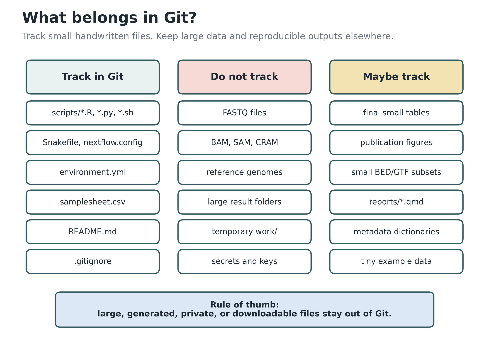
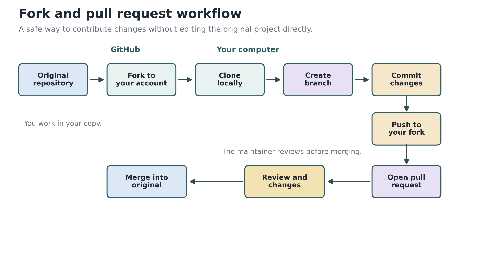

# Version Control with Git and GitHub

## The Problem Git Solves

Every bioinformatician has seen a directory that looks like this:

```
analysis.R
analysis_v2.R
analysis_v2_fixed.R
analysis_FINAL.R
analysis_FINAL_v2.R
analysis_FINAL_v2_actually_final.R
analysis_FINAL_v2_actually_final_FIXED_JAN15.R
```

This informal "version control" by renaming files seems harmless at first, but it leads to real problems:

- **Which version produced the results in your paper?** Three months later, you cannot remember.
- **What changed between versions?** You open two files side by side and squint at differences. Across 500 lines of code, you miss a critical one-line change.
- **A collaborator emails their copy.** Now you have two divergent versions and no way to merge them without manually comparing every line.
- **You break something.** An analysis that worked yesterday no longer works, and you have no idea which change caused it.

**Git** solves all of these problems. It is a version control system that records every change you make to your files as a **snapshot** — a permanent, labeled checkpoint you can always return to. Think of Git as a time machine for your project: you can rewind to any previous state, see exactly what changed and when, and safely experiment without fear of losing work.

::: {.callout-note}
## Why This Matters for Science

Reproducibility is a cornerstone of science, but a 2016 Nature survey found that over 70% of researchers could not reproduce others' findings, and 60% could not reproduce their own. Journals are responding: PLOS, Nature, and Springer Nature now require code availability statements, and many require publicly accessible code at publication. Git makes this straightforward — your analysis code is version-controlled, shareable, and citable.
:::

## Installing and Configuring Git

### Installation

```bash
# macOS (via Homebrew — recommended)
brew install git

# macOS (via Xcode tools — comes with macOS)
xcode-select --install

# Linux (Debian/Ubuntu)
sudo apt-get update && sudo apt-get install git

# Linux (Fedora)
sudo dnf install git

# Verify installation
git --version
```

On Windows, download from [git-scm.com](https://git-scm.com/download/win), which includes Git Bash — a Unix-like terminal.

### First-Time Setup

Before your first commit, tell Git who you are. This identity is recorded in every commit you make:

```bash
# Your name and email (used in every commit)
git config --global user.name "Jane Biologist"
git config --global user.email "jane.biologist@university.edu"

# Set the default branch name to "main" (modern convention)
git config --global init.defaultBranch main

# Set a beginner-friendly text editor
git config --global core.editor "nano"

# Handle line endings (macOS/Linux)
git config --global core.autocrlf input

# Verify your settings
git config --list
```

::: {.callout-tip}
## Pro-Tip: Use Your Institutional Email

Use the email associated with your GitHub account. This links your commits to your GitHub profile, making your contributions visible on your profile page — useful for career and collaboration visibility.
:::

## Understanding Git: A Mental Model

Git can feel abstract at first. Here is a concrete analogy that covers the core concepts.

**Think of Git as a photographer with a Polaroid camera, a photo album, and a time machine:**

- Your **working directory** is the scene — the files on your disk that you are actively editing
- The **staging area** is the arrangement on a table — you choose which items to photograph next
- A **commit** is a snapshot — a permanent photo with a note written on the back describing what it shows
- The **repository** is the photo album — a chronological collection of all your snapshots
- **Branches** are alternate photo albums — you can create a separate album to try a different arrangement, and if you like it, paste those photos into the main album

{#fig-git-three-areas fig-align="center" width="95%"}

The key insight is the **staging area**. You do not commit everything at once — you deliberately choose which changes belong together in a single snapshot. This lets you make one logical commit ("Add normalization step") even if you also have unrelated edits in progress.

## Your First Repository

### Creating a Repository

```bash
# Create a new project directory and initialize Git
mkdir rnaseq-analysis
cd rnaseq-analysis
git init
```

This creates a hidden `.git/` folder that stores all version history. Your project directory looks normal — Git works invisibly in the background.

```bash
# Or initialize in an existing directory
cd ~/existing-project
git init
```

### The Core Workflow: Edit, Stage, Commit

The daily Git workflow has three steps:

**1. Edit files** — work as you normally would

```bash
# Create an analysis script
nano deseq2_analysis.R
```

**2. Stage changes** — select what goes into the next snapshot

```bash
# Stage a specific file
git add deseq2_analysis.R

# Stage multiple files
git add deseq2_analysis.R config.yaml

# Stage all changes in the current directory (use with caution)
git add .
```

**3. Commit** — save the snapshot with a descriptive message

```bash
git commit -m "Add DESeq2 differential expression analysis script"
```

That's it. Every commit is a permanent checkpoint you can always return to.

### Checking the Status

`git status` is the command you will run most often. It tells you what has changed, what is staged, and what is not being tracked:

```bash
git status
# On branch main
# Changes to be committed:
#   (use "git restore --staged <file>..." to unstage)
#         new file:   deseq2_analysis.R
#
# Changes not staged for commit:
#   (use "git add <file>..." to update what will be committed)
#         modified:   config.yaml
#
# Untracked files:
#   (use "git add <file>..." to include in what will be committed)
#         notes.txt
```

The output tells you exactly what to do next — read the hints in parentheses.

### Viewing History

```bash
# Full commit log
git log

# Compact one-line view (most useful day-to-day)
git log --oneline
# a1b2c3d Add pathway enrichment analysis
# e4f5g6h Add DESeq2 differential expression script
# i7j8k9l Initial commit: project setup with README

# Show which files changed in each commit
git log --stat

# Show a graphical view of branches
git log --oneline --graph --all
```

### Comparing Changes

```bash
# See what you changed but haven't staged yet
git diff

# See what is staged and will be committed next
git diff --staged

# Compare the current state to a specific commit
git diff a1b2c3d

# Compare a specific file between two commits
git diff a1b2c3d e4f5g6h -- deseq2_analysis.R
```

The output uses `-` for removed lines and `+` for added lines.

## Writing Good Commit Messages

Commit messages are your lab notebook for code. Months later, they are how you (or a reviewer) understand *why* you made each change.

### The Rules

1. **Use the imperative mood**: "Add normalization step" not "Added normalization step"
2. **Keep the subject line under 50 characters**: Short and scannable
3. **Explain *why*, not *what***: The code shows what changed; the message explains the reasoning

### Good vs. Bad Examples

Good:
```bash
git commit -m "Add TMM normalization before differential expression

Raw counts showed library size bias across samples.
Added TMM normalization using edgeR to correct for
composition differences between RNA-seq libraries."
```

```bash
git commit -m "Fix off-by-one error in variant filter

Variants at position 0 were excluded from VCF output.
This affected 23 variants in the chromosome 1 analysis."
```

Bad:
```bash
git commit -m "updated stuff"
git commit -m "fix"
git commit -m "changes"
git commit -m "WIP"
```

::: {.callout-tip}
## Pro-Tip: The Subject Line Test

A good subject line completes this sentence naturally:
"If applied, this commit will **[your subject line]**."

- "If applied, this commit will **Add TMM normalization before differential expression**" — reads naturally
- "If applied, this commit will **updated stuff**" — does not
:::

### Multi-Line Commit Messages

For complex changes, add a body after a blank line:

```bash
# Open your editor for a longer message
git commit

# Or use multiple -m flags
git commit -m "Subject line here" -m "Body paragraph explaining why."
```

## Branching

Branches let you work on new features or experiments without disturbing the stable main branch. Think of branches as alternate timelines — you can try a new normalization method on a branch, and if it works, merge it back into main. If it fails, delete the branch. The main branch is never affected.

{#fig-git-branching fig-align="center" width="95%"}

### Creating and Switching Branches

```bash
# Create a new branch and switch to it
git switch -c new-normalization-method

# List all branches (* marks the current one)
git branch
# * new-normalization-method
#   main

# Switch back to main
git switch main

# Older syntax (still works, but switch is preferred)
git checkout -b new-normalization-method
```

### Merging

Once you are happy with the work on a branch, merge it into main:

```bash
# Switch to the branch you want to merge INTO
git switch main

# Merge the feature branch
git merge new-normalization-method
# Merge made by the 'ort' strategy.
#  deseq2_analysis.R | 15 ++++++++++++---
#  1 file changed, 12 insertions(+), 3 deletions(-)

# Delete the branch after merging (optional cleanup)
git branch -d new-normalization-method
```

### Resolving Merge Conflicts

Conflicts happen when two branches change the same lines in a file. Git marks the conflict and asks you to resolve it:

```r
<<<<<<< HEAD
normalized_counts <- counts / lib_sizes
=======
normalized_counts <- counts / median(lib_sizes)
>>>>>>> new-normalization-method
```

**Resolution steps:**

1. Open the conflicted file in your editor
2. Look for the `<<<<<<<`, `=======`, and `>>>>>>>` markers
3. Decide which version to keep (or combine both)
4. Delete all conflict markers
5. Stage and commit the resolution:

```bash
git add deseq2_analysis.R
git commit -m "Resolve conflict: use median normalization"
```

::: {.callout-note}
## When Do Conflicts Happen?

Conflicts only arise when two branches edit the **same lines** of the **same file**. If you edit `alignment.sh` and your collaborator edits `deseq2_analysis.R`, there is no conflict — Git merges both changes automatically.
:::

## What to Track (and What Not to Track)

In bioinformatics, some files must be version-controlled and others must not. The distinction is simple: track the small, hand-written files that represent your intellectual work. Do not track the large, generated files that can be recreated.

{#fig-git-project-structure fig-align="center" width="90%"}

| Track (in Git) | Do NOT Track | Maybe |
|---------------|-------------|-------|
| Analysis scripts (`.R`, `.py`, `.sh`) | Raw FASTQ files | Small result tables |
| Pipeline configs (`Snakefile`, `nextflow.config`) | BAM/SAM/CRAM alignment files | Final figures |
| `environment.yml`, `requirements.txt` | Reference genomes and indices | Summary statistics |
| Sample metadata sheets | VCF/BCF files | |
| `README.md`, documentation | Temporary/intermediate files | |
| `.gitignore` itself | Secrets (`.env`, API keys) | |

### The `.gitignore` File

A `.gitignore` file tells Git which files to ignore. Create it at the root of your project:

```gitignore
# ── Raw sequencing data (deposit in SRA/ENA instead) ──
*.fastq
*.fastq.gz
*.fq
*.fq.gz

# ── Alignment files ──
*.bam
*.bam.bai
*.sam
*.cram

# ── Variant files ──
*.vcf
*.vcf.gz
*.bcf

# ── Reference genomes and indices ──
*.fasta
*.fa
*.fai
*.bt2
*.amb
*.ann
*.bwt
*.pac
*.sa

# ── Intermediate and temporary files ──
results/
tmp/
work/

# ── R artifacts ──
.Rhistory
.RData
.Rproj.user/

# ── Python artifacts ──
__pycache__/
*.pyc
.ipynb_checkpoints/

# ── Environment and secrets ──
.env
*.pem

# ── OS files ──
.DS_Store
Thumbs.db

# ── Editor files ──
*.swp
*~
.vscode/
```

```bash
# Add and commit .gitignore
git add .gitignore
git commit -m "Add .gitignore for bioinformatics project"
```

::: {.callout-tip}
## Pro-Tip: Set a Global .gitignore

OS-specific junk files like `.DS_Store` (macOS) and `Thumbs.db` (Windows) should be ignored globally, not in every project:

```bash
git config --global core.excludesFile '~/.gitignore_global'
```

Then in `~/.gitignore_global`:
```gitignore
.DS_Store
Thumbs.db
*~
*.swp
```
:::

## Working with GitHub

GitHub is a web platform for hosting Git repositories. It adds collaboration features — pull requests, issues, code review — on top of Git's version control.

### Creating a Repository on GitHub

1. Go to [github.com](https://github.com) and click **+** > **New repository**
2. Name it (e.g., `rnaseq-deseq2-analysis`)
3. Add a description
4. Choose **Public** (for open science) or **Private**
5. Optionally initialize with a README and `.gitignore`
6. Click **Create repository**

### Connecting a Local Repository to GitHub

```bash
# If you already have a local repo
git remote add origin https://github.com/username/rnaseq-deseq2-analysis.git
git push -u origin main

# If starting from a GitHub repo
git clone https://github.com/username/rnaseq-deseq2-analysis.git
cd rnaseq-deseq2-analysis
```

**`origin`** is the conventional name for the primary remote repository on GitHub.

### Push, Pull, Fetch

```bash
# Push local commits to GitHub
git push origin main

# Pull changes from GitHub (fetch + merge)
git pull origin main

# Fetch without merging (safer — inspect first, then merge)
git fetch origin
git log origin/main --oneline    # see what's new
git merge origin/main            # merge when ready
```

::: {.callout-warning}
## Push vs. Pull

- **Push**: sends your local commits to GitHub. Fails if the remote has commits you do not have locally — `pull` first.
- **Pull**: downloads remote commits and merges them into your local branch. May cause merge conflicts if you and a collaborator edited the same file.

When in doubt, `fetch` first, inspect with `git log`, then `merge`.
:::

### Authentication

GitHub no longer accepts account passwords for Git operations over HTTPS. Use one of these methods:

**SSH keys (recommended for regular use):**
```bash
# Generate an SSH key
ssh-keygen -t ed25519 -C "jane.biologist@university.edu"

# Copy the public key
cat ~/.ssh/id_ed25519.pub
# Paste it into GitHub: Settings > SSH and GPG keys > New SSH key

# Test the connection
ssh -T git@github.com

# Clone using SSH (no password prompt)
git clone git@github.com:username/rnaseq-analysis.git
```

**Personal access tokens (for HTTPS):**

1. GitHub: Settings > Developer settings > Personal access tokens
2. Prefer a fine-grained token with access only to the repository you need
3. Use the token as your password when pushing over HTTPS
4. Store it in your operating system credential manager instead of pasting it into scripts

::: {.callout-warning}
## Never Commit Credentials

Do not commit passwords, personal access tokens, SSH private keys, `.env` files, or cloud credentials. If a secret is committed to GitHub, treat it as compromised: revoke it immediately and create a new one.
:::

### Writing a Good README

The `README.md` is the front page of your project. For a bioinformatics project, include:

````markdown
# RNA-seq Differential Expression Analysis

Analysis of differential gene expression between control and
treated samples using DESeq2.

## Requirements

- Conda/Miniforge (see environment.yml)
- Raw data: PRJNA123456 (SRA)

## Setup

```bash
conda env create -f environment.yml
conda activate rnaseq-analysis
```

## Usage

```bash
# Run the complete pipeline
bash scripts/run_all.sh
```

## Directory Structure

- `scripts/` — Analysis scripts (numbered by execution order)
- `data/` — Raw and processed data (not in Git; see data/README.md)
- `results/` — Output figures and tables
- `reports/` — Analysis reports (Quarto/RMarkdown)

## Data Availability

Raw sequencing data deposited in SRA under accession PRJNA123456.

## Citation

If you use this code, please cite: [DOI: 10.5281/zenodo.XXXXXXX]

## License

MIT License
````

## Collaborating on GitHub

### The Fork and Pull Request Workflow

This is the standard way to contribute to someone else's project:

{#fig-github-workflow fig-align="center" width="95%"}

**Step 1: Fork** — Click "Fork" on the GitHub page to create a copy in your account.

**Step 2: Clone your fork:**
```bash
git clone https://github.com/YOUR-USERNAME/project.git
cd project
```

**Step 3: Add the original as "upstream":**
```bash
git remote add upstream https://github.com/ORIGINAL-OWNER/project.git
```

**Step 4: Create a branch for your changes:**
```bash
git switch -c fix-normalization-bug
```

**Step 5: Make changes, commit, push to your fork:**
```bash
git add deseq2_analysis.R
git commit -m "Fix normalization to use median of ratios"
git push origin fix-normalization-bug
```

**Step 6: Open a Pull Request** — On GitHub, click "Compare & pull request." Describe your changes and why they are needed.

**Step 7: Code review** — The maintainer reviews your code, may request changes, and eventually merges.

### Keeping Your Fork in Sync

```bash
git fetch upstream
git switch main
git merge upstream/main
git push origin main
```

### GitHub Issues

Use Issues as a lightweight task tracker for your project:

- Bug reports: "STAR alignment fails on sample SRR1234567"
- Feature requests: "Add batch correction step"
- Questions: "Should we use TMM or DESeq2 normalization?"

Issues support Markdown, labels (bug, enhancement, question), milestones, and assignees. Reference them in commits: `git commit -m "Fix alignment parameters, closes #12"` — this automatically closes the issue when merged.

## Git for Reproducible Science

### Tagging Releases

Tags mark specific commits as important milestones — particularly useful for marking the code version used in a publication:

```bash
# Create an annotated tag (recommended)
git tag -a v1.0 -m "Code version for manuscript submission to Nature Methods"

# Tag a past commit
git tag -a v0.9 a1b2c3d -m "Preliminary results presented at conference"

# List all tags
git tag

# Push tags to GitHub
git push origin --tags
```

On GitHub, tags appear under **Releases**. Create a release from a tag to generate a downloadable archive of your code at that exact state.

### Getting a DOI with Zenodo

Journals increasingly require persistent identifiers for code. Zenodo (operated by CERN) archives GitHub releases and assigns a **DOI** (Digital Object Identifier):

1. Create an account at [zenodo.org](https://zenodo.org) and link your GitHub
2. Toggle your repository to "On" in Zenodo's GitHub settings
3. Create a **Release** on GitHub (Releases > "Create a new release")
4. Zenodo automatically archives it and assigns a DOI
5. Add the DOI badge to your README

Now your code is citable:

> Analysis scripts are available at https://github.com/janebiologist/rnaseq-analysis (archived at https://doi.org/10.5281/zenodo.XXXXXXX, version 1.0).

### CITATION.cff

Place a `CITATION.cff` file in your repository root. GitHub automatically displays a "Cite this repository" button:

```yaml
cff-version: 1.2.0
message: "If you use this software, please cite it as below."
authors:
  - family-names: Biologist
    given-names: Jane
    orcid: "https://orcid.org/0000-0001-1234-5678"
title: "RNA-seq Differential Expression Pipeline"
version: 1.0.0
date-released: "2026-03-15"
doi: "10.5281/zenodo.1234567"
license: MIT
```

## Handling Large Files

Git is designed for text files (scripts, configs, documentation). Large binary files (FASTQ, BAM, reference genomes) should not be committed to Git — they bloat the repository and are impossible to diff meaningfully.

### The Rule of Thumb

| File Type | Solution |
|-----------|---------|
| Raw sequencing data (FASTQ) | Deposit in SRA/ENA. Document accession in README. |
| Alignment files (BAM/CRAM) | Do not track. They can be regenerated. |
| Reference genomes | Do not track. Document the version and download URL. |
| Medium files (10-100 MB) that must be tracked | Use **Git LFS** |
| Small metadata, gene lists, BED files | Track normally in Git |

### Git LFS (Large File Storage)

Git LFS replaces large files with lightweight pointers in Git while storing the actual file contents on a separate server:

```bash
# Install Git LFS (once per system)
brew install git-lfs     # macOS
# sudo apt install git-lfs  # Ubuntu

# Initialize (once per user)
git lfs install

# Track specific file patterns
git lfs track "*.bed.gz"
git lfs track "*.rds"
git lfs track "trained_model.h5"

# Commit the tracking configuration
git add .gitattributes
git commit -m "Configure Git LFS for annotation and model files"

# Now add and commit files normally — LFS handles them transparently
git add reference_peaks.bed.gz
git commit -m "Add ChIP-seq reference peak set"
git push origin main
```

::: {.callout-warning}
## GitHub LFS Limits

GitHub blocks regular Git files larger than 100 MB, and Git LFS has storage and bandwidth quotas. Those quotas can change, so check GitHub's current documentation before relying on LFS for a large project. For most bioinformatics data, the better solution is to deposit data in domain-specific repositories such as SRA, ENA, GEO, or Zenodo and document the accession numbers in your README.
:::

## Common Mistakes and How to Fix Them

The safest Git command depends on whether the change is local, staged, committed, or already pushed.

{#fig-git-undo-safety fig-align="center" width="90%"}

### Accidentally Committed a Large File

**Symptom:** `git push` fails because a file exceeds GitHub's 100 MB limit.

```bash
# If you haven't pushed yet:
# Undo the last commit (keep the changes)
git reset --soft HEAD~1

# Remove the large file from staging
git restore --staged large_file.bam

# Add it to .gitignore
echo "*.bam" >> .gitignore

# Re-commit without the large file
git add .gitignore
git add your_script.R
git commit -m "Add analysis script (exclude BAM files)"
```

If the file is buried deep in your history, use `git filter-repo`:
```bash
pip install git-filter-repo
git filter-repo --path large_file.bam --invert-paths
```

### Undoing the Last Commit

```bash
# Undo commit but keep changes staged (safest)
git reset --soft HEAD~1

# Undo commit and unstage changes (keep files on disk)
git reset HEAD~1

# Undo commit AND discard all changes (DANGEROUS — data loss!)
git reset --hard HEAD~1
```

### Reverting a Pushed Commit (Safe)

If you already pushed a bad commit, use `git revert` — it creates a new commit that undoes the changes without rewriting history:

```bash
git revert a1b2c3d
# Creates a new commit that reverses the changes in a1b2c3d
```

### Recovering a Deleted File

```bash
# Restore from the last commit
git restore deleted_file.R

# Restore from a specific commit
git checkout a1b2c3d -- deleted_file.R
```

### Committed to the Wrong Branch

```bash
# Create the correct branch at the current position
git branch correct-branch

# Reset main back one commit
git reset --hard HEAD~1

# Switch to the correct branch
git switch correct-branch
```

### Amending the Last Commit

```bash
# Forgot to add a file? Fix the message?
git add forgotten_file.R
git commit --amend -m "Corrected commit message"
```

Only amend **unpushed** commits. Amending rewrites the commit hash, which causes problems if others have already pulled the original.

::: {.callout-tip}
## Pro-Tip: Almost Everything Is Recoverable

As long as you have committed or staged your work, Git has a record of it. Even after `git reset`, the old commits remain in the **reflog** for 30 days:
```bash
git reflog
# Shows every position HEAD has been at
# Find the commit hash you want, then:
git checkout a1b2c3d
```
:::

## A Complete Bioinformatics Project Workflow

Here is a realistic end-to-end workflow for managing an RNA-seq analysis with Git and GitHub:

````bash
# ── 1. Create the project ─────────────────────────────────────────────────
mkdir rnaseq-deseq2-project && cd rnaseq-deseq2-project
git init

# ── 2. Set up the directory structure ─────────────────────────────────────
mkdir -p scripts data/{raw,reference} results/{figures,tables} reports

# ── 3. Create .gitignore ──────────────────────────────────────────────────
cat > .gitignore << 'EOF'
# Sequencing data (deposited in SRA)
*.fastq.gz
*.bam
*.bam.bai

# Reference genome
data/reference/

# Large results
results/alignments/

# R artifacts
.Rhistory
.RData

# OS junk
.DS_Store
EOF

# ── 4. Add README and environment file ────────────────────────────────────
cat > README.md << 'EOF'
# RNA-seq DESeq2 Analysis

Differential expression analysis of [experiment description].

## Data

Raw data: SRA accession PRJNA123456

## Requirements

```bash
conda env create -f environment.yml
conda activate rnaseq
```
EOF

# ── 5. First commit ───────────────────────────────────────────────────────
git add .gitignore README.md environment.yml
git commit -m "Initial project setup with README and environment"

# ── 6. Write analysis scripts, committing logical units ───────────────────
# ... write scripts/01_qc.sh ...
git add scripts/01_qc.sh
git commit -m "Add quality control script using FastQC and MultiQC"

# ... write scripts/02_align.sh ...
git add scripts/02_align.sh
git commit -m "Add STAR alignment script with two-pass mode"

# ── 7. Experiment on a branch ─────────────────────────────────────────────
git switch -c try-salmon-pseudoalign

# ... write scripts/02b_salmon.sh ...
git add scripts/02b_salmon.sh
git commit -m "Add Salmon pseudo-alignment as alternative to STAR"

# Happy with the results? Merge it.
git switch main
git merge try-salmon-pseudoalign
git branch -d try-salmon-pseudoalign

# ── 8. Push to GitHub ─────────────────────────────────────────────────────
# (After creating the repo on GitHub)
git remote add origin git@github.com:janebiologist/rnaseq-deseq2-project.git
git push -u origin main

# ── 9. Tag the version used for manuscript submission ─────────────────────
git tag -a v1.0 -m "Code version for manuscript submission to Genome Biology"
git push origin --tags

# ── 10. After revision, make changes and tag again ────────────────────────
# ... address reviewer comments ...
git add scripts/03_deseq2.R
git commit -m "Add batch correction per reviewer 2 request"
git tag -a v1.1 -m "Code version for revised manuscript"
git push origin main --tags
````

## Quick Reference

### Essential Commands

```bash
# Setup
git init                         # create a new repository
git clone <url>                  # copy a remote repository

# Daily workflow
git status                       # what's changed?
git add <file>                   # stage for next commit
git commit -m "message"          # save a snapshot
git diff                         # see unstaged changes
git diff --staged                # see staged changes
git log --oneline                # view history

# Branching
git switch -c <branch>           # create and switch to branch
git switch main                  # switch to main
git merge <branch>               # merge branch into current
git branch -d <branch>           # delete merged branch
git branch                       # list branches

# Remote (GitHub)
git remote add origin <url>      # link to GitHub
git push origin main             # upload commits
git pull origin main             # download and merge
git fetch origin                 # download without merging

# Undo
git restore <file>               # discard unstaged changes
git restore --staged <file>      # unstage a file
git reset --soft HEAD~1          # undo last commit (keep changes)
git revert <hash>                # create a reversal commit

# Tags
git tag -a v1.0 -m "message"    # create annotated tag
git push origin --tags           # push tags to GitHub
```

### Key Concepts

| Concept | What It Means |
|---------|--------------|
| **Repository** | A project tracked by Git (has a `.git/` folder) |
| **Commit** | A snapshot of your project at a point in time |
| **Staging area** | Where you arrange changes before committing |
| **Branch** | An independent line of development |
| **Remote** | A copy of the repo on GitHub (or another server) |
| **HEAD** | Pointer to the current commit on the current branch |
| **Merge** | Combining two branches together |
| **Pull request** | A proposal to merge changes (with review) on GitHub |
| **Tag** | A named label for a specific commit (e.g., `v1.0`) |
| **Clone** | Copy a remote repo to your local machine |
| **Fork** | Copy someone else's repo to your GitHub account |

## Summary

Git is not optional for modern bioinformatics — it is as fundamental as knowing how to use the command line. The key points:

- **Commit early and often** with descriptive messages that explain *why*, not just *what*
- The **staging area** lets you craft logical, focused commits from scattered changes
- **Branches** let you experiment safely — try a new method without risking the working code
- **.gitignore** keeps large data files out of Git — track scripts and configs, not FASTQs and BAMs
- **GitHub** adds collaboration (pull requests, issues) and visibility (public repos, DOIs)
- **Tag releases** for manuscript versions and **archive with Zenodo** for a citable DOI
- **Almost everything is recoverable** — Git's reflog keeps a record of every state your project has been in

## Exercises

1. **First repository**: Create a directory called `git-practice`, initialize a Git repo, create a file called `analysis.sh` with a simple command, and make your first commit. Run `git log` to see your commit.

2. **Multiple commits**: Add three more files to your repo one at a time (e.g., `01_qc.sh`, `02_align.sh`, `03_count.sh`), committing each separately with a descriptive message. Run `git log --oneline` to see the history.

3. **Staging practice**: Modify two files simultaneously. Stage and commit only one of them. Run `git status` to confirm the other file is still "Changes not staged for commit." Then stage and commit the second file separately.

4. **Branching**: Create a branch called `new-feature`, switch to it, make a change, and commit. Switch back to `main` and verify the change is not present. Merge the branch into `main`.

5. **Gitignore**: Create a `.gitignore` file appropriate for a bioinformatics project. Create a file called `test.fastq.gz` (an empty file is fine: `touch test.fastq.gz`). Run `git status` and confirm Git ignores it.

6. **GitHub**: Create a repository on GitHub, connect your local repository using `git remote add origin`, and push your commits. Verify the files appear on GitHub.

7. **Collaboration**: Find a classmate's public repository on GitHub. Fork it, clone your fork, create a branch, make a small change (fix a typo in the README, for example), push to your fork, and open a pull request.

8. **Time travel**: Make a commit, then make another commit that introduces a deliberate mistake. Use `git revert` to undo the mistake while preserving history. Check `git log` to see both the mistake and its reversal.

9. **Tagging**: Tag the current state of your repository as `v1.0` with an annotated tag. Push the tag to GitHub. Navigate to the Releases page on GitHub and verify the tag appears.

10. **Recovery**: Create and commit a file, then delete it with `rm`. Use `git restore` to recover it. Then try `git reset --soft HEAD~1` to undo the last commit and verify the changes remain staged.
